**目录**：

>笔记持续更新，原地址 : https://github.com/Niefee/Wangyi-Note ;

<ul>
<li><a href="#bom">BOM</a><ul>
<li><a href="#结构图">结构图</a></li>
<li><a href="#属性">属性</a><ul>
<li><a href="#navigator">navigator</a><ul>
<li><a href="#navigatoruseragent">navigator.userAgent</a></li>
</ul>
</li>
<li><a href="#location">location</a></li>
<li><a href="#history">history</a></li>
<li><a href="#screen">screen</a></li>
</ul>
</li>
<li><a href="#方法">方法</a><ul>
<li><a href="#三种对话框">三种对话框</a></li>
<li><a href="#打开或关闭窗口">打开或关闭窗口</a></li>
</ul>
</li>
<li><a href="#事件">事件</a></li>
</ul>
</li>
</ul>
#BOM

##结构图
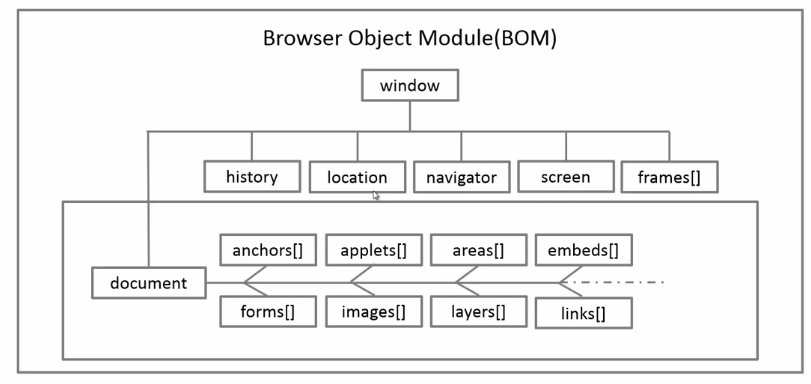
##属性
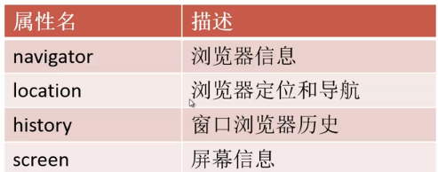
###navigator
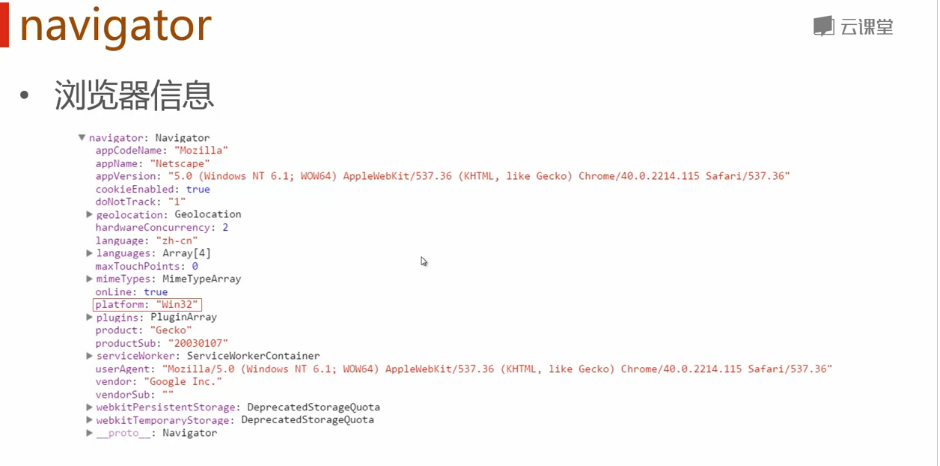
####navigator.userAgent
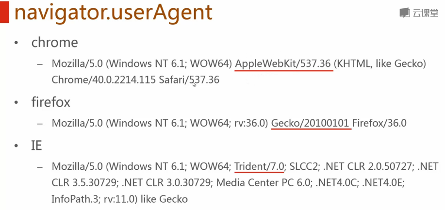
###location
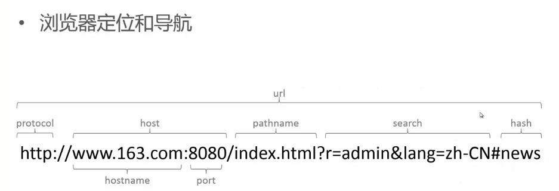
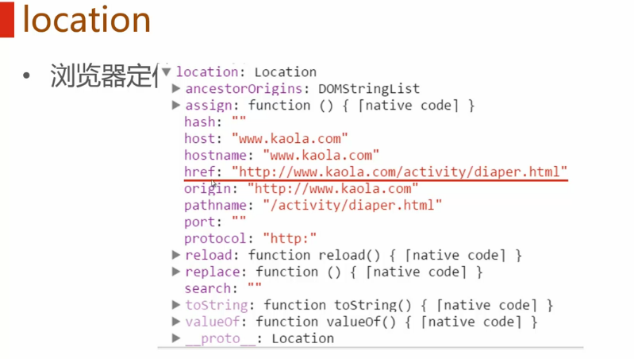
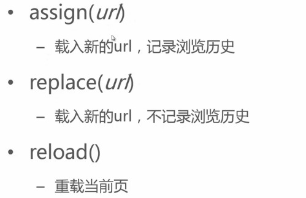
###history
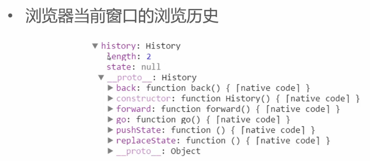
常用方法：
 - back()
 - forward()
 - go()

###screen
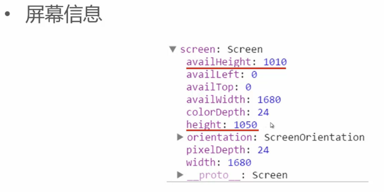

##方法
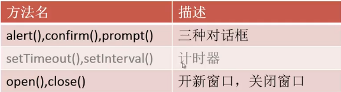
###三种对话框
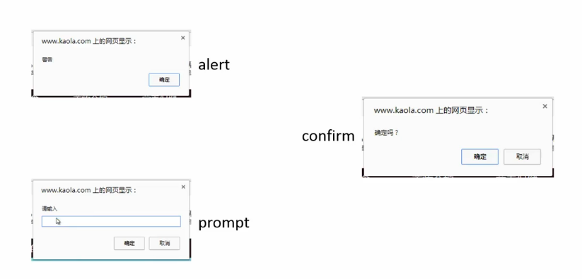
>可以在浏览器中调试：
>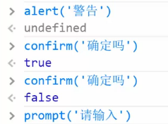

###打开或关闭窗口 
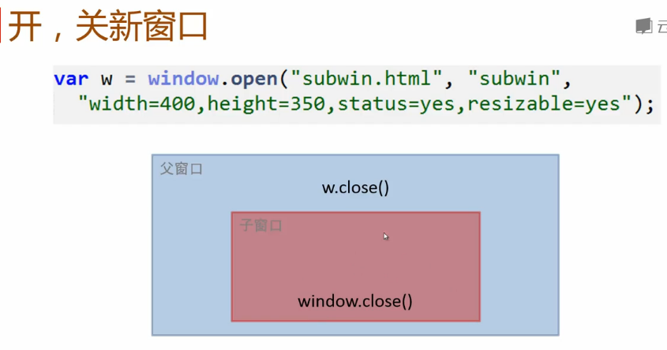
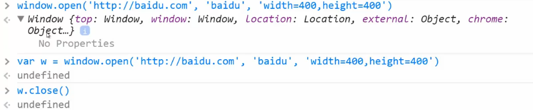

##事件
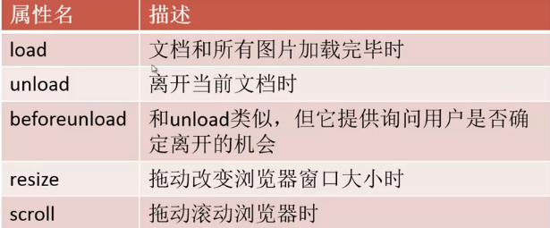
