**目录**：

>笔记持续更新，原地址 : https://github.com/Niefee/Wangyi-Note ;

ul>
<li><a href="#dom事件">DOM事件</a><ul>
<li><a href="#事件流">事件流</a><ul>
<li><a href="#什么是dom时间">什么是DOM时间</a></li>
<li><a href="#事件流-1">事件流</a></li>
</ul>
</li>
<li><a href="#事件注册">事件注册</a><ul>
<li><a href="#事件注册与触发">事件注册与触发</a></li>
<li><a href="#事件注册-1">事件注册</a></li>
<li><a href="#取消事件注册">取消事件注册</a></li>
<li><a href="#事件触发">事件触发</a></li>
<li><a href="#浏览器兼容型ie678">浏览器兼容型（IE6,7,8）</a></li>
<li><a href="#事件对象">事件对象</a><ul>
<li><a href="#阻止事件传播">阻止事件传播</a></li>
<li><a href="#默认行为">默认行为</a></li>
</ul>
</li>
</ul>
</li>
<li><a href="#事件类型">事件类型</a><ul>
<li><a href="#event">Event</a></li>
<li><a href="#window">window</a></li>
<li><a href="#image">Image</a></li>
<li><a href="#uievent">UIEvent</a></li>
<li><a href="#mouseevent">MouseEvent</a></li>
<li><a href="#mouseevent-1">MouseEvent</a></li>
<li><a href="#例子-拖拽div">例子-拖拽div</a></li>
<li><a href="#wheelevent">WheelEvent</a></li>
<li><a href="#focusevent">FocusEvent</a></li>
<li><a href="#inputevent">InputEvent</a></li>
<li><a href="#keyboardevent">KeyboardEvent</a></li>
</ul>
</li>
</ul>
</li>
</ul>
#DOM事件
##事件流
###什么是DOM时间
 - 点击一个DOM元素
 - 键盘按下一个键
 - 输入框输入内容
 - 页面加载完成

###事件流
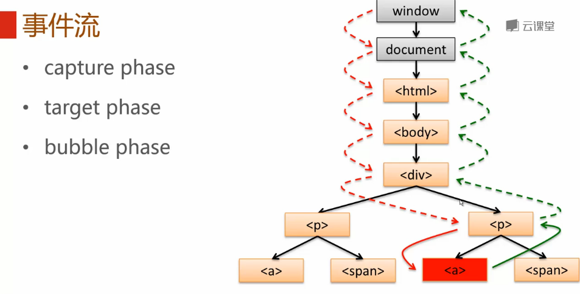
>页面的load没有冒泡过程。

##事件注册
###事件注册与触发
 - 事件注册
 - 取消事件注册
 - 事件触发

###事件注册
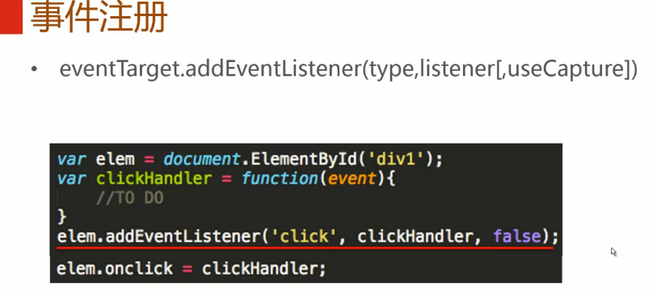
###取消事件注册
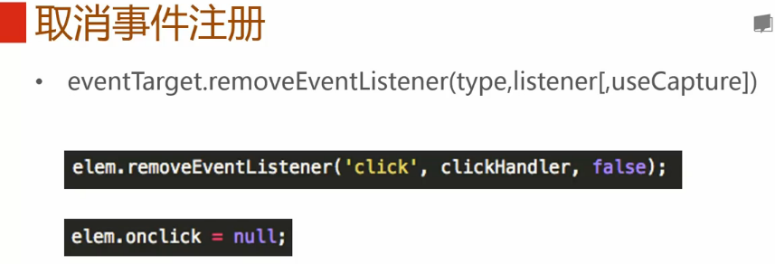
###事件触发
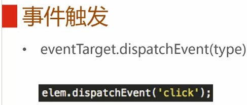
###浏览器兼容型（IE6,7,8）
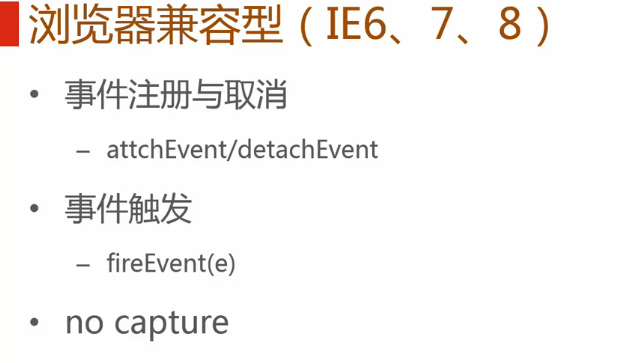
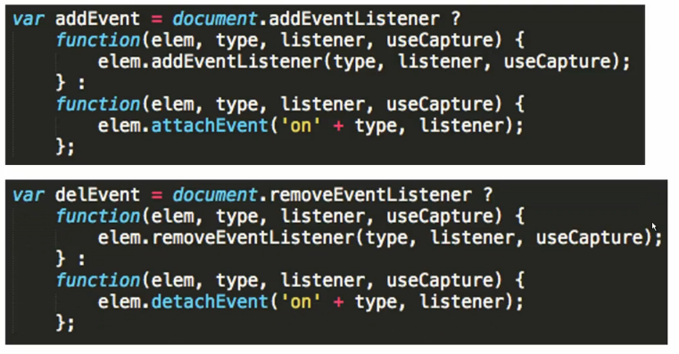
###事件对象
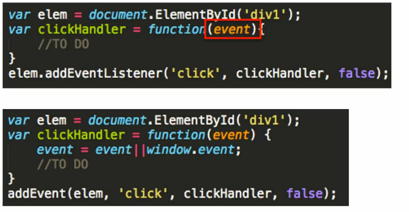
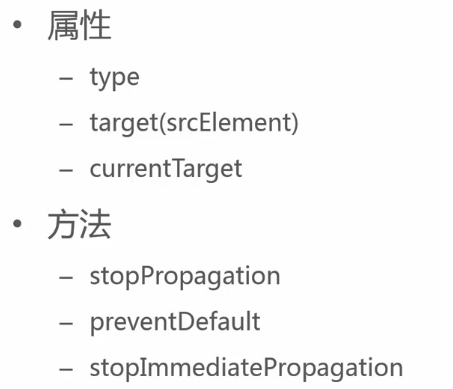
####阻止事件传播
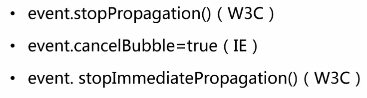
####默认行为
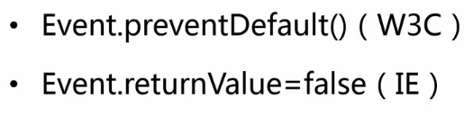
##事件类型
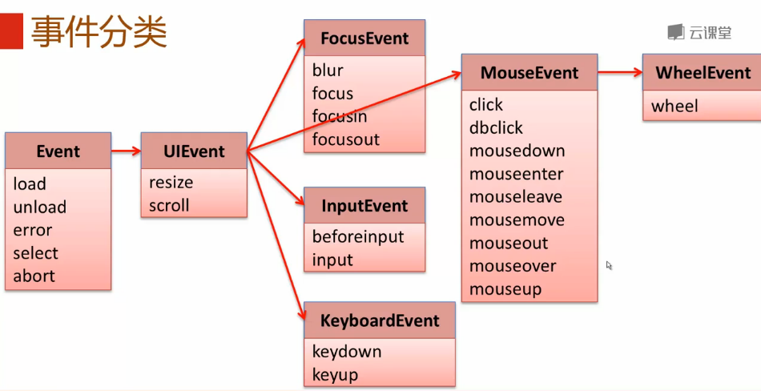
###Event
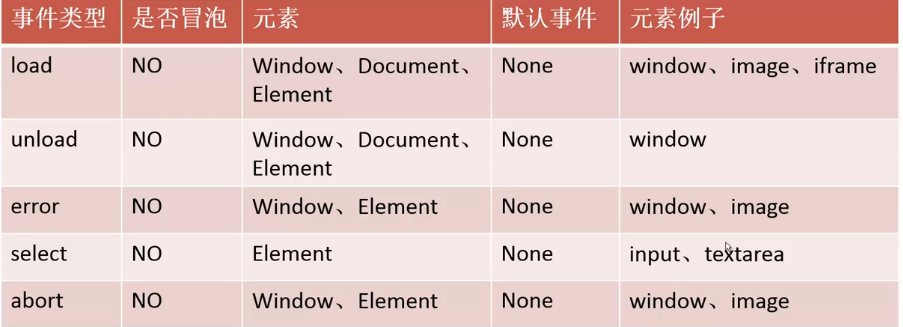
###window
 - load
 - unload
 - error
 - abort

###Image
 - load
 - error
 - abort

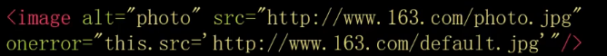

###UIEvent

###MouseEvent
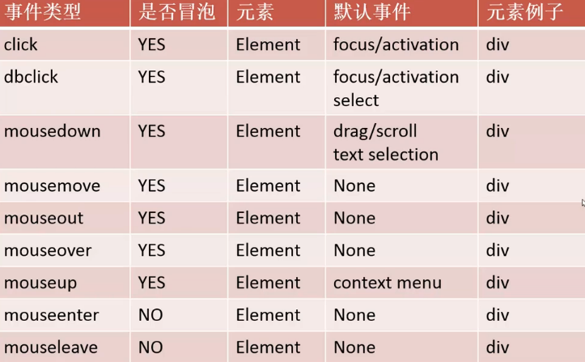

 - 属性
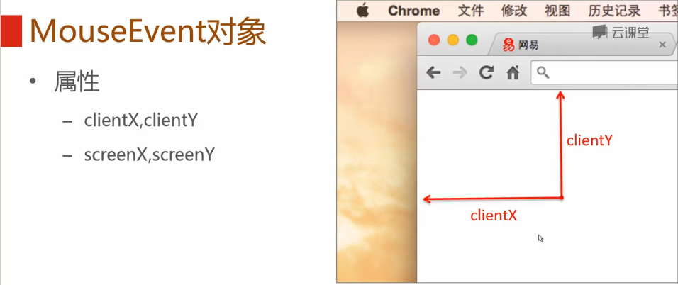
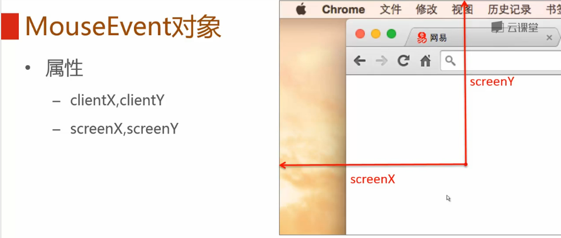
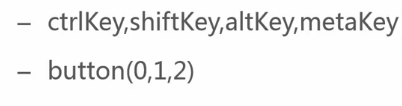

###MouseEvent
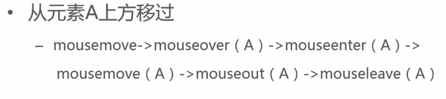
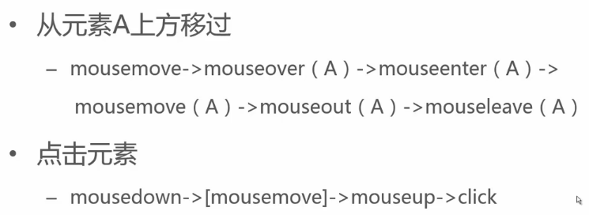

###例子-拖拽div
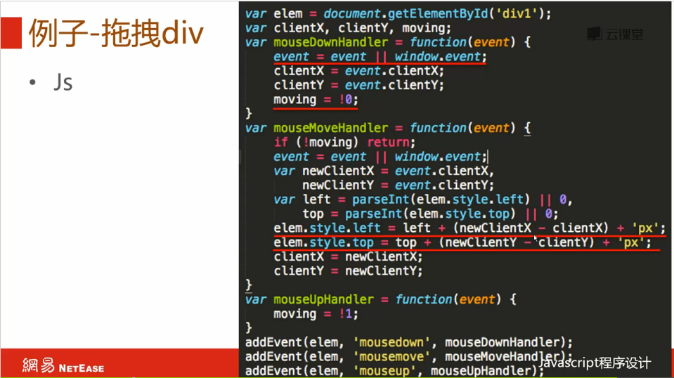

###WheelEvent
 - 属性
	 - deltaMode
	 - deltaX
	 - deltaY
	 - deltaZ

###FocusEvent
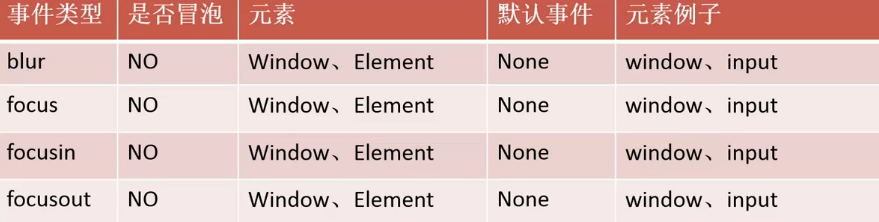
 - 属性
	 - relatedTarget

###InputEvent
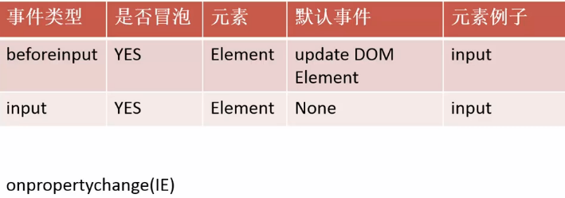

###KeyboardEvent
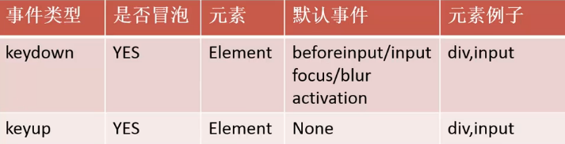
 - 属性
	 - key
	 - code
	 - ctrlKey/shiftKey/altKey/metaKey
	 - repeat
	 - *keyCode*
	 - *charCode*
	 - *which	*

