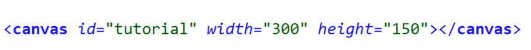
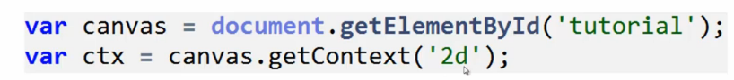
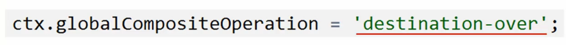
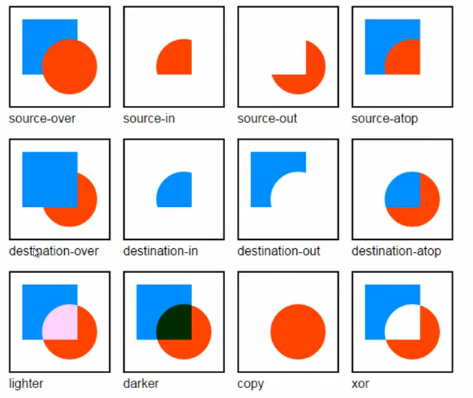
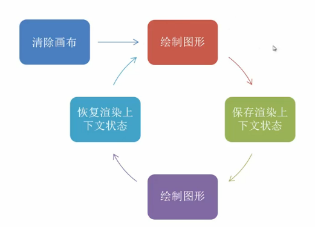
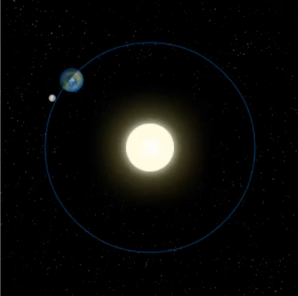
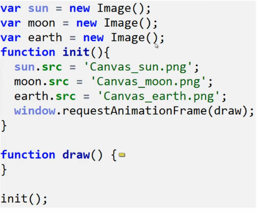
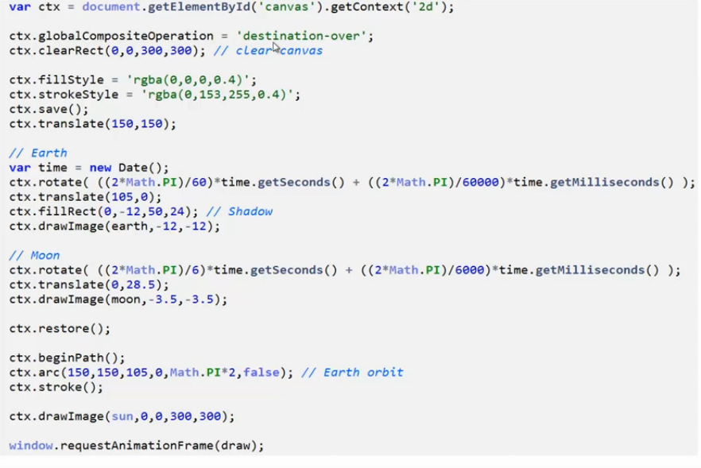

**目录**：

>笔记持续更新，原地址 : https://github.com/Niefee/Wangyi-Note ;

<ul>
<li><a href="#canvas">canvas</a><ul>
<li><a href="#基本用法">基本用法</a></li>
<li><a href="#渲染下上文">渲染下上文</a></li>
<li><a href="#globalcompositionoperation">globalCompositionOperation</a></li>
<li><a href="#基本画图的步骤">基本画图的步骤</a></li>
<li><a href="#实例">实例</a></li>
</ul>
</li>
</ul>
#canvas
##基本用法

##渲染下上文

##globalCompositionOperation

##基本画图的步骤

##实例

>画圆的具体案例：http://www.w3cfuns.com/article-1717-1-1.html 。

>Canvas详解：http://www.xker.com/page/e2010/0802/97593.html 。
