**目录**：

>笔记持续更新，原地址 : https://github.com/Niefee/Wangyi-Note ;

<ul>
<li><a href="#列表操作">列表操作</a><ul>
<li><a href="#内容">内容</a></li>
<li><a href="#定义数据">定义数据</a></li>
<li><a href="#显示列表">显示列表</a></li>
<li><a href="#选择列表项">选择列表项</a><ul>
<li><a href="#单选">单选</a></li>
<li><a href="#多选">多选</a></li>
<li><a href="#右键菜单">右键菜单</a></li>
<li><a href="#增加列表项">增加列表项</a></li>
<li><a href="#删除列表项">删除列表项</a></li>
<li><a href="#更新列表项">更新列表项</a></li>
<li><a href="#更新状态">更新状态</a></li>
</ul>
</li>
<li><a href="#编程方式">编程方式</a><ul>
<li><a href="#面向视图">面向视图</a></li>
<li><a href="#面向数据">面向数据</a></li>
<li><a href="#面向数据编程">面向数据编程</a></li>
</ul>
</li>
</ul>
</li>
</ul>
#列表操作
##内容
 - 显示列表
 - 选择列表项
 - 新增列表项
 - 删除列表项
 - 更新列表项

##定义数据
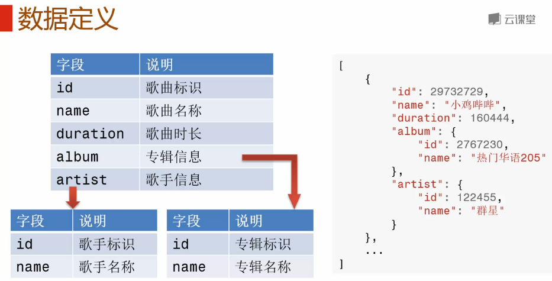

##显示列表
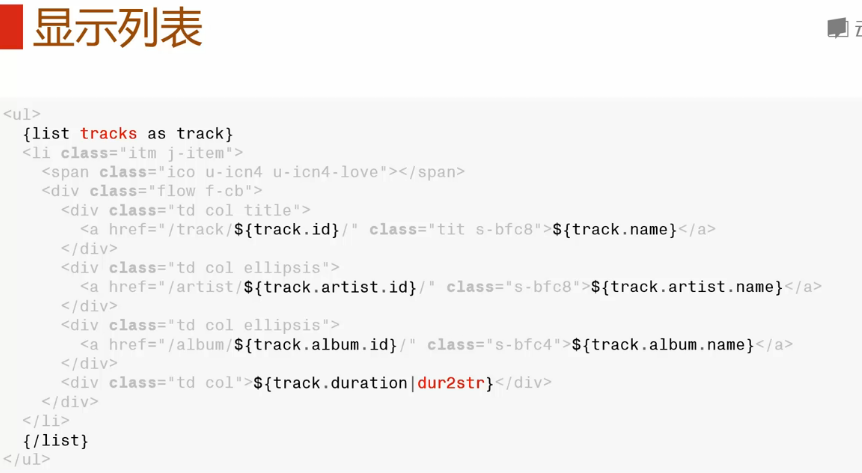
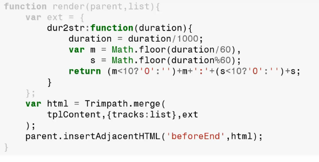
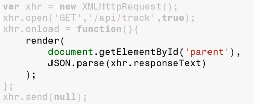

##选择列表项
###单选
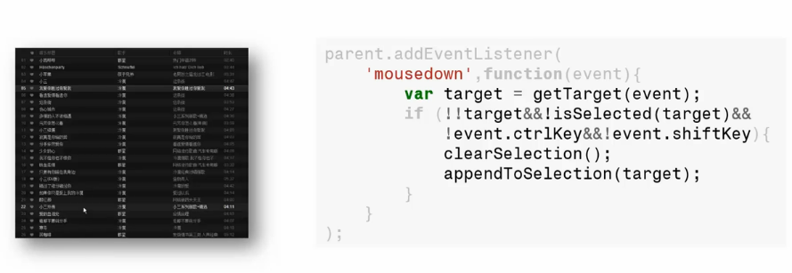

###多选
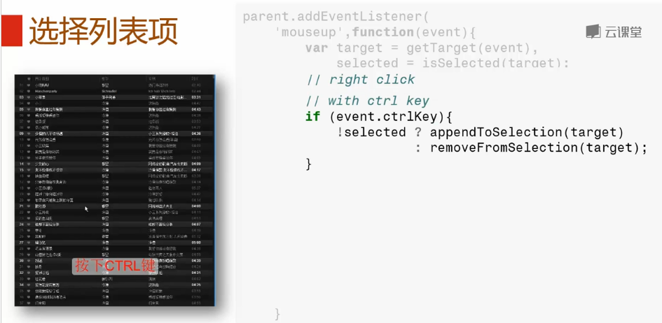
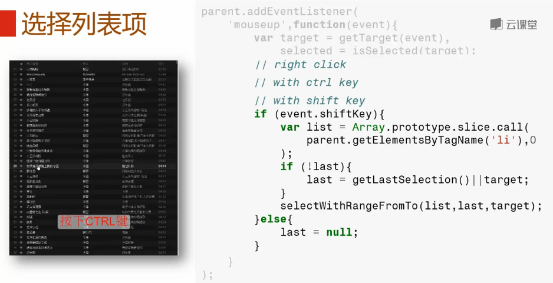

###右键菜单
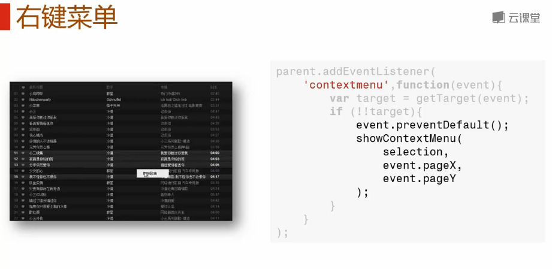
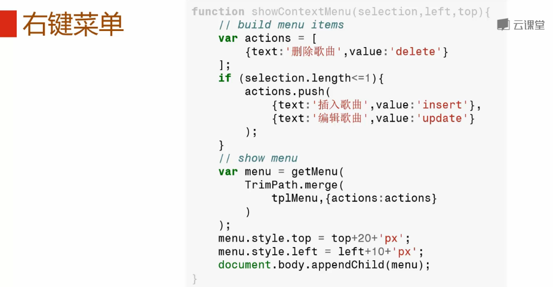

###增加列表项
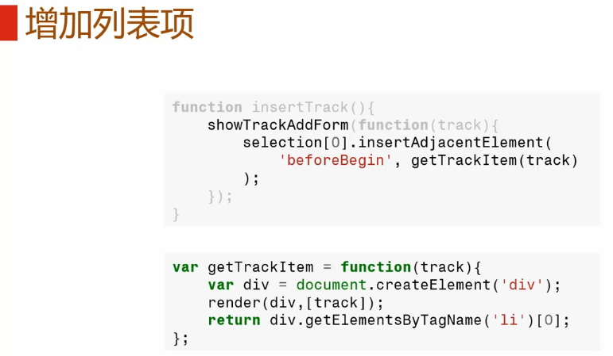
###删除列表项
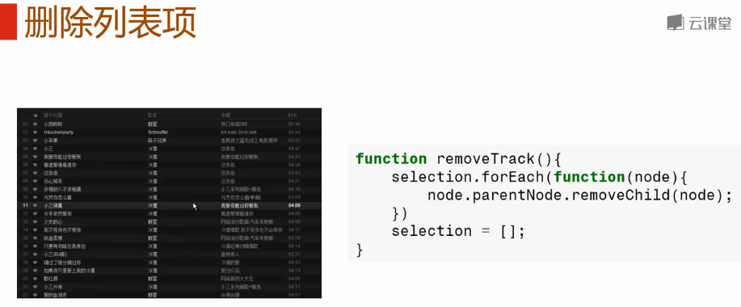
###更新列表项
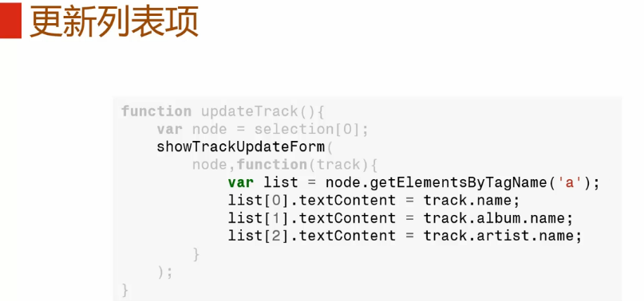
###更新状态
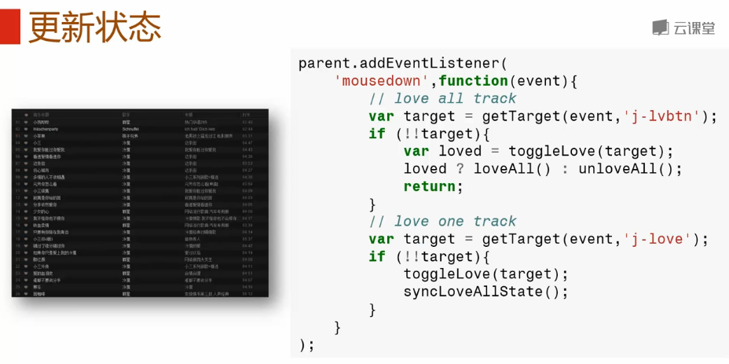

##编程方式
###面向视图
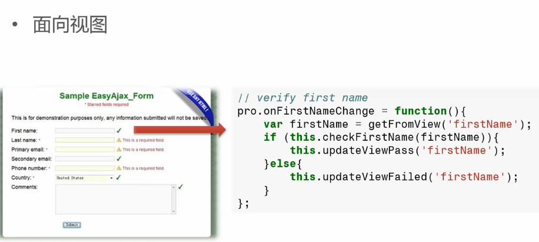
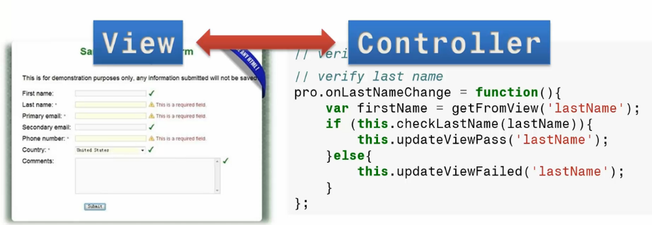

###面向数据
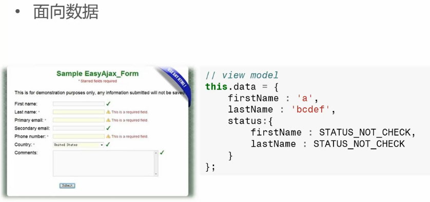
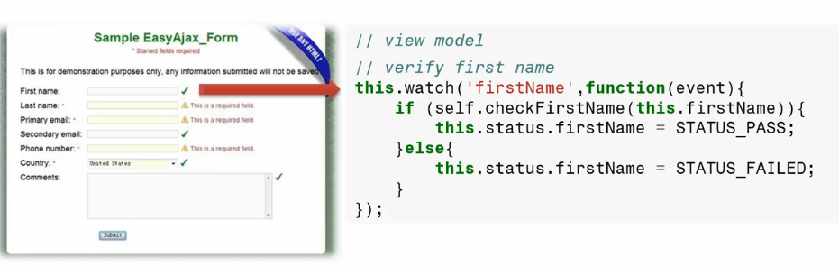
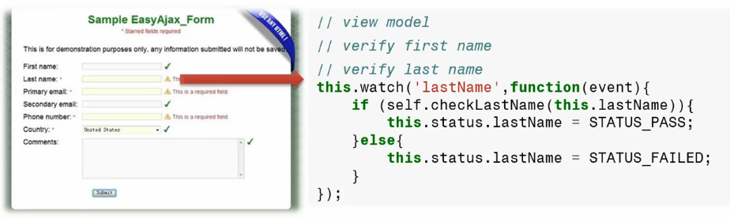
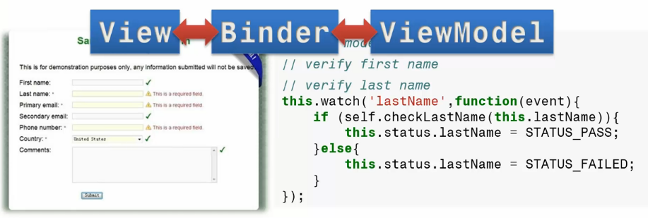

###面向数据编程
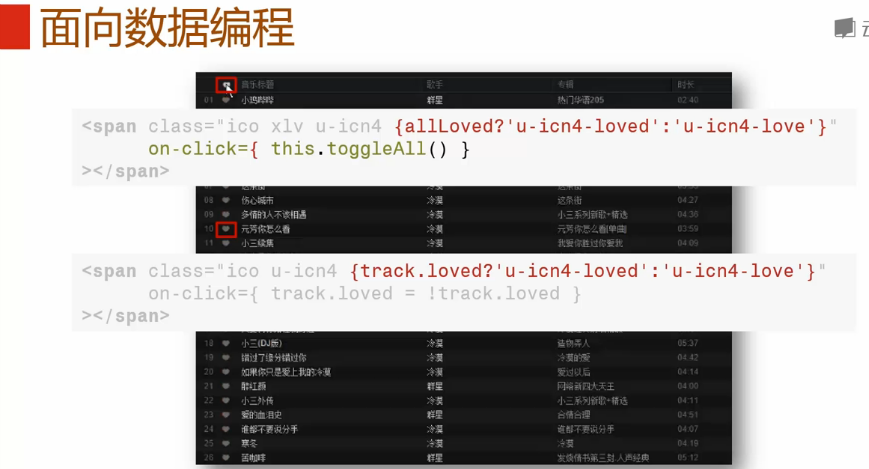
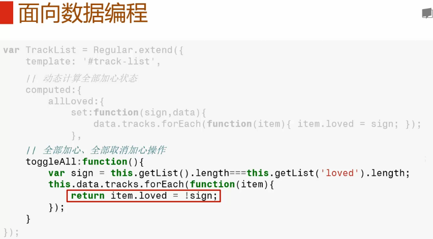
