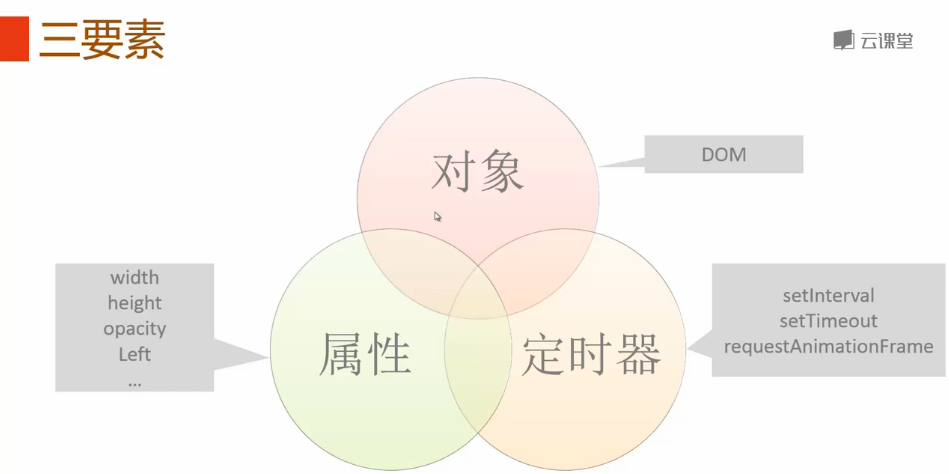
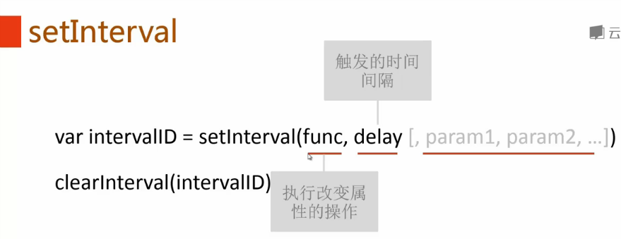
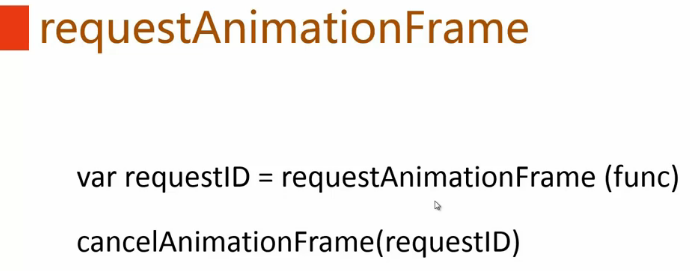
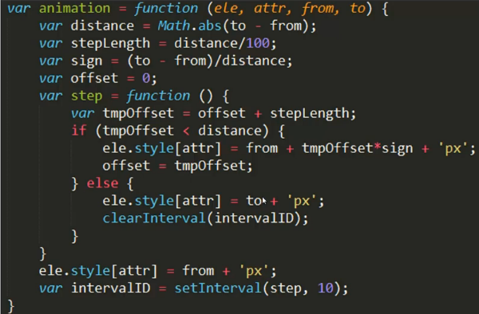
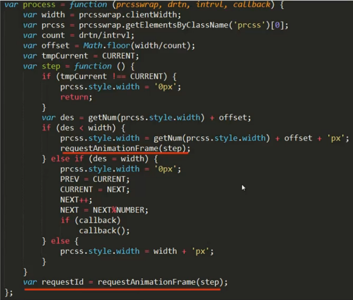
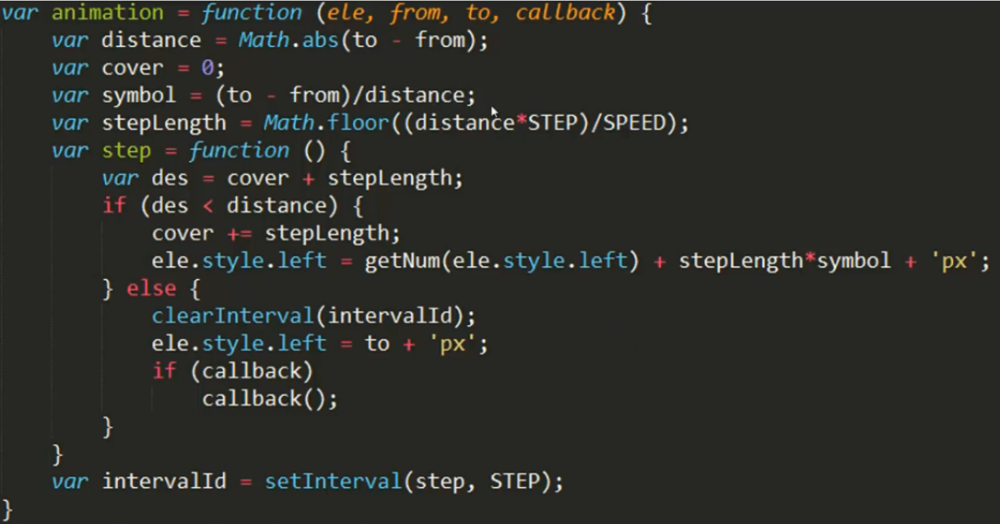

**目录**：

>笔记持续更新，原地址 : https://github.com/Niefee/Wangyi-Note ;

<ul>
<li><a href="#动画">动画</a><ul>
<li><a href="#三要素">三要素</a><ul>
<li><a href="#setinterval">setInterval</a></li>
<li><a href="#settimeout">setTimeout</a></li>
<li><a href="#requestanimationframe">requestAnimationFrame</a></li>
<li><a href="#动画函数">动画函数</a></li>
</ul>
</li>
</ul>
</li>
</ul>
#动画
##三要素

###setInterval

###setTimeout

>默认值0表示立刻执行。

###requestAnimationFrame

>跟随屏幕的刷新频率。

###动画函数

 >进度条
 >

>左右移动
>

