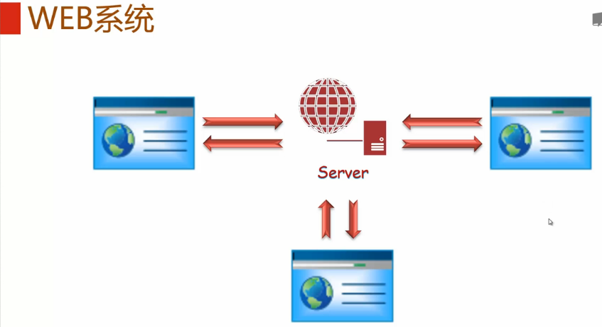
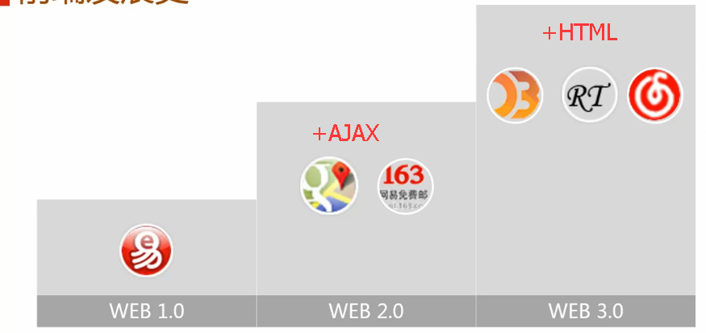
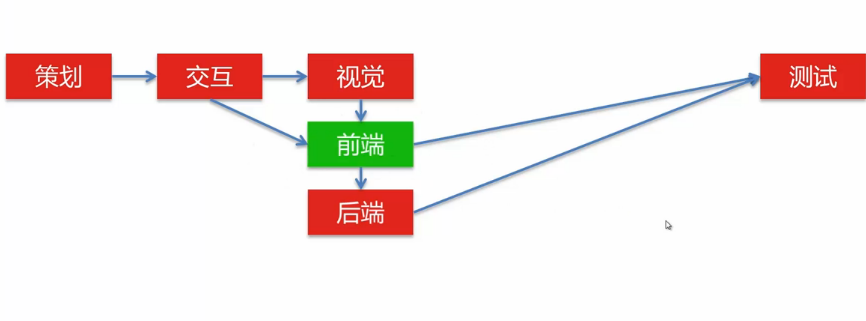
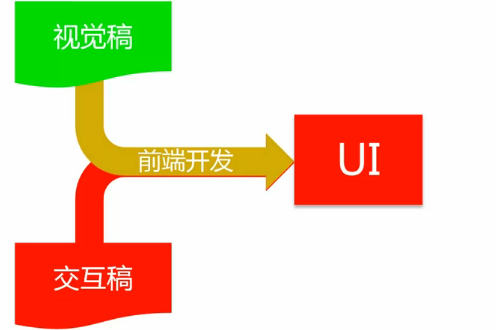
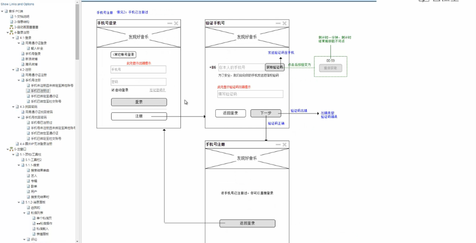

**目录**：

>笔记持续更新，原地址 : https://github.com/Niefee/Wangyi-Note ;

<ul>
<li><a href="#学习指南">学习指南</a><ul>
<li><a href="#web系统">WEB系统</a></li>
<li><a href="#前端发展史">前端发展史</a></li>
<li><a href="#协作流程">协作流程</a></li>
<li><a href="#工作职责">工作职责</a></li>
<li><a href="#技能要求">技能要求</a></li>
</ul>

#学习指南
##WEB系统

##前端发展史

##协作流程

##工作职责

 - 页面逻辑开发

 - 页面制作

##技能要求
 - HTML
 - css
 - javascript
 - DOM
 - Photoshop

