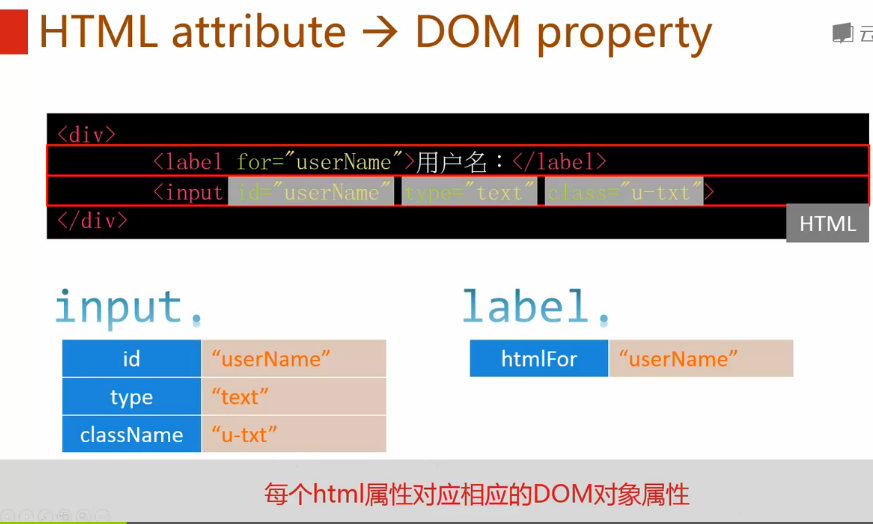
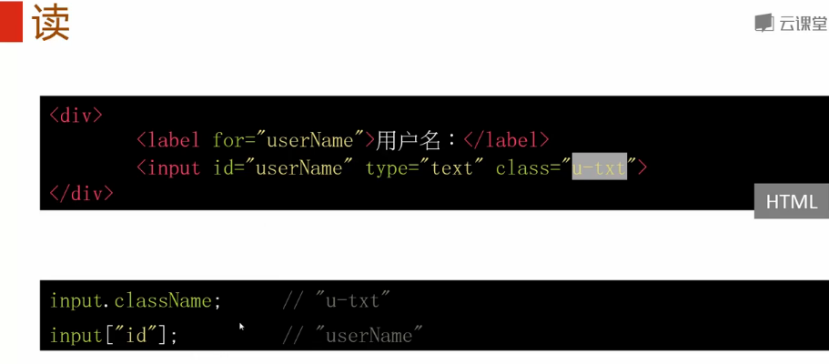
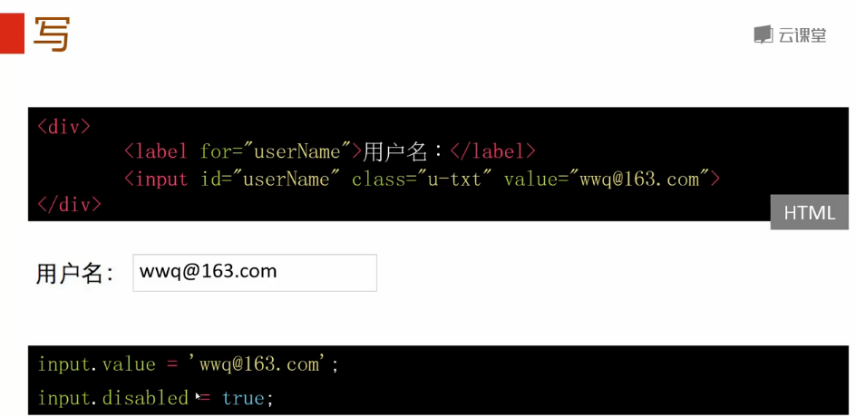
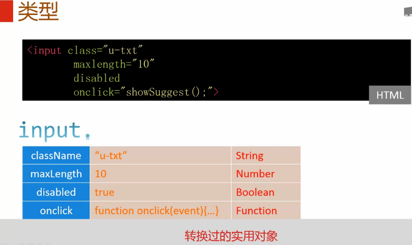
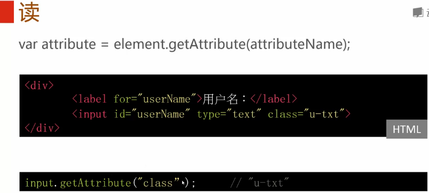
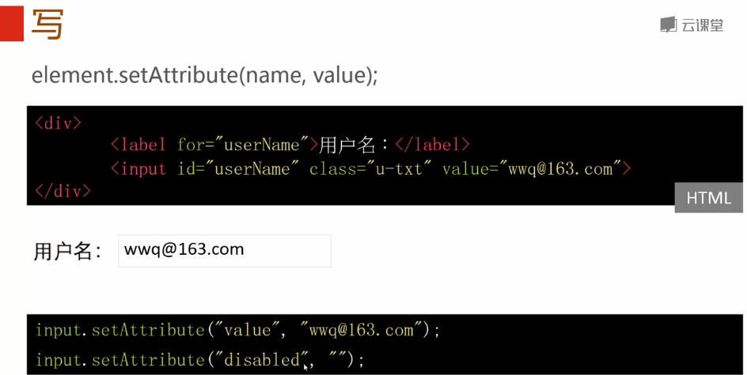
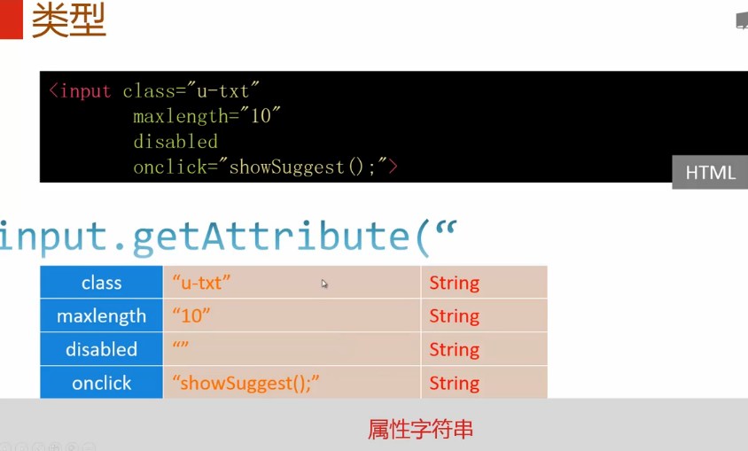
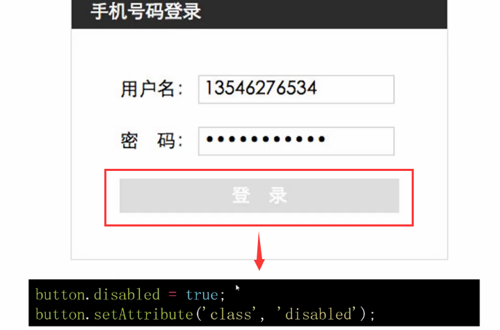
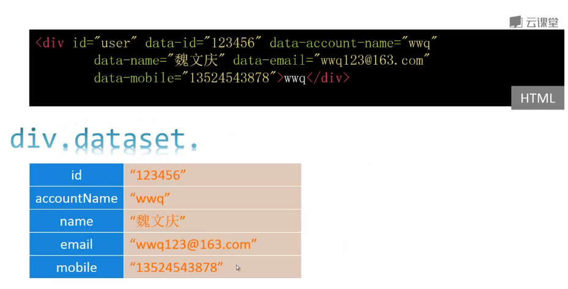
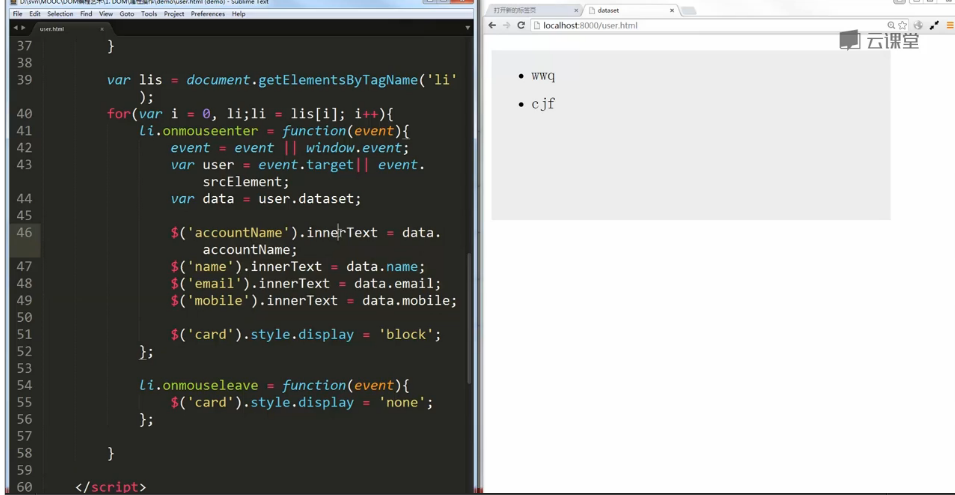

**目录**：

>笔记持续更新，原地址 : https://github.com/Niefee/Wangyi-Note ;

<ul>
<li><a href="#属性操作">属性操作</a><ul>
<li><a href="#html-attribute-dom-property">HTML attribute → DOM property</a><ul>
<li><a href="#读">读</a></li>
<li><a href="#写">写</a></li>
<li><a href="#类型">类型</a></li>
</ul>
</li>
<li><a href="#gsetattribute">g/setAttribute</a><ul>
<li><a href="#读-1">读</a></li>
<li><a href="#写-1">写</a></li>
</ul>
</li>
<li><a href="#类型-1">类型</a></li>
<li><a href="#例子">例子</a></li>
<li><a href="#dataset">dataset</a></li>
</ul>
</li>
</ul>
#属性操作

##HTML attribute → DOM property
###读

###写

###类型

> - 通用型-名字异常
> 扩展性
> 实用对象

##g/setAttribute
###读

###写

##类型

> - 仅字符串
> 通用型

##例子

##dataset
 - HTMLElement.dataset
 - data-*属性集
 - 元素上保存数据

