**目录**：

>笔记持续更新，原地址 : https://github.com/Niefee/Wangyi-Note ;

<ul>
<li><a href="#数据存储">数据存储</a><ul>
<li><a href="#cookie">cookie</a></li>
<li><a href="#storage">storage</a></li>
</ul>
</li>
</ul>

#数据存储
##cookie
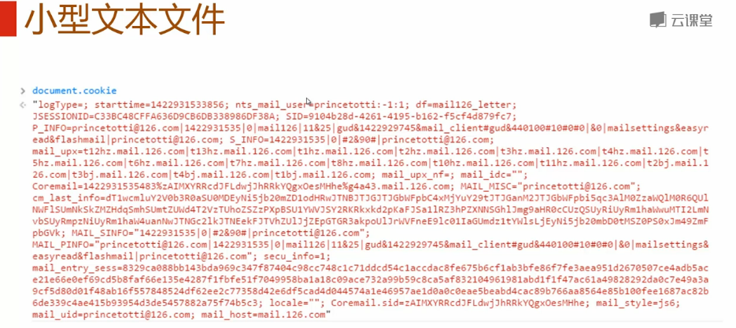
>大小在4kb左右，由键值对构成，用分号（；）跟空格隔开。

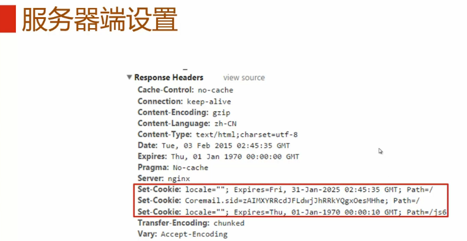
 
 - 浏览器端
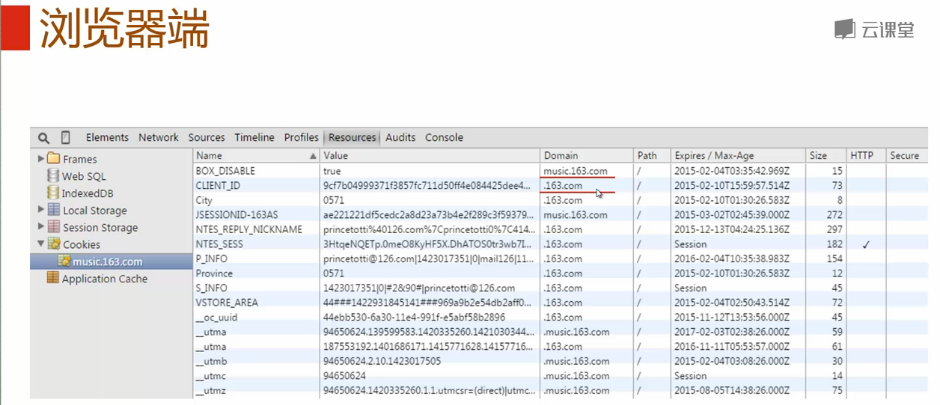

 - 属性
 
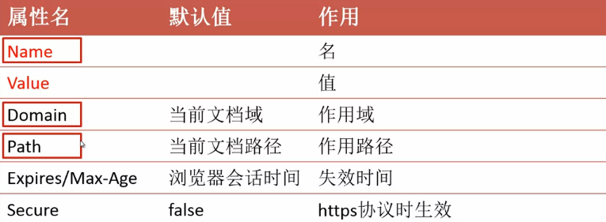

>Expires表示时间戳，Max-Age是表示以毫秒为单位的时间长度。

 - 作用域
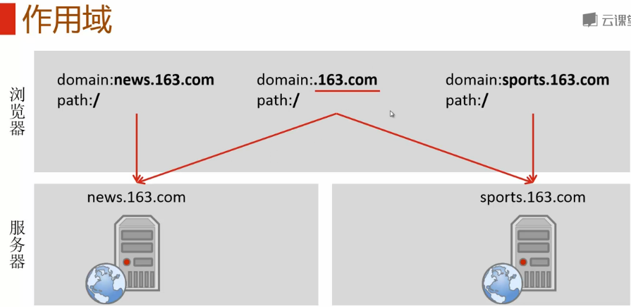

 - 作用路径
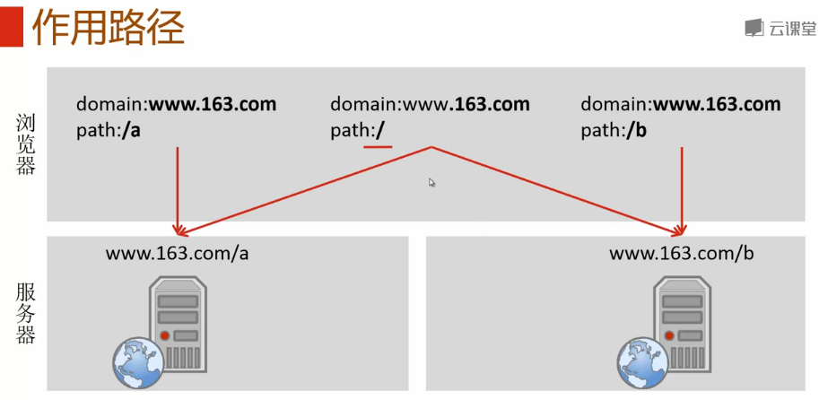

 - 读取

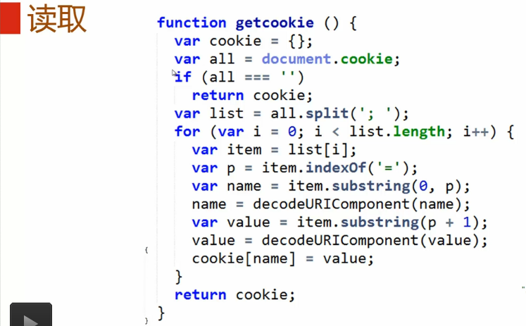

 - 设置/修改
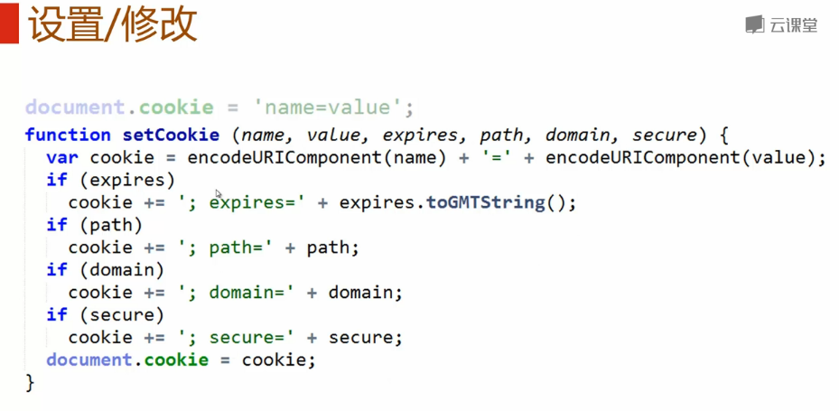

 - 删除
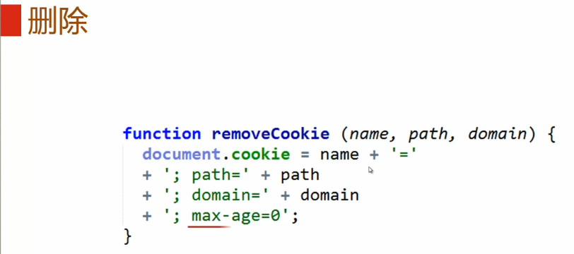
>name\path\domain是唯一标示一个cookie的。

 - 缺陷
	 - 流量代价
	 - 安全性问题
	 - 大小限制

##storage
 - localStorage
	有效期是永久
	
 - sessionStorage
	有效期是浏览器的会话时间

 - 作用域
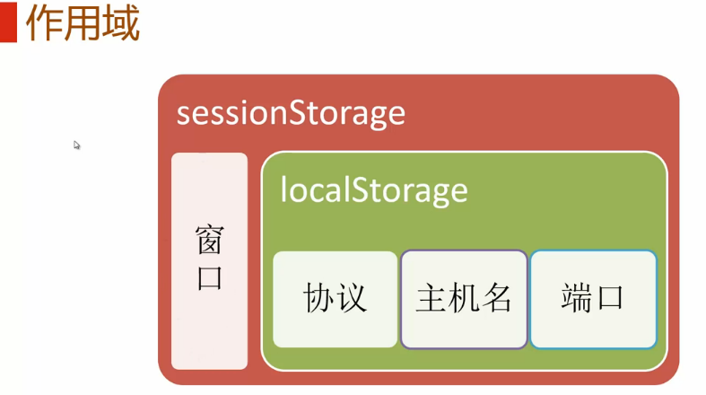

 - 大小
**5MB**

 - javascript对象
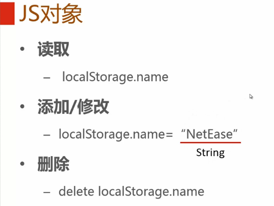

 - API
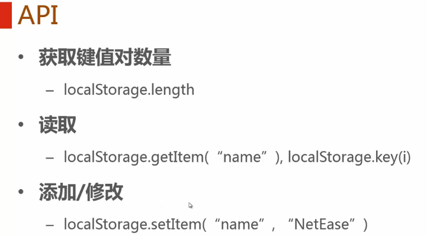
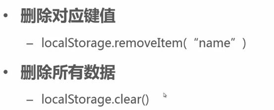

 - 实例
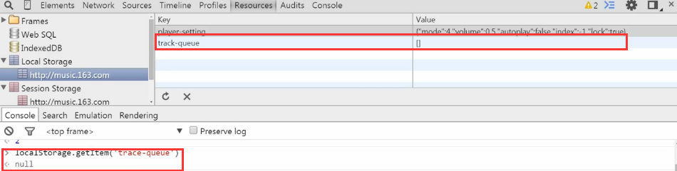
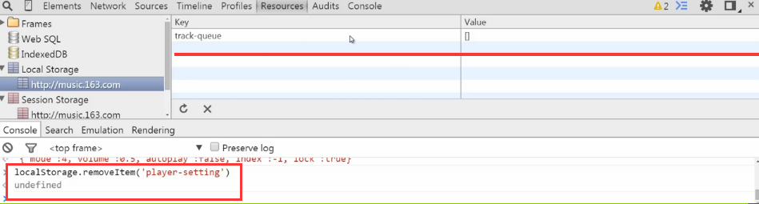
