**目录**：

>笔记持续更新，原地址 : https://github.com/Niefee/Wangyi-Note ;

<ul>
<li><a href="#数据通信">数据通信</a><ul>
<li><a href="#http协议">HTTP协议</a><ul>
<li><a href="#http事务">HTTP事务</a></li>
<li><a href="#请求报文格式">请求报文格式</a></li>
<li><a href="#相应报文格式">相应报文格式</a></li>
<li><a href="#常用http方法">常用HTTP方法</a></li>
<li><a href="#url构成">URL构成</a></li>
<li><a href="#http版本">HTTP版本</a></li>
<li><a href="#常见http状态码">常见HTTP状态码</a></li>
</ul>
</li>
<li><a href="#ajax">ajax</a><ul>
<li><a href="#ajax概念">Ajax概念</a></li>
<li><a href="#ajax通信流程">Ajax通信流程</a></li>
<li><a href="#ajax调用示例">Ajax调用示例</a></li>
<li><a href="#open">open</a></li>
<li><a href="#setrequestheader">setRequestHeader</a></li>
<li><a href="#send">send</a></li>
<li><a href="#请求参数序列化">请求参数序列化</a></li>
<li><a href="#get请求">GET请求</a></li>
<li><a href="#post请求">post请求</a></li>
<li><a href="#同源策略">同源策略</a></li>
<li><a href="#跨域资源访问">跨域资源访问</a></li>
<li><a href="#cors">CORS</a></li>
<li><a href="#其他跨域技术">其他跨域技术</a><ul>
<li><a href="#frame代理">Frame代理</a></li>
<li><a href="#jsonp">JSONP</a></li>
</ul>
</li>
</ul>
</li>
</ul>
</li>
</ul>
#数据通信
##HTTP协议
###HTTP事务
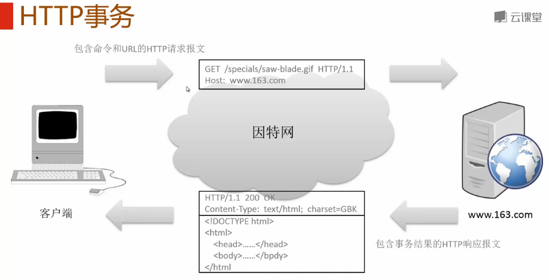
###请求报文格式
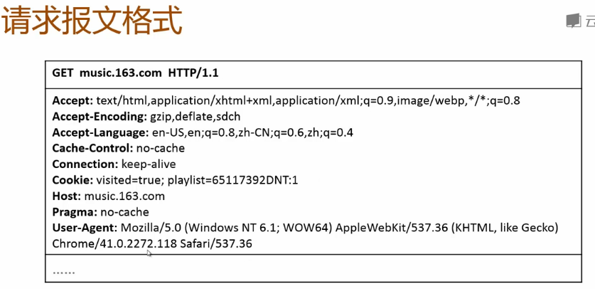
###相应报文格式
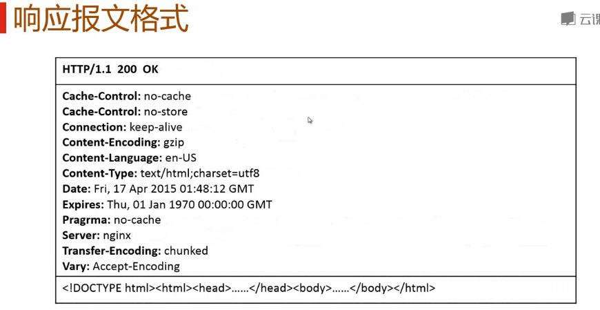
###常用HTTP方法
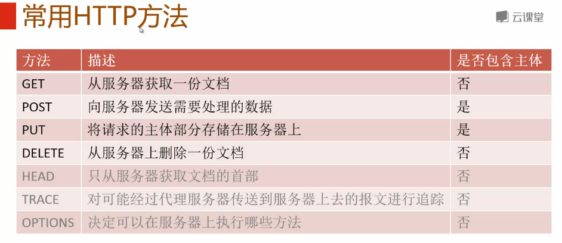
###URL构成
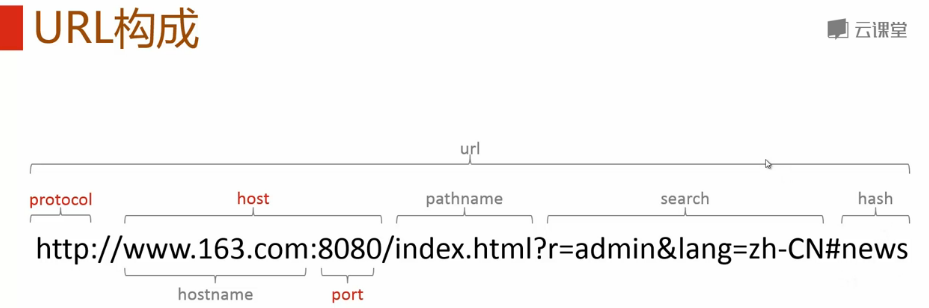
###HTTP版本
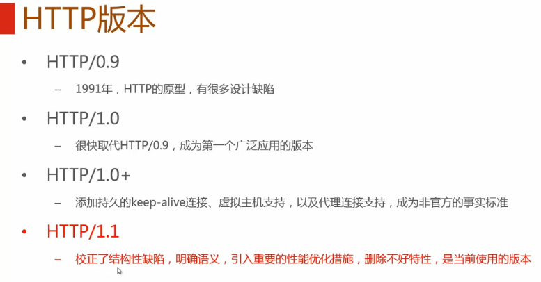
###常见HTTP状态码
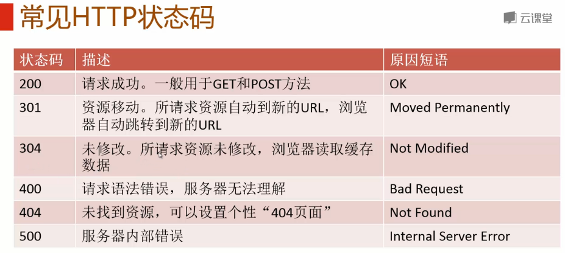
##ajax
###Ajax概念

###Ajax通信流程
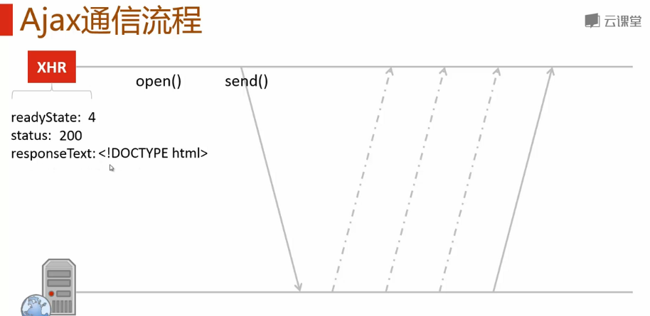
###Ajax调用示例
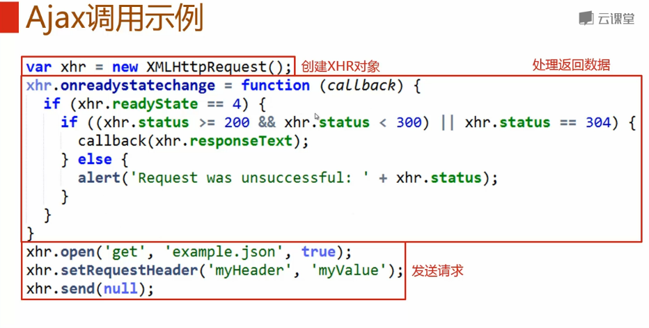
>成功返回时会调用 load事件。

###open
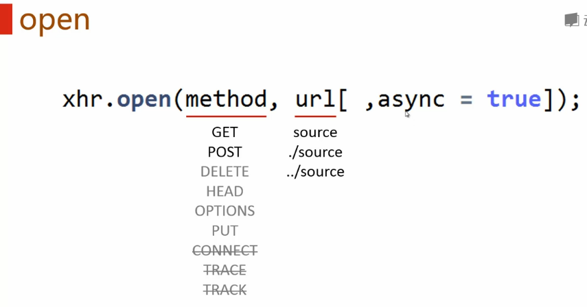
###setRequestHeader
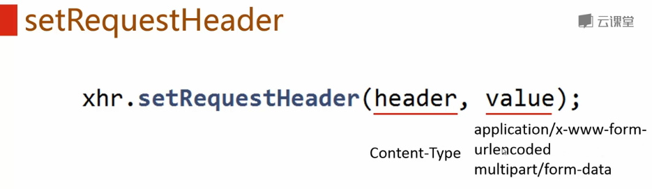
###send
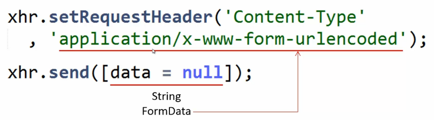
###请求参数序列化
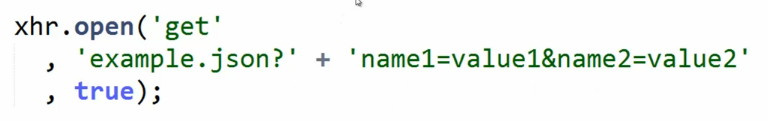
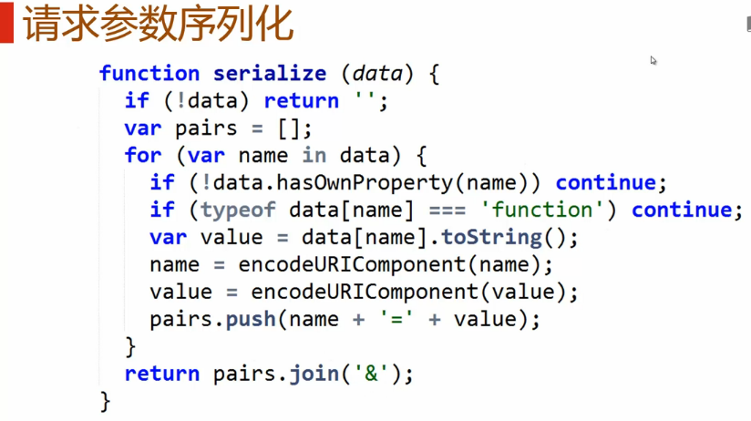
###GET请求
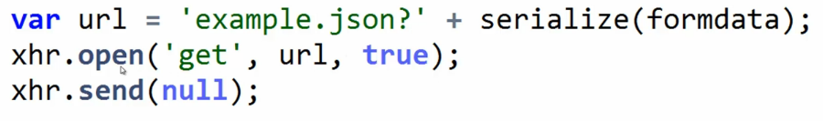
###post请求
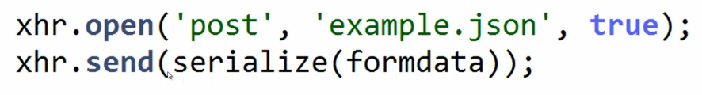
###同源策略
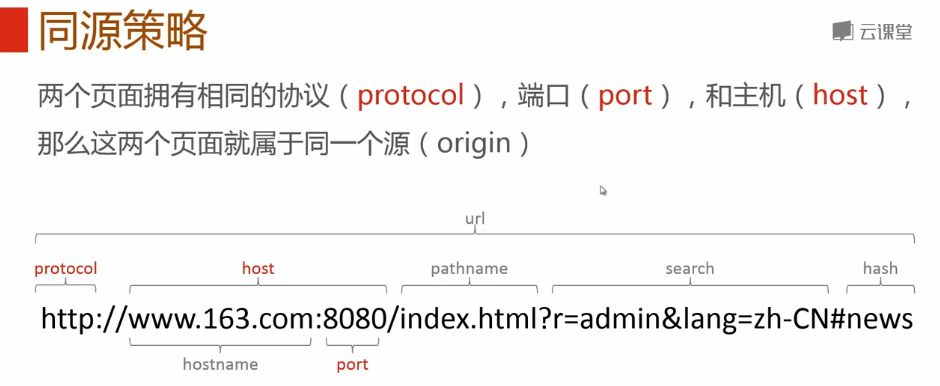
###跨域资源访问
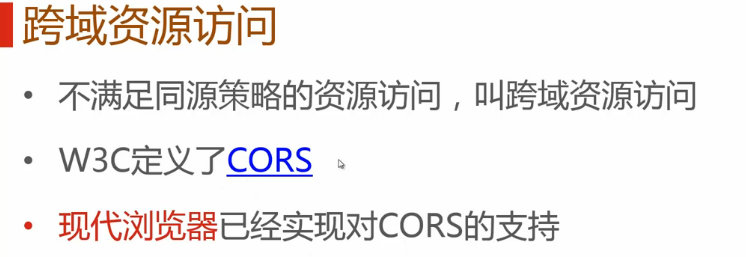
###CORS
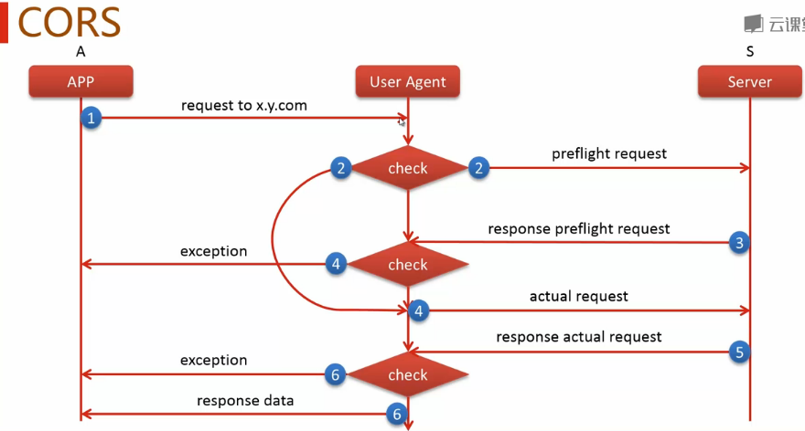
###其他跨域技术
####Frame代理
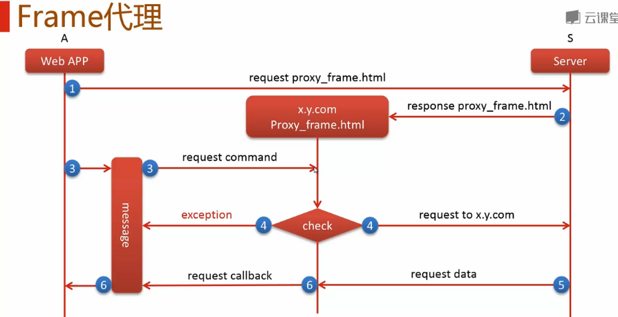
####JSONP
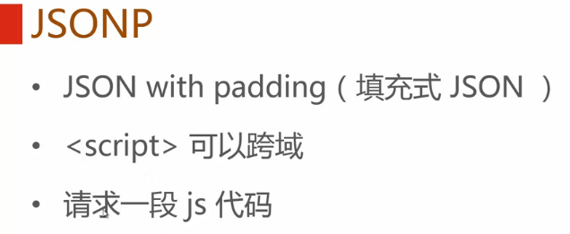
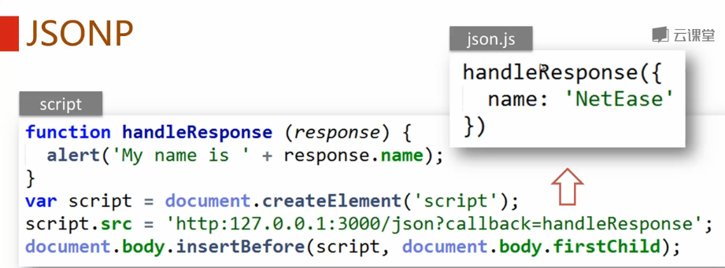
