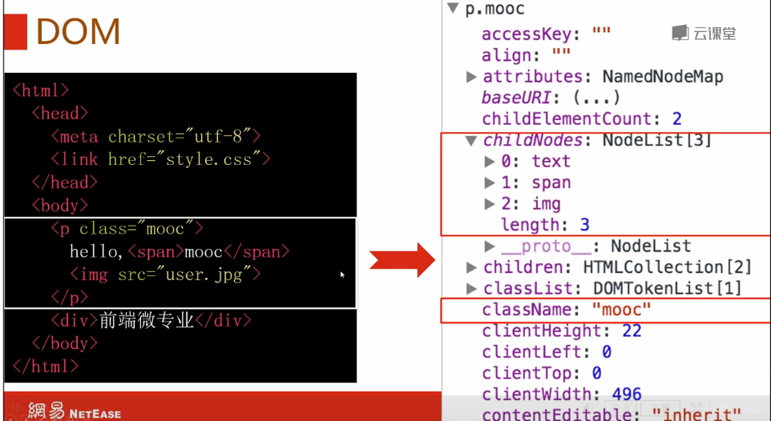
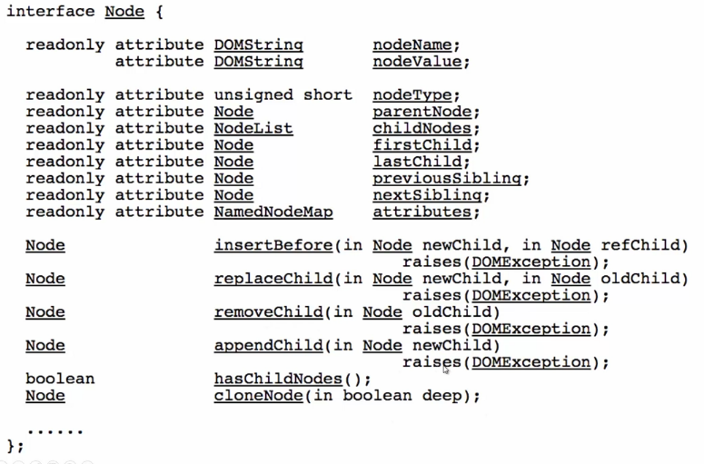
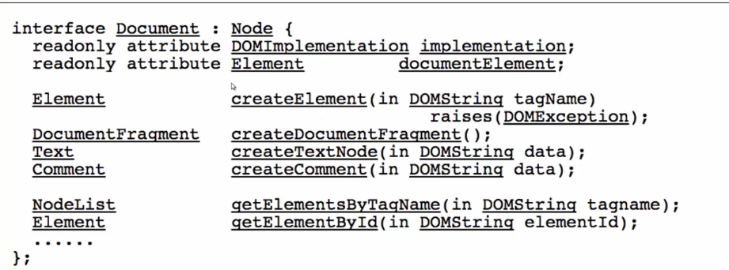
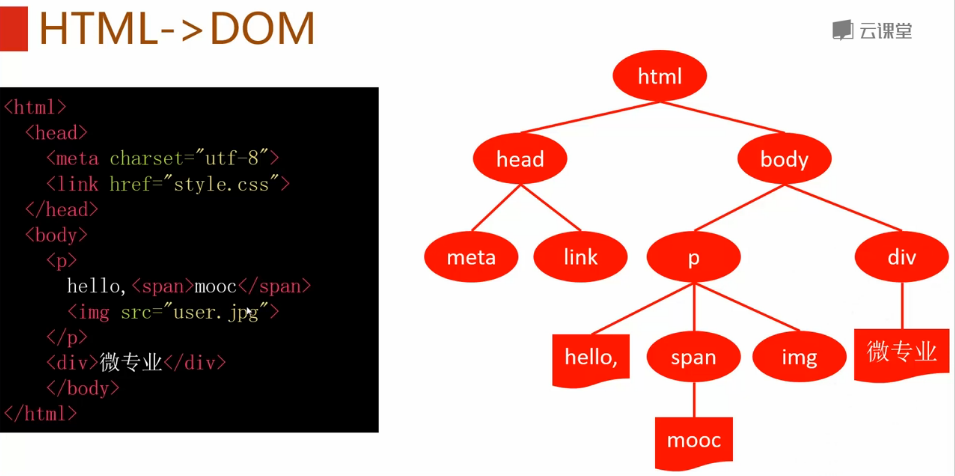
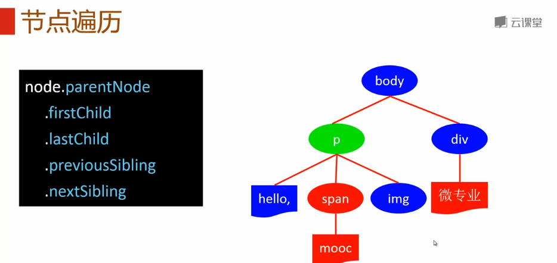
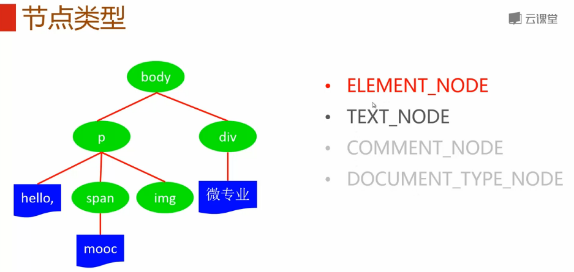
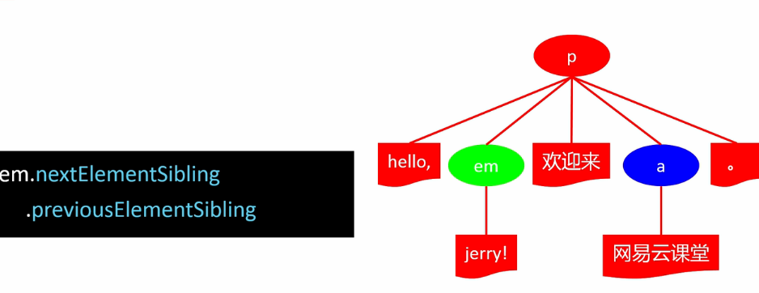

**目录**：

>笔记持续更新，原地址 : https://github.com/Niefee/Wangyi-Note ;

<ul>
<li><a href="#文档树">文档树</a><ul>
<li><a href="#dom">DOM</a></li>
<li><a href="#节点遍历">节点遍历</a></li>
<li><a href="#节点类型">节点类型</a></li>
<li><a href="#元素遍历">元素遍历</a></li>
</ul>
</li>
</ul>
#文档树
##DOM
>文档对象模型（Document Object Model，简称DOM）

 - API规范

 - DOM
	 - DOM Core
	 - DOM HTML
	 - DOM Style
	 - DOM Event

 - HTML - > DOM

##节点遍历

##节点类型

##元素遍历

