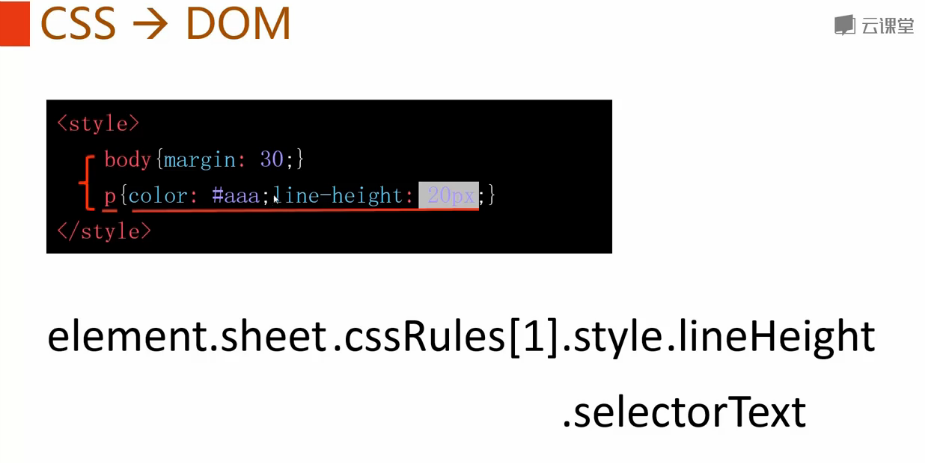
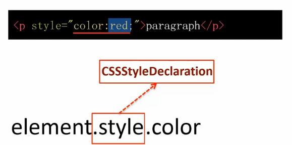
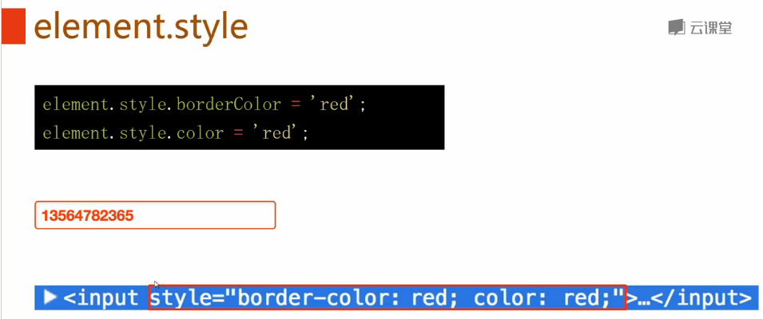
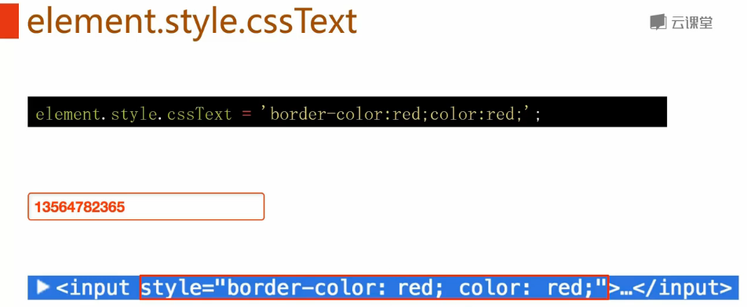
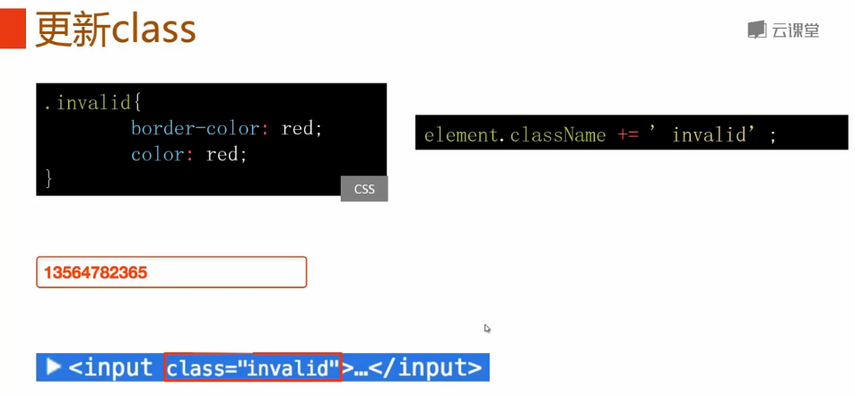
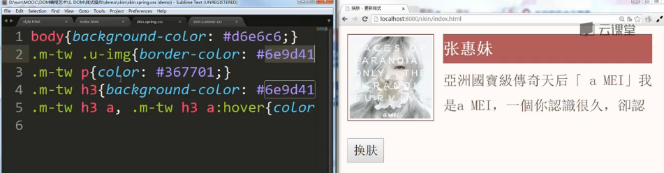
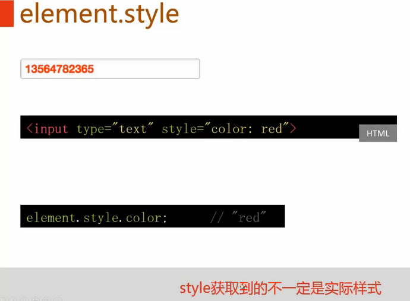
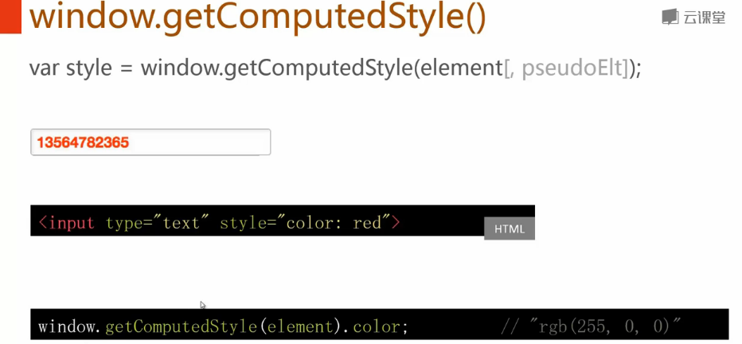
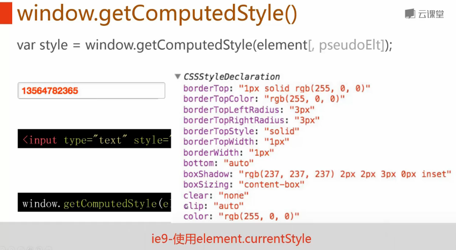
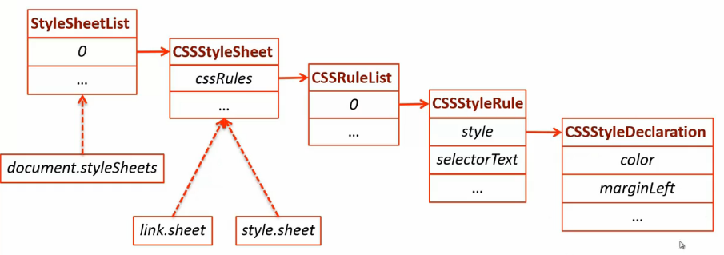

**目录**：

>笔记持续更新，原地址 : https://github.com/Niefee/Wangyi-Note ;

<ul>
<li><a href="#样式操作">样式操作</a><ul>
<li><a href="#cssdom">CSS→DOM</a></li>
<li><a href="#elementstyle">element.style</a></li>
<li><a href="#elementsytlecsstext">element.sytle.cssText</a></li>
<li><a href="#更新class">更新class</a></li>
<li><a href="#换肤">换肤</a></li>
<li><a href="#elementstyle">element.style</a></li>
<li><a href="#windowgetcomputedstyle">window.getComputedStyle()</a></li>
<li><a href="#css-dom-overview">CSS DOM overview</a></li>
</ul>
</li>
</ul>
#样式操作
##CSS→DOM

##element.style

##element.sytle.cssText

##更新class

##换肤
 - 一次更换多个样式

##element.style

##window.getComputedStyle

>ie9方法：
>

##CSS DOM overview

