**目录**：

>笔记持续更新，原地址 : https://github.com/Niefee/Wangyi-Note ;

<ul>
<li><a href="#节点操作">节点操作</a><ul>
<li><a href="#获取节点">获取节点</a><ul>
<li><a href="#getelementbyid">getElementById</a></li>
<li><a href="#gerelementbytabname">gerElementByTabName</a></li>
<li><a href="#getelementbyclassname">getElementByClassName</a></li>
<li><a href="#queryselector-all">querySelector /All</a></li>
</ul>
</li>
<li><a href="#创建节点">创建节点</a><ul>
<li><a href="#createelement">createElement</a></li>
</ul>
</li>
<li><a href="#修改节点">修改节点</a></li>
<li><a href="#添加节点">添加节点</a><ul>
<li><a href="#appendchild">appendChild</a></li>
<li><a href="#insertbefore">insertBefore</a></li>
</ul>
</li>
<li><a href="#删除节点">删除节点</a><ul>
<li><a href="#removechild">removeChild</a></li>
</ul>
</li>
<li><a href="#innerhtml">innerHTML</a></li>
</ul>
</li>
</ul>
#节点操作
##获取节点
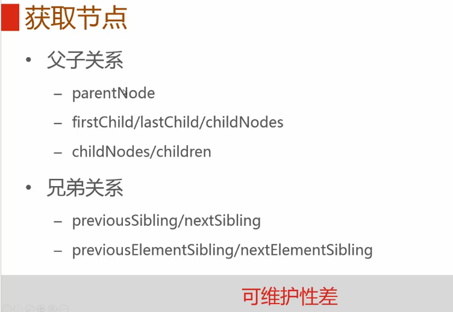
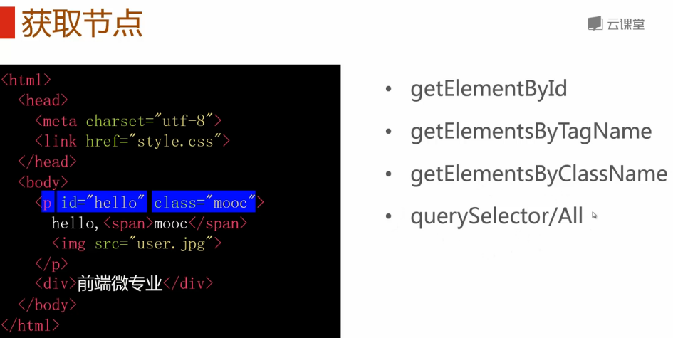
>通过DOM 获取节点，可维护性更强。

###getElementById
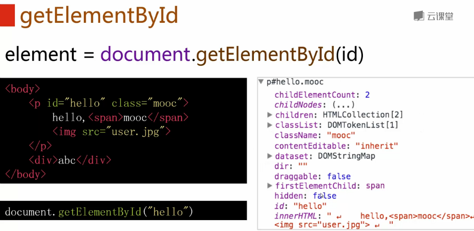

###gerElementByTabName
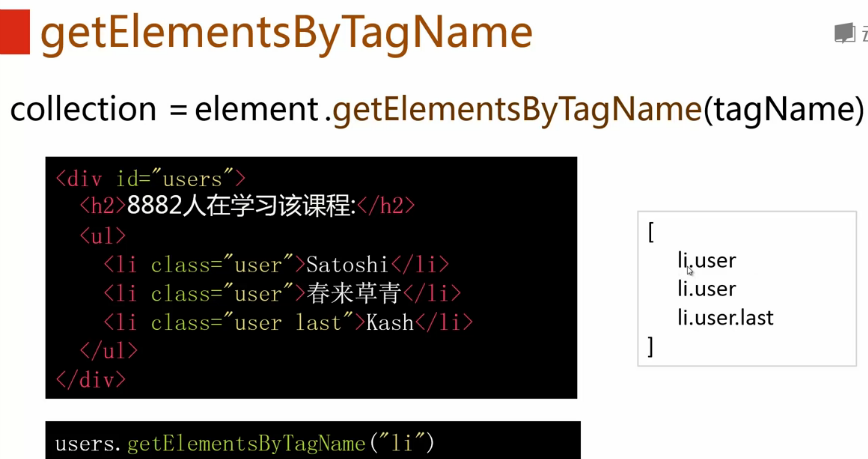
**可通过下标获取指定元素**

>这里获取去了 **li.user.last ** 这个节点。

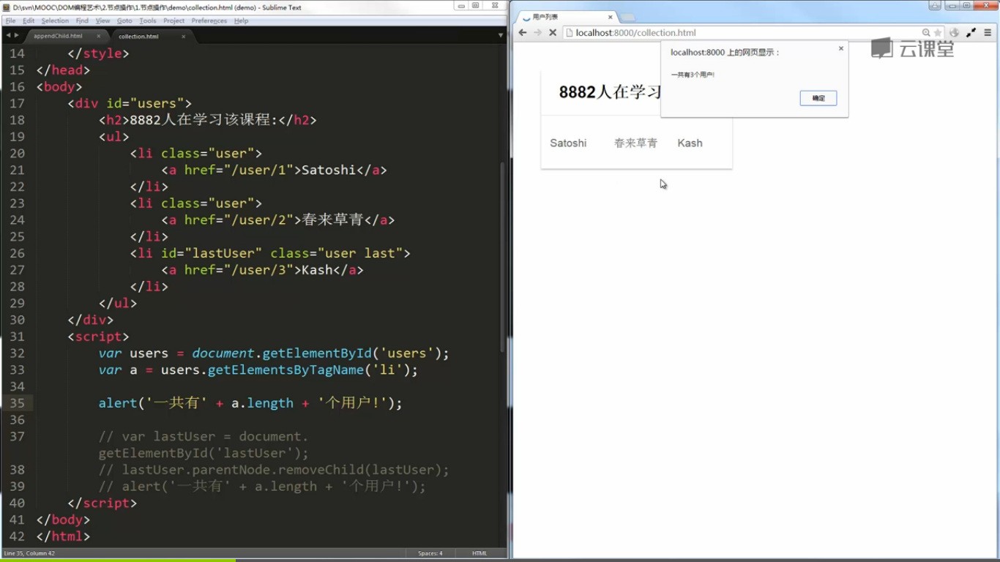
>集合是活的。

###getElementByClassName
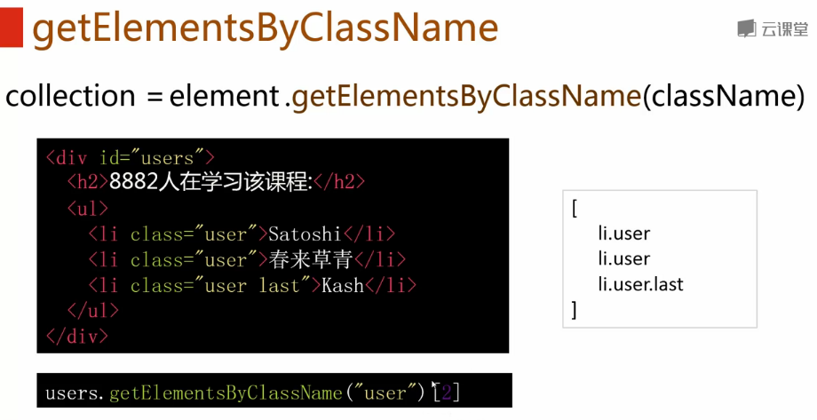

**就版本兼容方案**
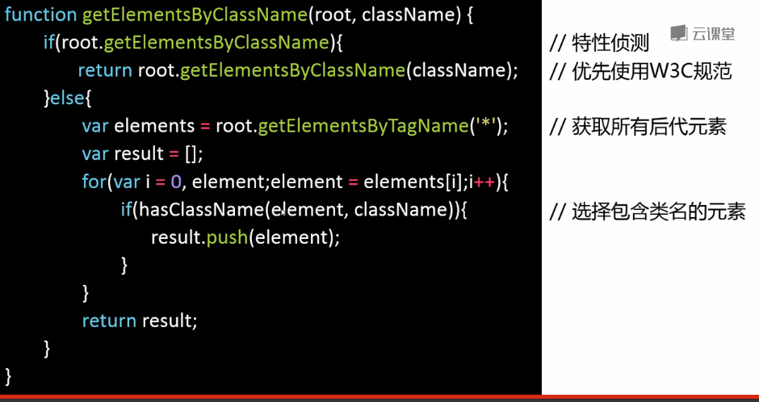

###querySelector /All
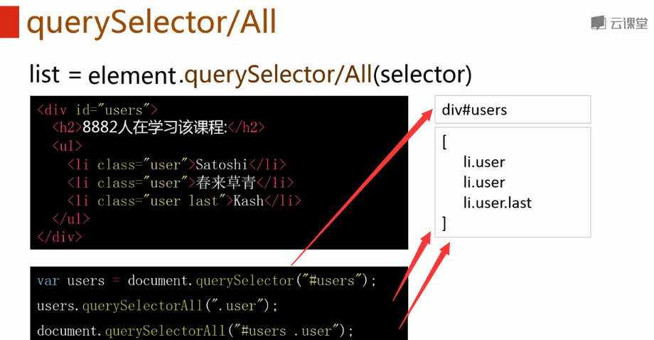
>静态的选择器。

 - 小结
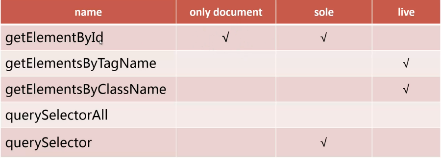

##创建节点
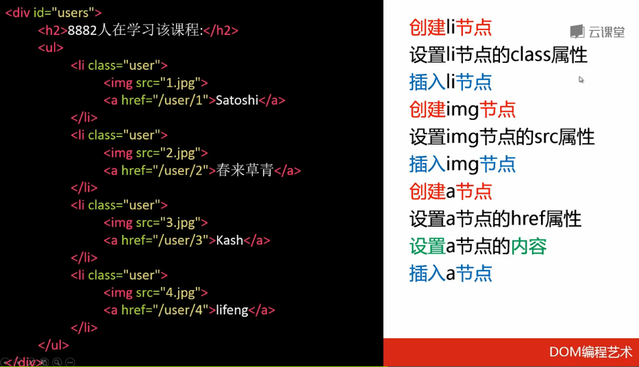
###createElement
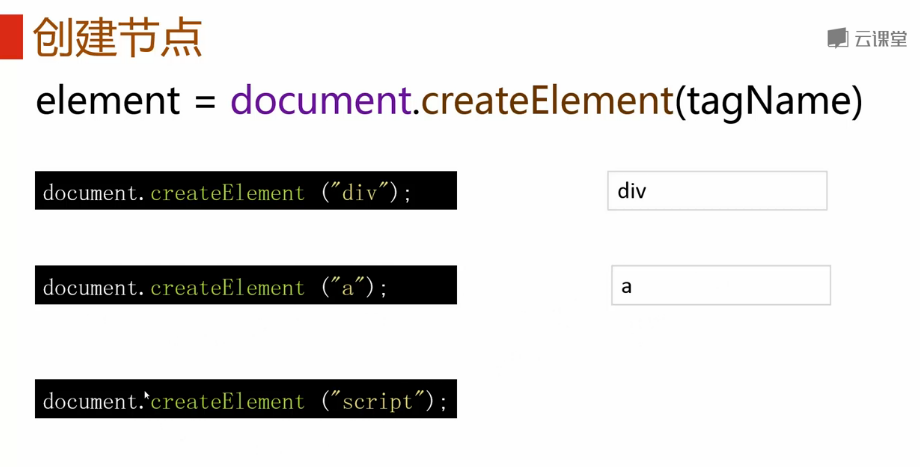
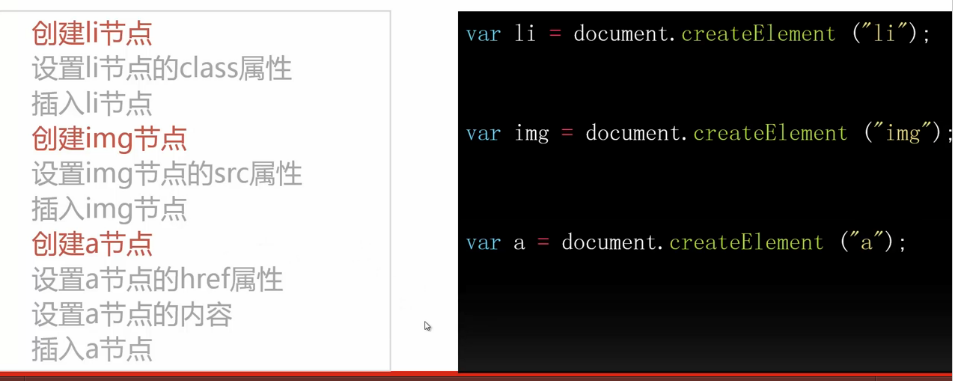
##修改节点
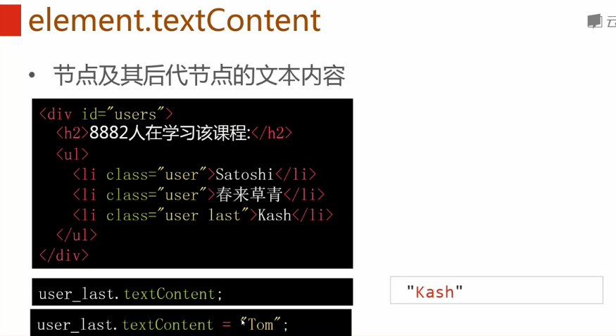
>Kash变成了Tom，ie9及以下不支持

可以使用**element.innerText**替代，但火狐不支持。

解决方案：
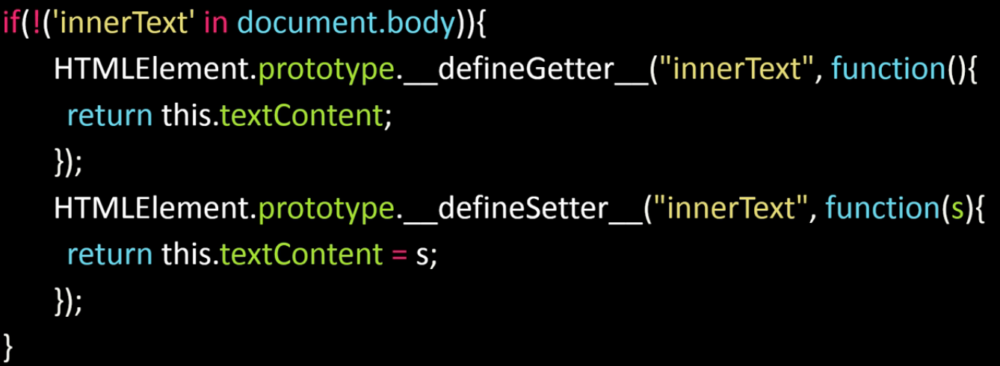

##添加节点
###appendChild
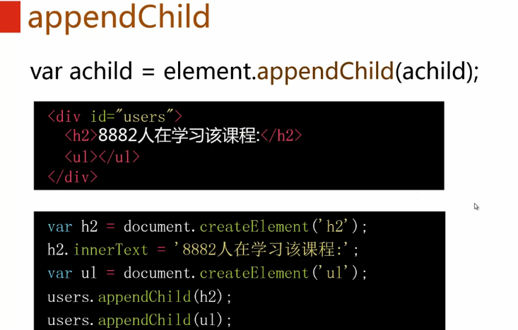
###insertBefore
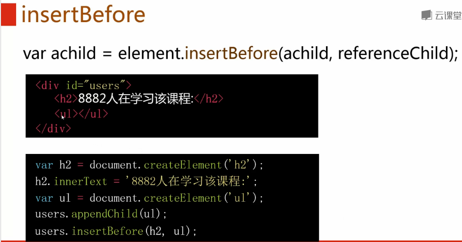

##删除节点
###removeChild
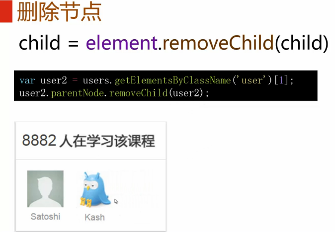

##innerHTML
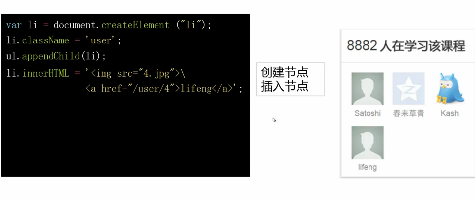

 - 安全问题
 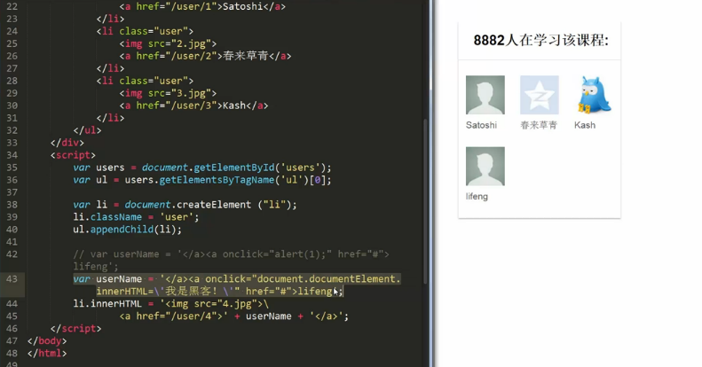

>建议只用于新节点。

