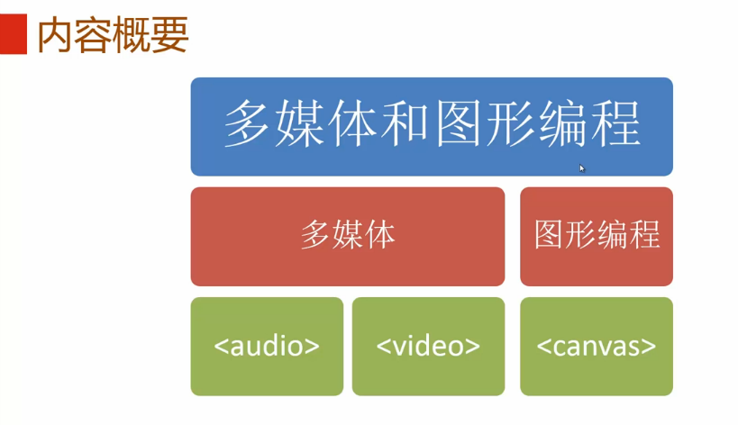
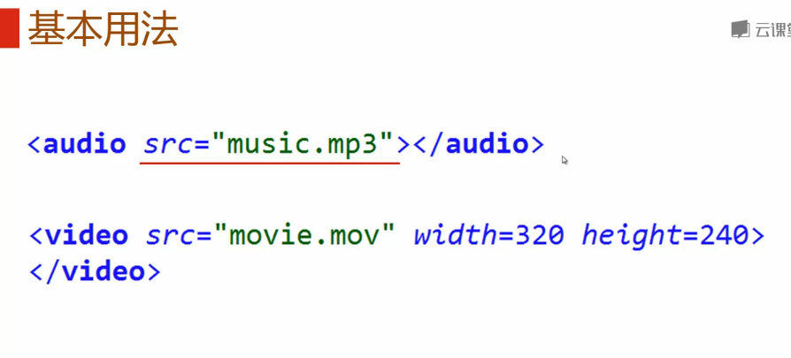
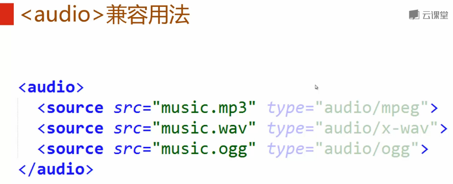
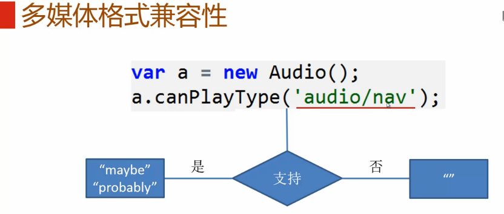
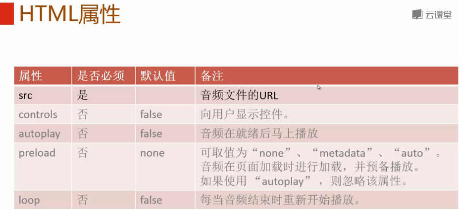
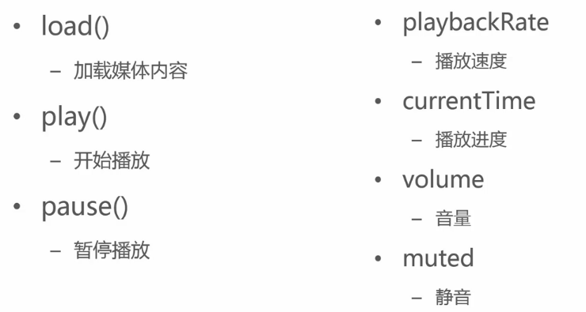
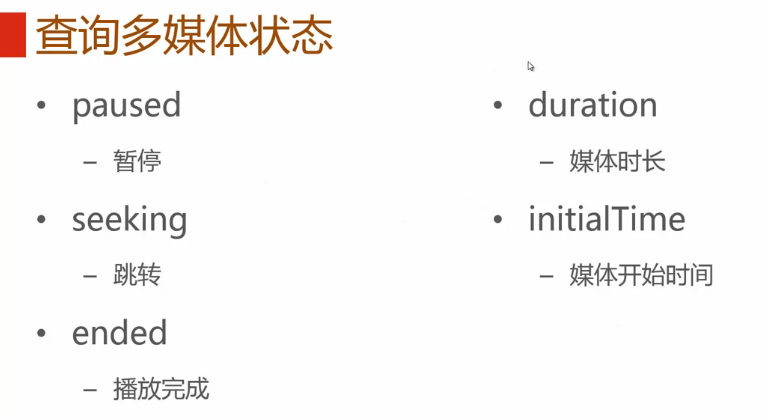
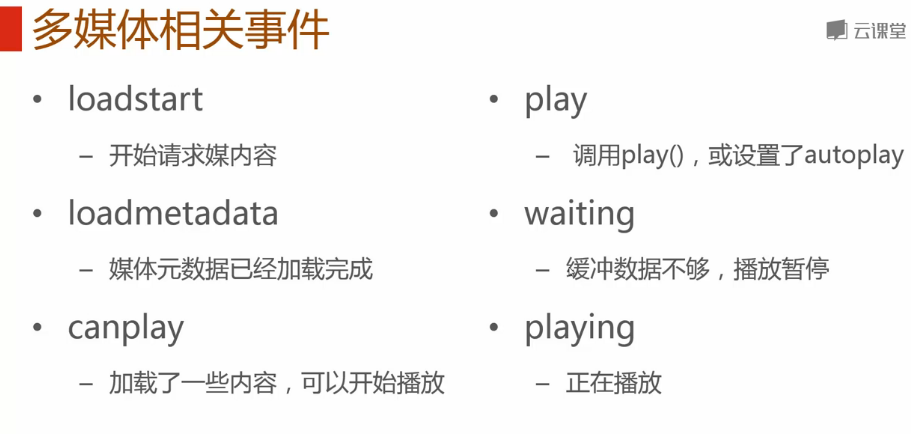

**目录**：

>笔记持续更新，原地址 : https://github.com/Niefee/Wangyi-Note ;

<ul>
<li><a href="#音频与视频">音频与视频</a><ul>
<li><a href="#基本用法">基本用法</a></li>
<li><a href="#html属性">HTML属性</a></li>
<li><a href="#控制多媒体播放">控制多媒体播放</a></li>
<li><a href="#查询多媒体状态">查询多媒体状态</a></li>
<li><a href="#对媒体相关事件">对媒体相关事件</a></li>
<li><a href="#扩展信息">扩展信息</a></li>
</ul>

#音频与视频

##基本用法

 - < audio>兼容用法

 - < video>兼容 用法

 - 多媒体格式兼容性

##HTML属性

##控制多媒体播放

##查询多媒体状态

##对媒体相关事件

##扩展信息
音频：http://en.wikipedia.org/wiki/HTML5_Audio#Supported_audio_coding_formats

视频：http://en.wikipedia.org/wiki/HTML5_video#Browser_support

事件列表：http://www.w3.org/wiki/HTML/Elements/audio#Media_Events

W3C官方定义：http://webaudio.github.io/web-audio-api/

mozilla官方教程：https://developer.mozilla.org/en-US/docs/Web/API/Web_Audio_API

第三方教程：http://www.html5rocks.com/en/tutorials/webaudio/intro/,http://webaudioapi.co