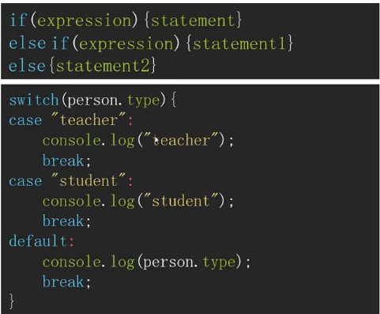
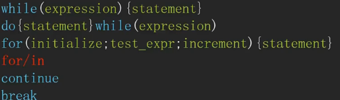
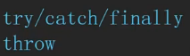
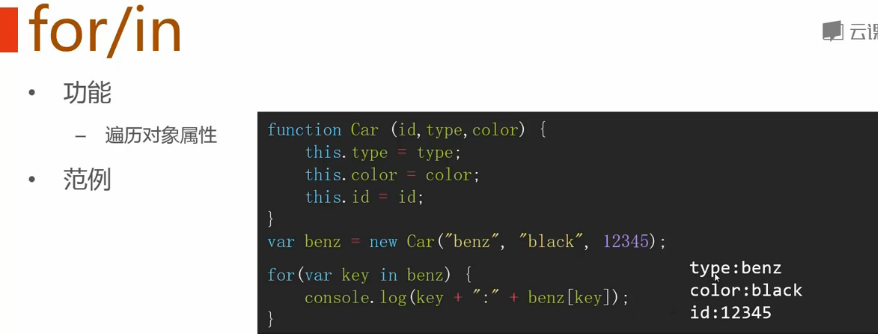
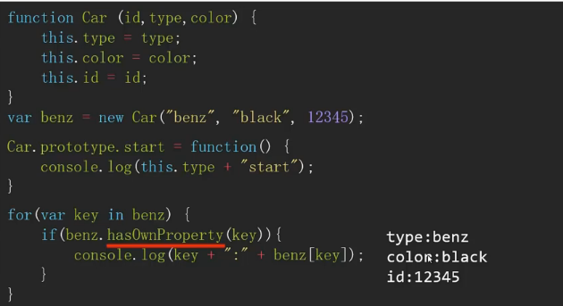
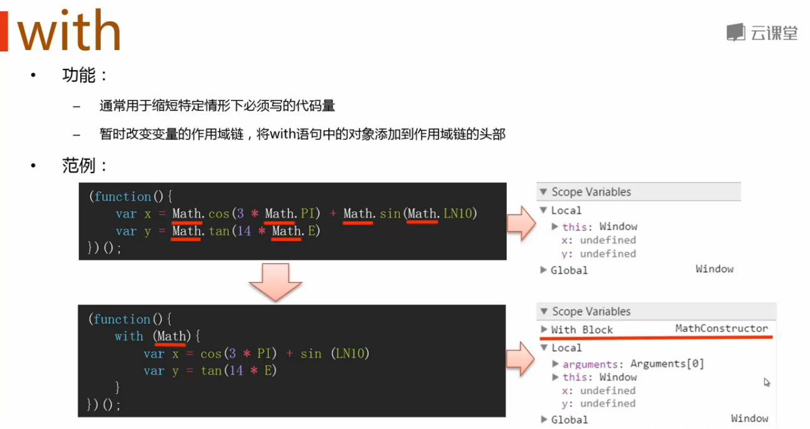
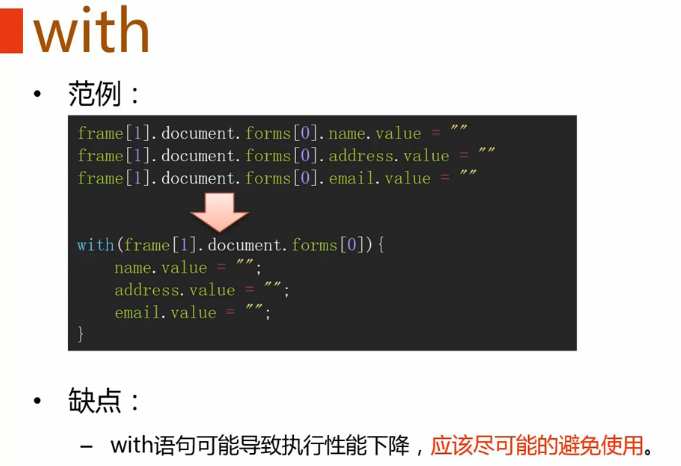

#简介

>笔记持续更新，原地址:  https://github.com/Niefee/Wangyi-Note ;

<ul>
<li><a href="#javascript语句">javascript语句</a><ul>
<li><a href="#条件控制语句">条件控制语句</a></li>
<li><a href="#循环控制语句">循环控制语句</a></li>
<li><a href="#异常处理语句">异常处理语句</a></li>
<li><a href="#with语句">with语句</a></li>
<li><a href="#forin">for/in</a></li>
<li><a href="#with">with</a></li>
</ul>
</li>
</ul>
#javascript语句

##条件控制语句

##循环控制语句

##异常处理语句

##with语句

##for/in

##with

