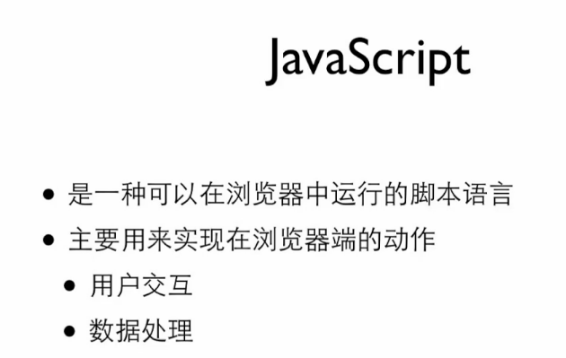
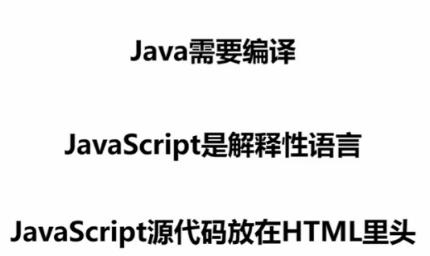
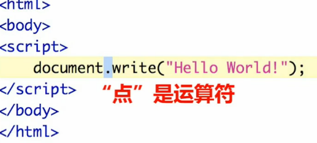
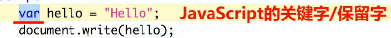
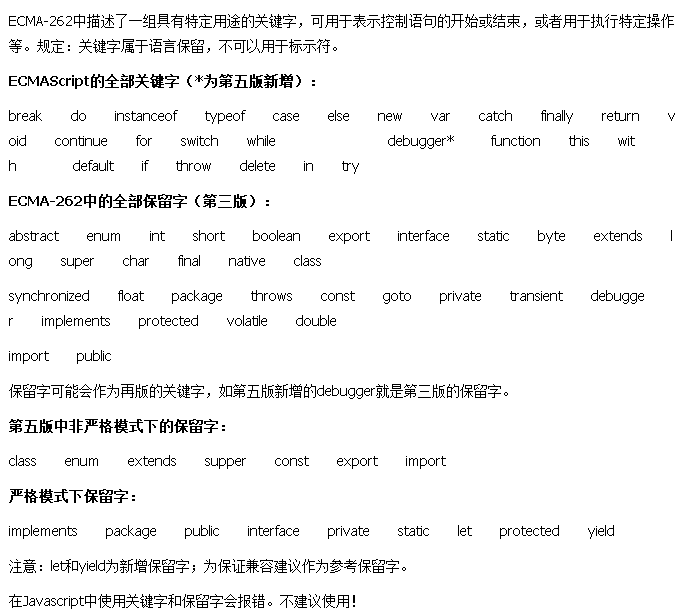

**目录**：

>笔记持续更新，原地址 :https ://github.com/Niefee/Wangyi-Note ;

<ul>
<li><a href="#什么是javascript">什么是javascript</a><ul>
<li><a href="#保留字与关键字的对比">保留字与关键字的对比</a></li>
</ul>
</li>
</ul>

#什么是javascript

>"点（.）"是一个运算符，表示做动作的符号
>上面表示document做write动作。
>"Hello World"是一个字符串。

>关键字保留字不能用来命名。

##保留字与关键字的对比
保留字(Reserved Words)一般是等同于关键字(Keywords)的。
从字面含义上理解，保留字是语言中**已经定义过的字**，使用者**不能再将这些字作为变量名或过程名使用**。而关键字则指在**语言中有特定含义**，成为**语法中一部分的那些字**。在一些语言中，一些保留字可能并没有应用于当前的语法中，这就成了保留字与关键字的区别。一般出现这种情况可能是由于考虑扩展性。例如，Javascript有一些未来保留字，如abstract、double、goto等等。它可能未来要增加直接跳转的功能，那么为了使当前版本的程序代码能向后兼容，所以不允许使用goto作为变量名，但当前版本的语言并不支持goto的直接跳转功能，它目前就不是关键字。

