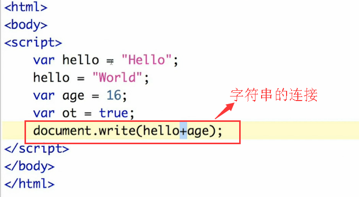
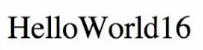
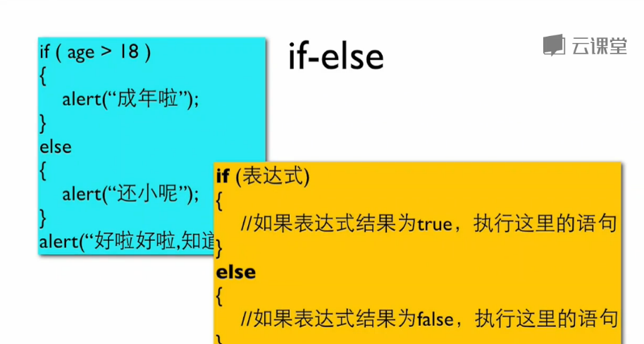
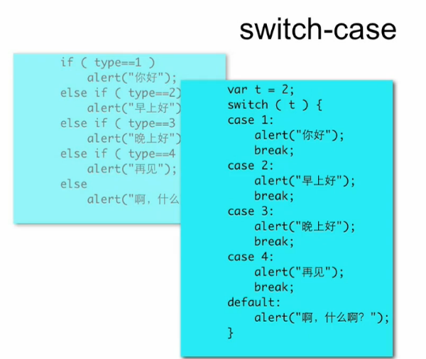
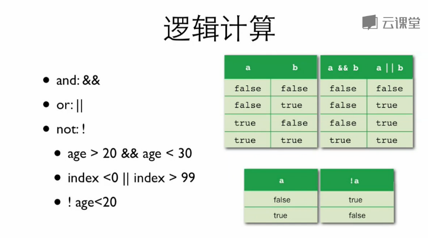
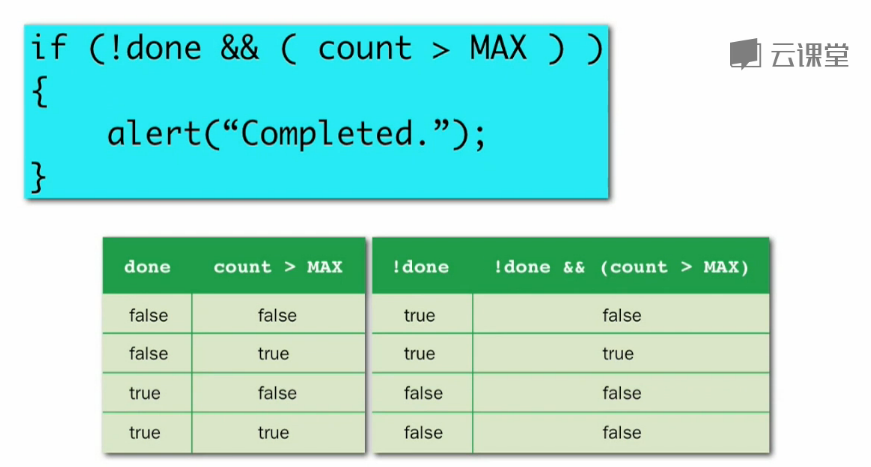
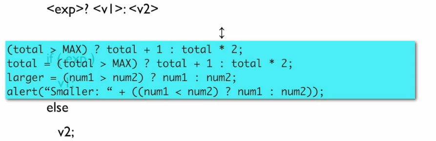

**目录**：

>笔记持续更新，原地址 :https://github.com/Niefee/Wangyi-Note ;

<ul>
    <li>
        <a href="#判断与计算">判断与计算</a>
        <ul>
            <li><a href="#关系运算符">关系运算符</a></li>
            <li><a href="#判断">判断</a></li>
            <li><a href="#逻辑运算">逻辑运算</a></li>
            <li><a href="#条件运算符">条件运算符</a></li>
        </ul>
    </li>
</ul>

##判断与计算

>结果如下：

###关系运算符

>关系运算符请看：http://www.w3school.com.cn/js/pro_js_operators_relational.asp

>字符串字母或数字的比较会转化成数字再比较，头位相同，比较第二位一直 下去。参看：[ASCII码表](http://www.asciima.com/)

###判断

###逻辑运算

>所有的逻辑运算符的优先级都低于关系运算符。

###条件运算符

>**variable = boolean_expression ? true_value : false_value;**
>该表达式主要是根据 boolean_expression 的计算结果有条件地为变量赋值。如果 Boolean_expression 为 true，就把 true_value 赋给变量；如果它是 false，就把 false_value 赋给变量。