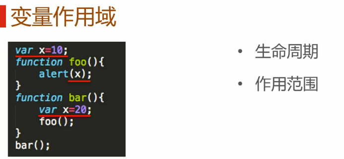
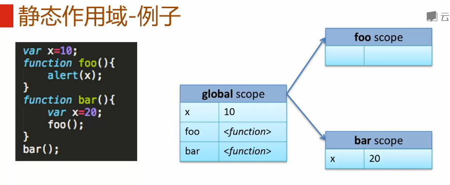
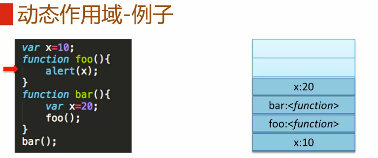
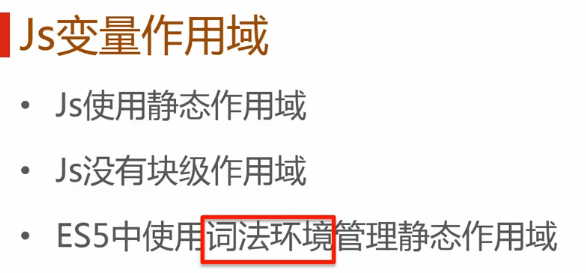
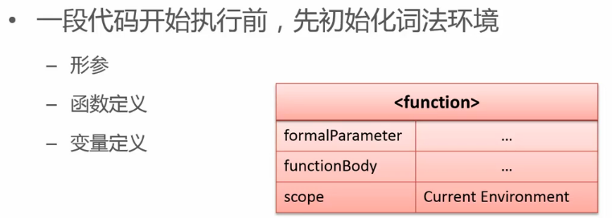
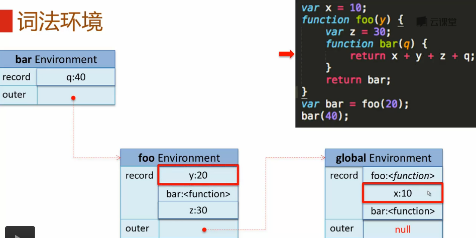
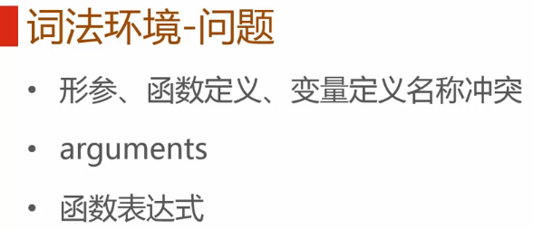
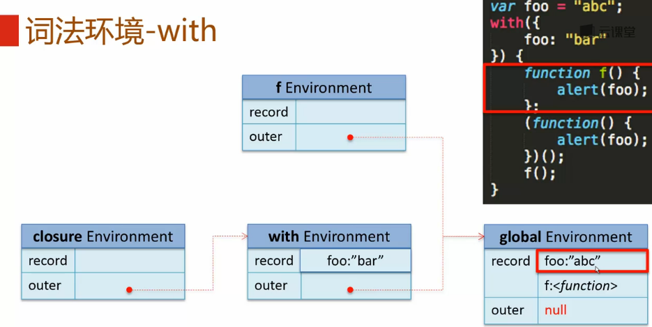
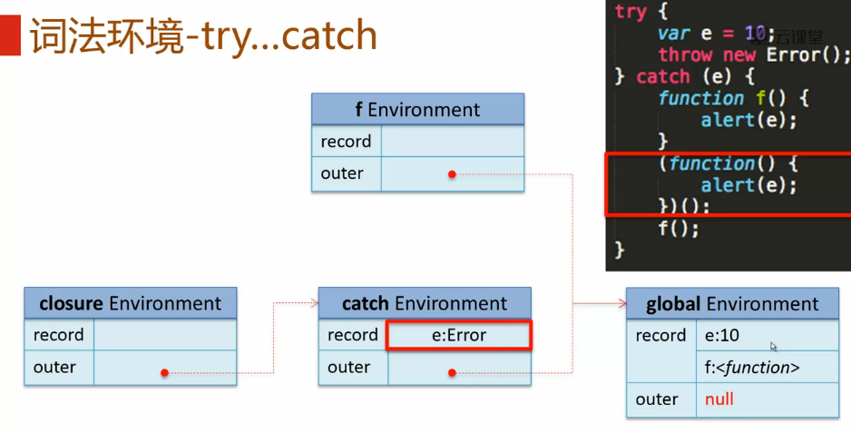
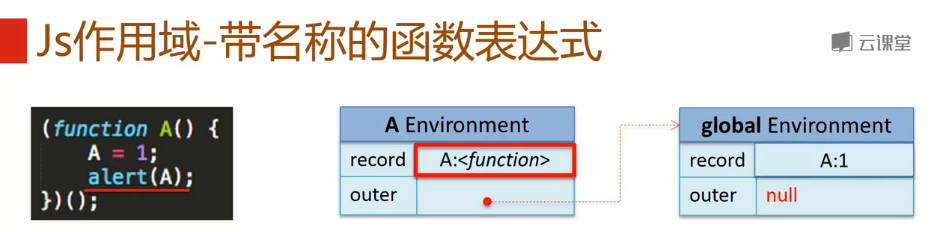

#简介

>笔记持续更新，原地址:  https://github.com/Niefee/Wangyi-Note ;

<ul>
<li><a href="#变量作用域">变量作用域</a><ul>
<li><a href="#静态作用域">静态作用域</a><ul>
<li><a href="#例子">例子</a></li>
</ul>
</li>
<li><a href="#动态作用域">动态作用域</a></li>
<li><a href="#javascript变量作用域">javascript变量作用域</a><ul>
<li><a href="#词法环境">词法环境</a><ul>
<li><a href="#词法环境-问题">词法环境-问题</a><ul>
<li><a href="#with">with</a></li>
<li><a href="#词法环境-try-catch">词法环境-try-catch</a></li>
<li><a href="#javascript作用域-带名称的函数表达式">javascript作用域-带名称的函数表达式</a></li>
</ul>
</li>
</ul>
</li>
</ul>
</li>
</ul>
</li>
</ul>
#变量作用域

##静态作用域
 - 又称为词法作用域
 - 由程序定义的位置决定

###例子

>运行bar()的结果是10；

##动态作用域

##javascript变量作用域

###词法环境
- 组成
	- 环境记录（形参、变量、函数等）
	- 对外部词法环境的应用（outer）

####词法环境-问题

#####with

#####词法环境-try-catch

#####javascript作用域-带名称的函数表达式

