**目录**：

>笔记持续更新，原地址 :https : //github.com/Niefee/Wangyi-Note ;

<ul>
<li><a href="#基本语法">基本语法</a><ul>
<li><a href="#语法重点">语法重点</a></li>
<li><a href="#变量标识符">变量标识符</a></li>
<li><a href="#关键字和保留字">关键字和保留字</a></li>
<li><a href="#大小写敏感">大小写敏感</a></li>
<li><a href="#严格模式">严格模式</a></li>
<li><a href="#注释">注释</a></li>
</ul>
</li>
</ul>

#基本语法
##语法重点
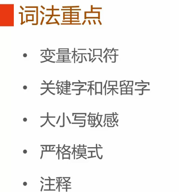
##变量标识符
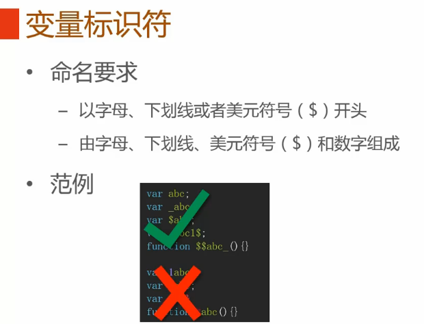
##关键字和保留字
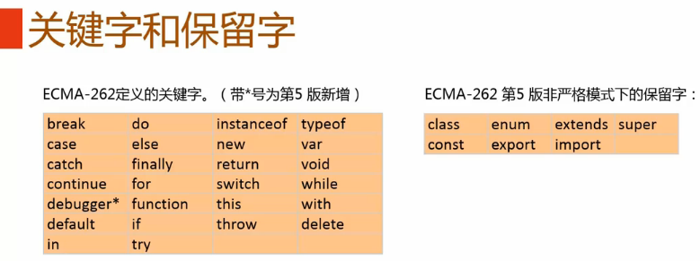
##大小写敏感
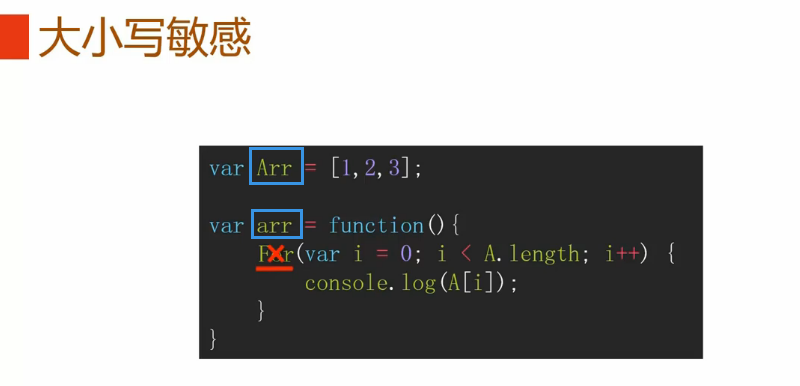
>arr跟Arr的涵义不一样。
>**For**是错误，正确的是**for**。
##严格模式
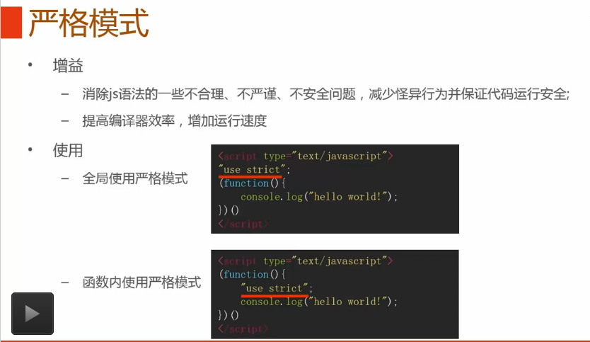
 - 区别
	 - 隐式声明或定义变量
	
	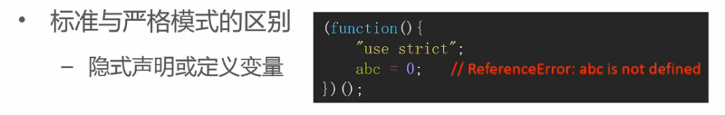
	 - 对象重名的属性
	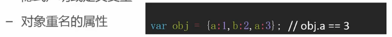
	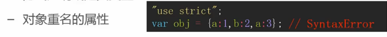
	 - arguments.callee
	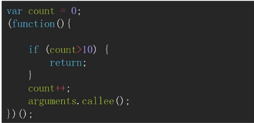
	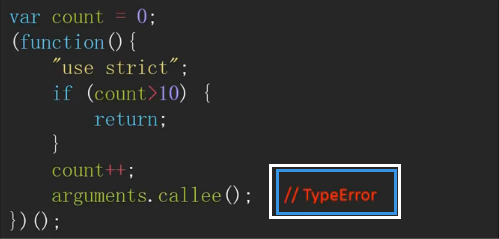
	 - with语句
	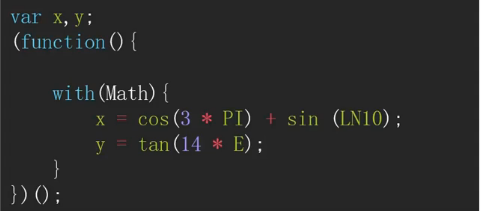
	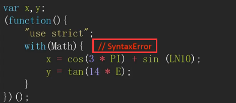
##注释
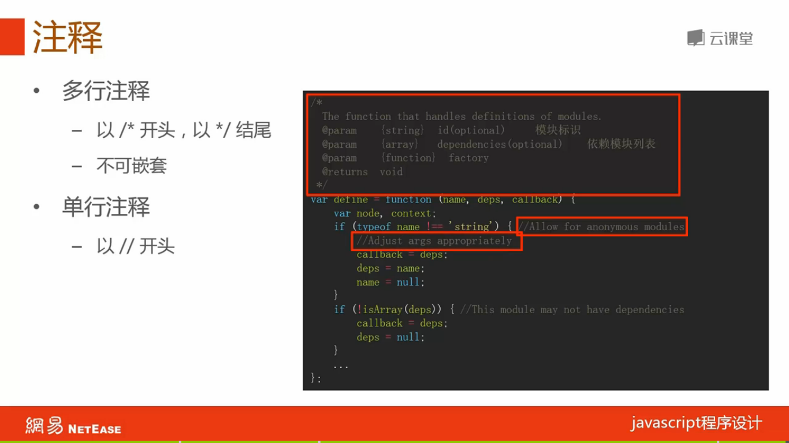

