#简介

>笔记持续更新，原地址:  https://github.com/Niefee/Wangyi-Note ;

<ul>
<li><a href="#循环函数与数组">循环函数与数组</a><ul>
<li><a href="#while">while</a></li>
<li><a href="#do-while">do-while</a></li>
<li><a href="#for循环">for循环</a></li>
<li><a href="#break与continue">break与continue</a></li>
<li><a href="#函数">函数</a></li>
<li><a href="#函数变量">函数变量</a></li>
<li><a href="#变量空间">变量空间</a></li>
<li><a href="#数组">数组</a></li>
<li><a href="#数组操作">数组操作</a></li>
</ul>
</li>
</ul>
#循环函数与数组
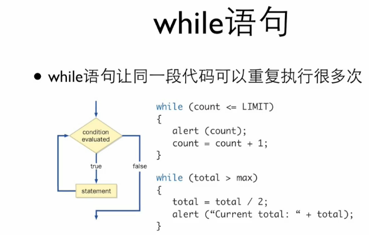
##while
 - 循环嵌套
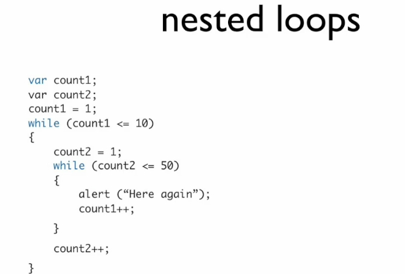

##do-while
 - 数字倒转的算法
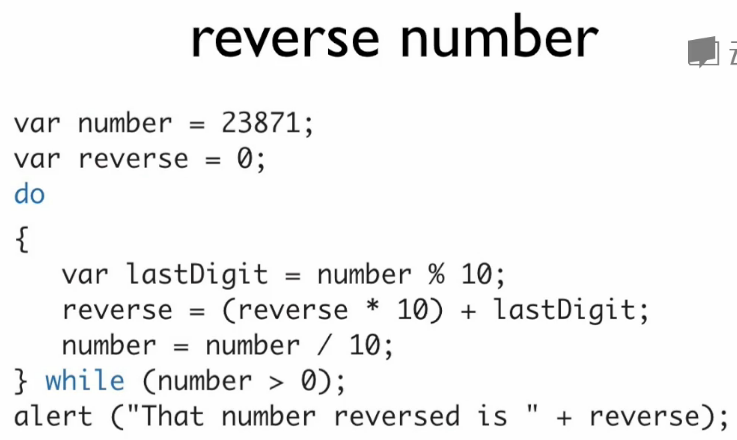

##for循环
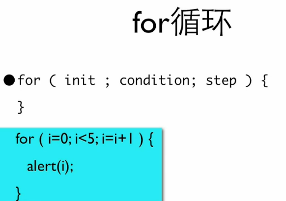

>最后弹出来的是”4“，循环结束后 **i** 的值是5. 

- 比较
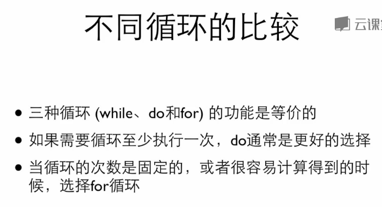
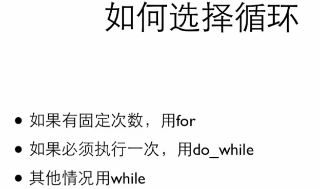

```
var amt=74;
		for(var one=0; one<=amt;++one){
   			for (var five=0;five<=amt/5;++five){
       			for (var ten=0;ten<=amt/10;++ten){
	 				for (var twenty=0;twenty<=amt/20;++twenty){ 
							if(one+five*5+ten*10+twenty*20==amt)
							{
					document.write(one+"张1元,"+five+"张5元，"+ten+"张10元，"+twenty+"张20元等于"+amt+"元"+"</br></br>");
}}}}}
```
##break与continue
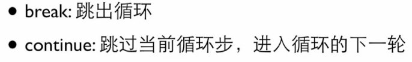

##函数
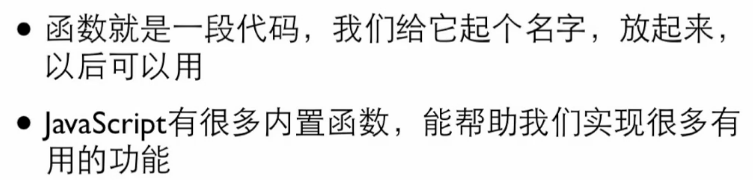
 - 定义函数
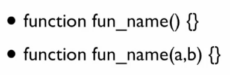

```
var u=42;
var v=24;
function max(a,b)
{
	return a>b?a:b;
}
function print(s){
	document.write(s);
}
function gcd(u,v){
	var a=u;
	var b=v;
	var temp=v;
	while(v!=0){
	temp=u%v;
	u=v;
	v=temp;
	}
	return u;
}
print(max(42,24)+"<br/>");//42;
print(u+"和"+v+"的最大公约数是"+gcd(u,v)+"<br/>")；//42和24的最大公约数是6；
```
##函数变量
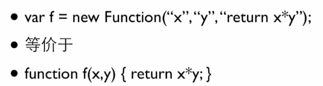

```
function add(a,b){
	return a+b;
}
function  cal(f,a,b){
	return f(a,b);
}
cal(add,5,6);//结果是11
```
##变量空间
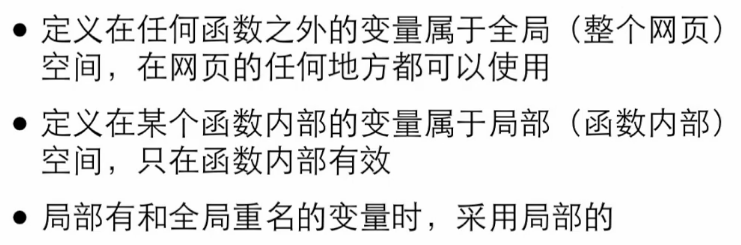

##数组
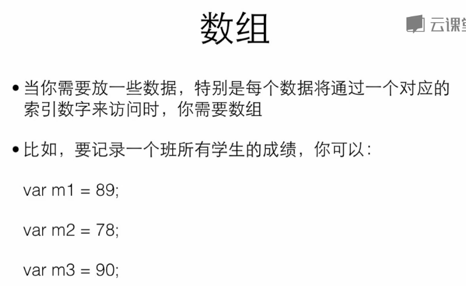
 - 创建数组

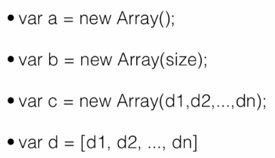
 - 访问数组

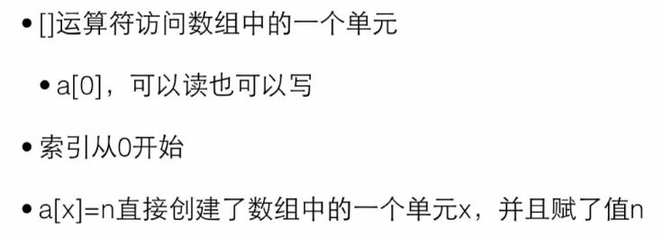
 - 数组长度

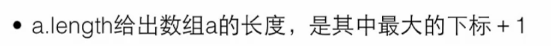
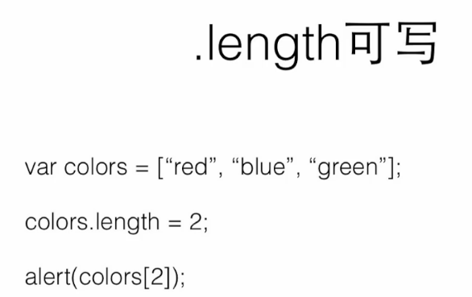
>alert (color[2])的结果是undefined 。


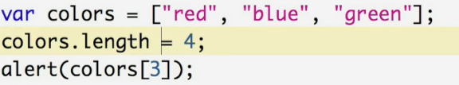
>alert (color[3])的结果是undefined 。

 - 转换数组为字符串
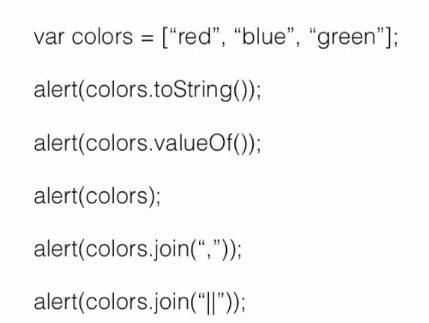

 - 扩展性
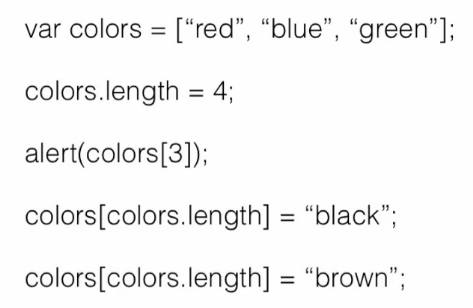
##数组操作
 - 堆栈操作
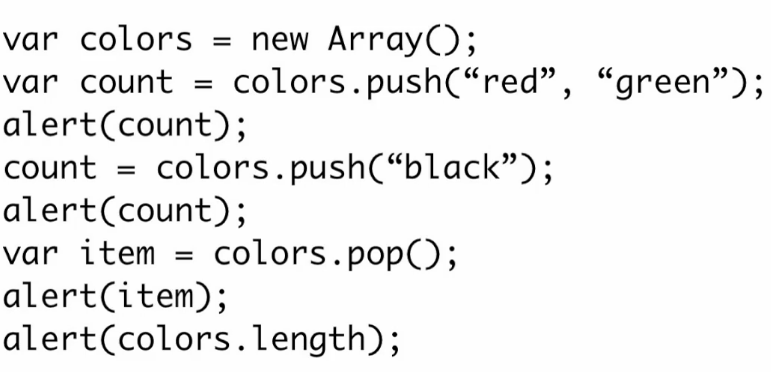
 - 队列操作
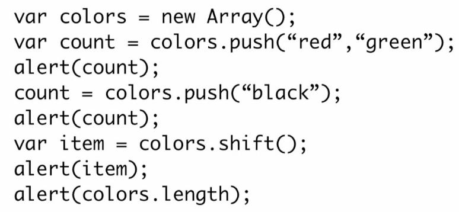
 - 排序操作
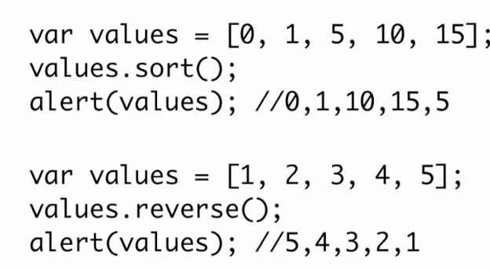
 - 大小比较
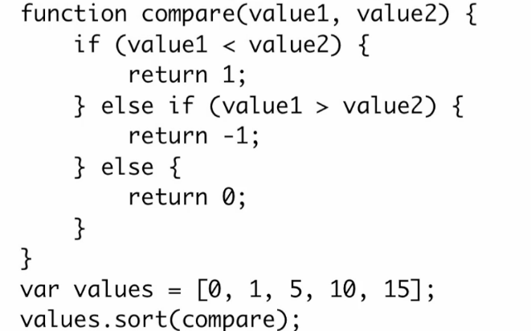
 - 数组操作
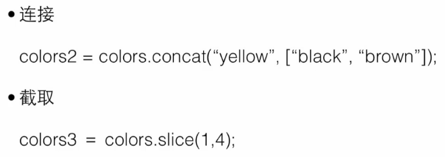
 - splice()

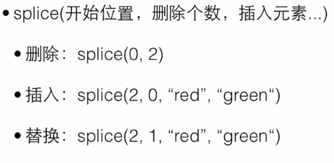
