**目录**：

>笔记持续更新，原地址 : https://github.com/Niefee/Wangyi-Note ;

<ul>
<li><ul>
<li><a href="#类型系统">类型系统</a><ul>
<li><a href="#基本类型">基本类型</a><ul>
<li><a href="#标准类型">标准类型</a><ul>
<li><a href="#原始类型与应用类型的区别">原始类型与应用类型的区别</a></li>
</ul>
</li>
<li><a href="#undefined">Undefined</a></li>
<li><a href="#null">Null</a></li>
<li><a href="#boolean">Boolean</a></li>
<li><a href="#string">String</a></li>
<li><a href="#number">Number</a></li>
<li><a href="#object">Object</a></li>
</ul>
</li>
<li><a href="#类型识别">类型识别</a><ul>
<li><a href="#typeof">typeof</a></li>
<li><a href="#objectprototypetostring">Object.prototype.toString</a></li>
<li><a href="#constructor">constructor</a></li>
<li><a href="#instanceof">instanceof</a></li>
</ul>
</li>
</ul>
</li>
</ul>
</li>
</ul>
##类型系统
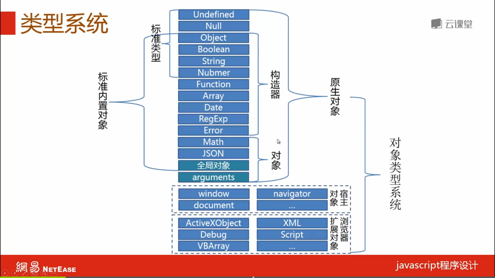
###基本类型
####标准类型
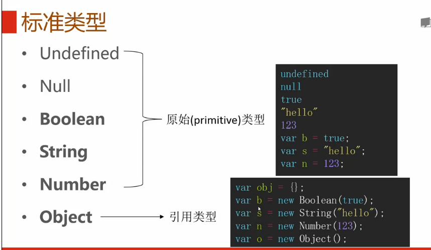
#####原始类型与应用类型的区别
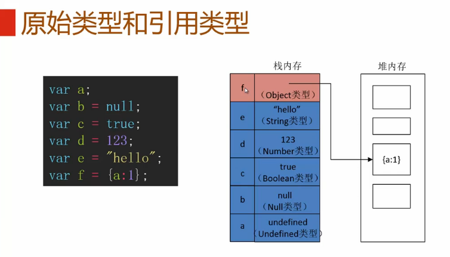
**复制的区别**
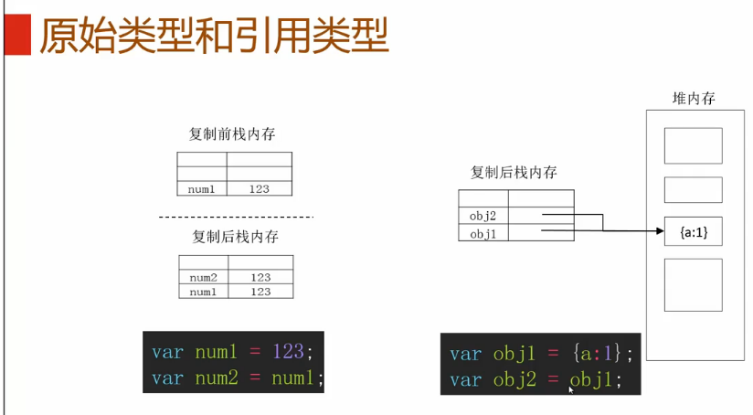
####Undefined
 - 类型说明
	 - 值：undefined

- 出现场景

1、已声明未赋值的变量

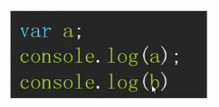

>声明一个变量a，却没有赋值， 打印出来是undefined。

2、获取对象不存在的属性

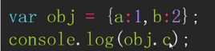

3、无返回值的函数的执行结果

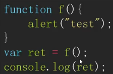

4、函数参数没有传入

5、void（expression）

---

 - 类型转换

**Undefined转Boolean**

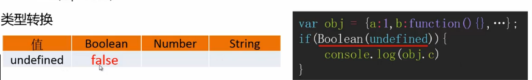
>obj.c = Boolean(undefined)

**Undefined转Number**

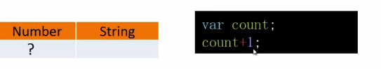
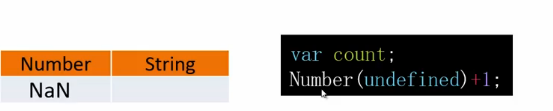

**Undefined转String**

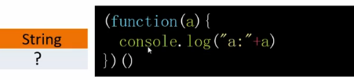
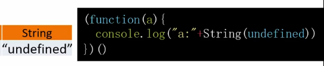

---

####Null
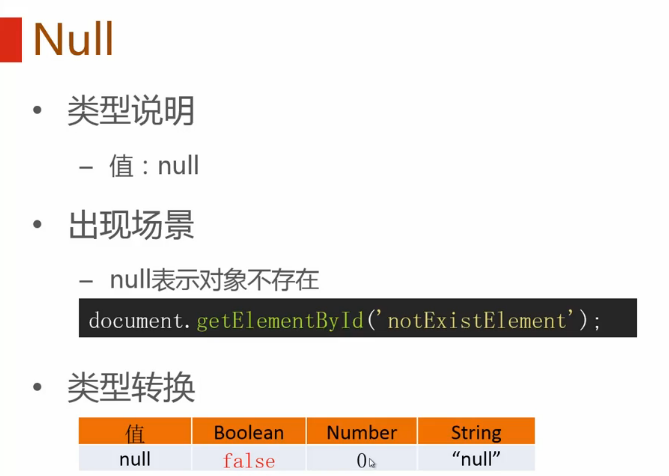

####Boolean
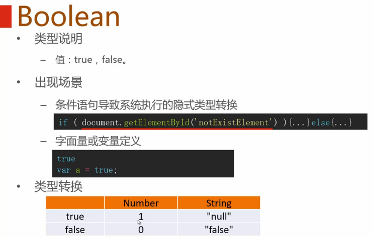

####String
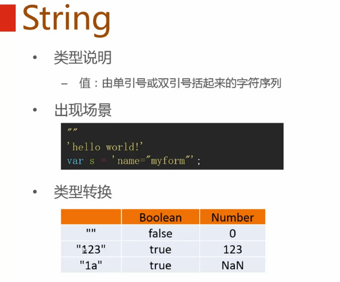

####Number
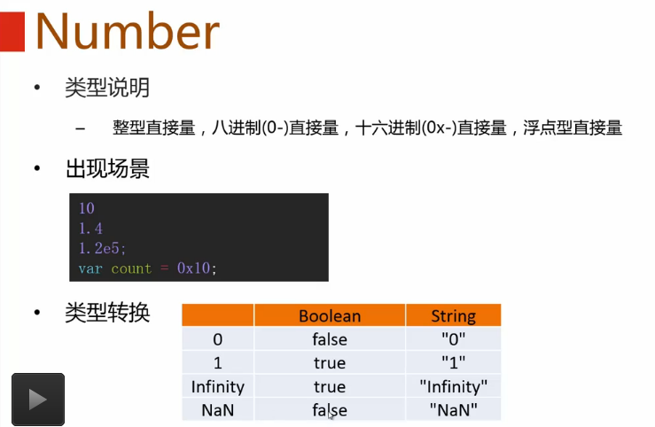
>NaN表示非数字值。 NaN = 'Not a Number' 非数字值。
>Infinity表示无穷大。

####Object
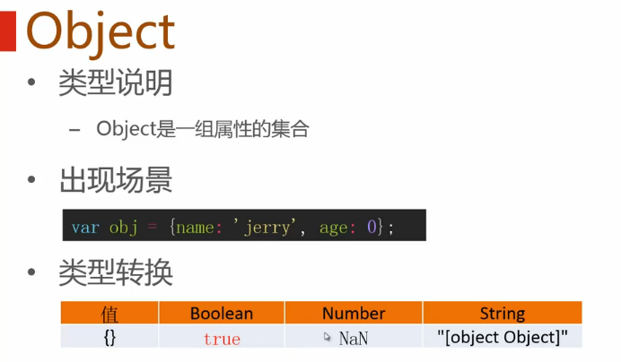

###类型识别
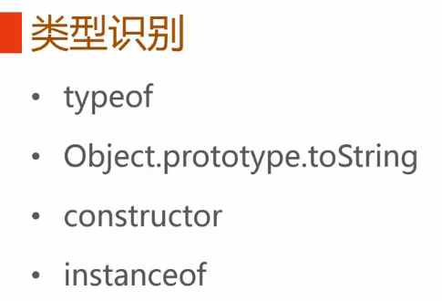

####typeof
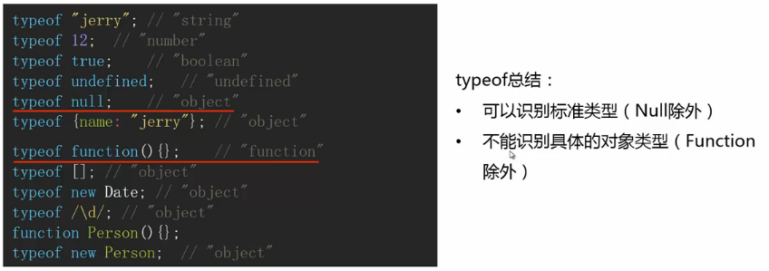

####Object.prototype.toString
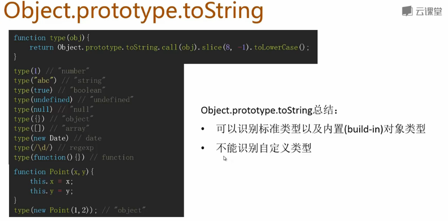
>首先封装一个函数type()。

####constructor
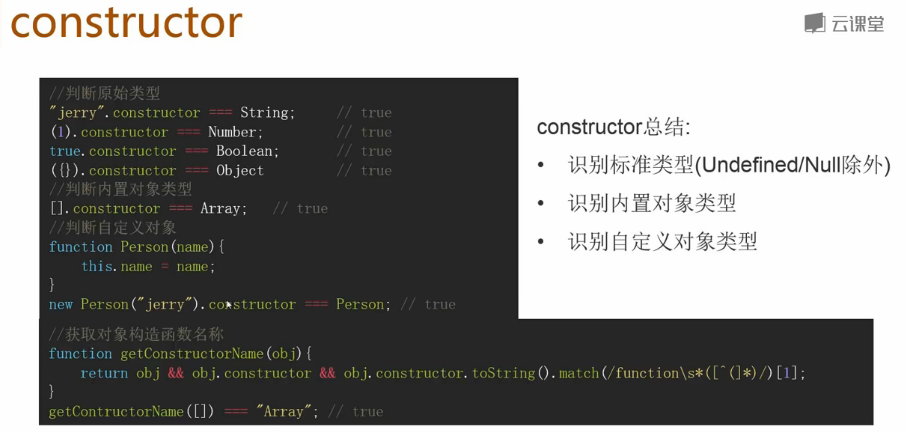

####instanceof
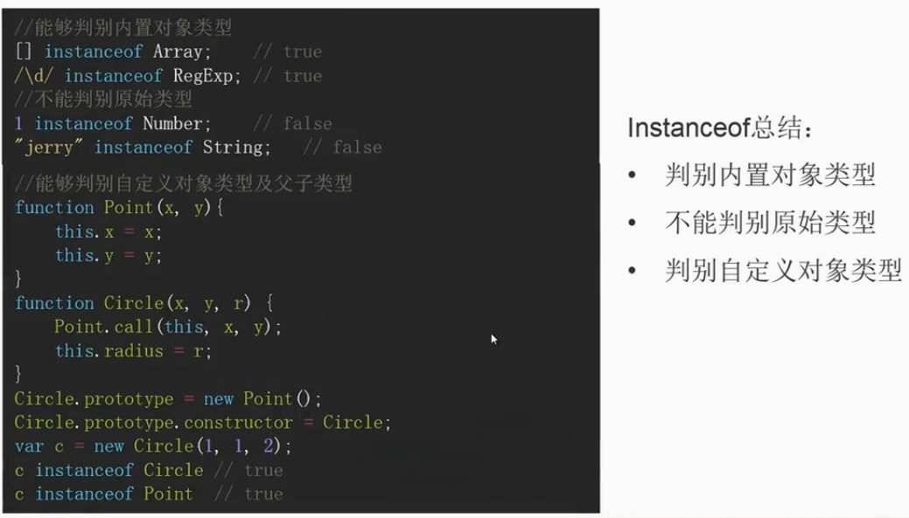

