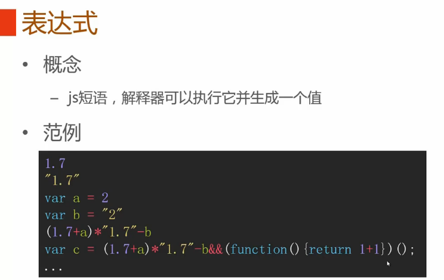
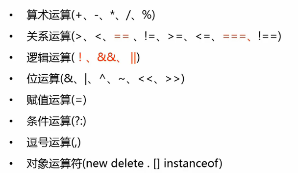
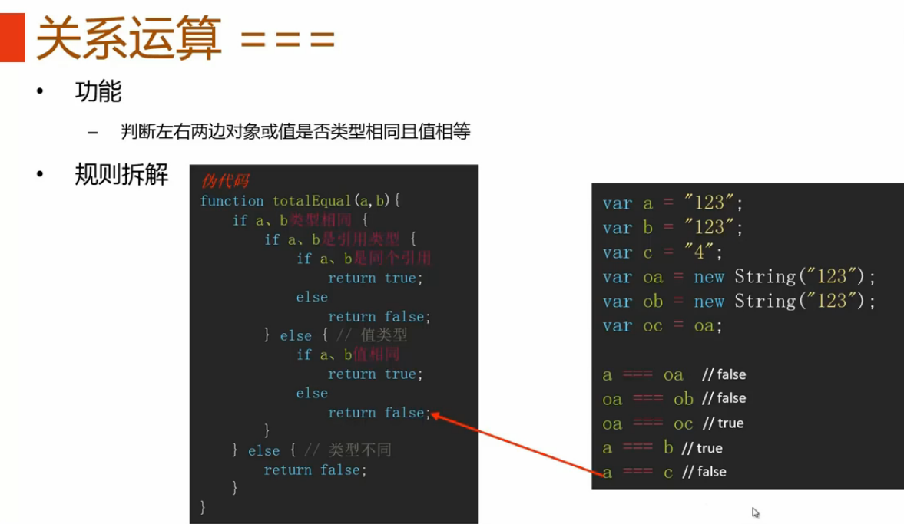
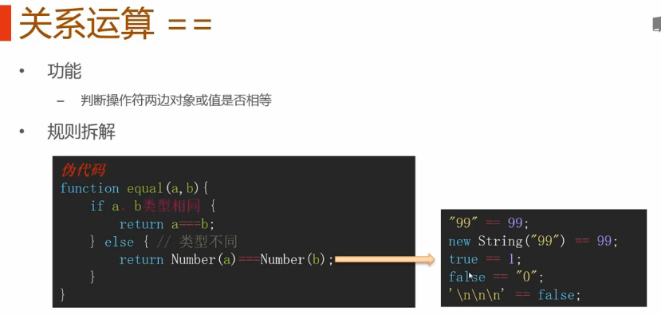
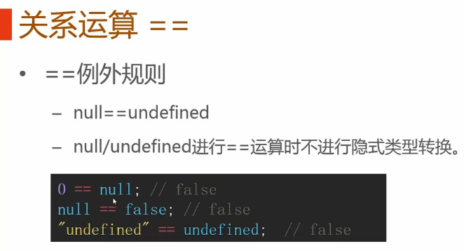
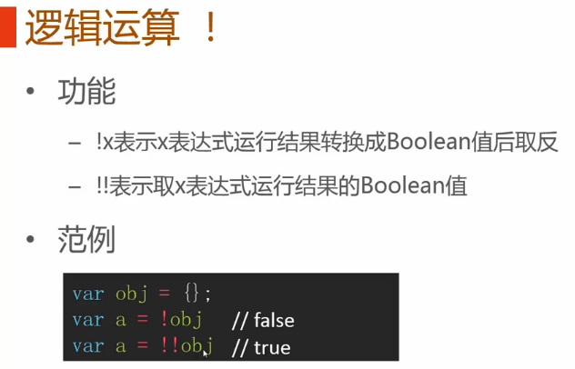
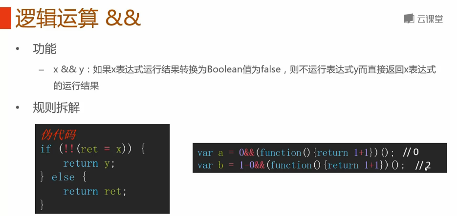
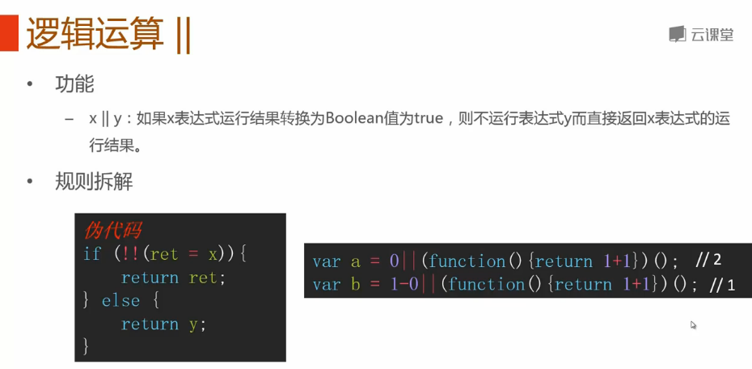
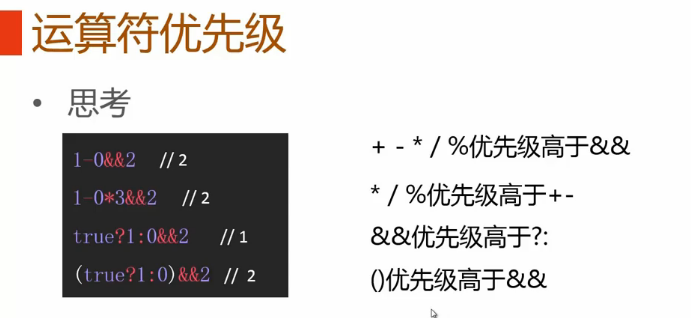
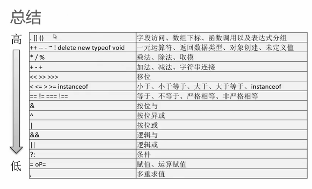

#简介

>笔记持续更新，原地址:  https://github.com/Niefee/Wangyi-Note ;

<ul>
<li><a href="#表达式与运算符">表达式与运算符</a><ul>
<li><a href="#运算符">运算符</a><ul>
<li><a href="#关系运算">关系运算 ===</a></li>
<li><a href="#关系运算-1">关系运算 ==</a></li>
<li><a href="#逻辑运算符">逻辑运算符</a></li>
<li><a href="#运算符优先级">运算符优先级</a></li>
</ul>
</li>
</ul>
</li>
</ul>
#表达式与运算符

##运算符

###关系运算 ===

###关系运算 ==

###逻辑运算符

>!!一般用来将后面的表达式强制转换为布尔类型的数据（boolean），也就是只能是true或者false;
>**!!val**等于**ToBoolean(value)**

>1、只要“&&”前面是false，无论“&&”后面是true还是false，结果都将返“&&”前面的值;
2、只要“&&”前面是true，无论“&&”后面是true还是false，结果都将返“&&”后面的值;

>1、只要“||”前面为false,不管“||”后面是true还是false，都返回“||”后面的值。
2、只要“||”前面为true,不管“||”后面是true还是false，都返回“||”前面的值。

>参考：http://www.cnblogs.com/pigtail/archive/2012/03/09/2387486.html

###运算符优先级

