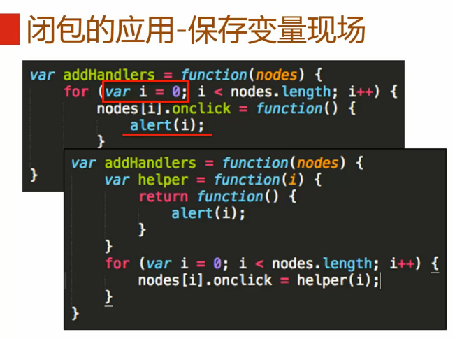
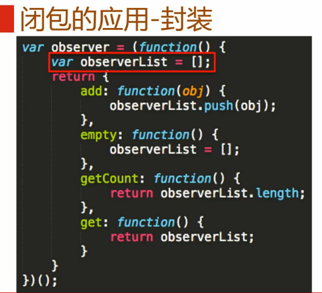

#简介

>笔记持续更新，原地址:  https://github.com/Niefee/Wangyi-Note ;

<ul>
<li><a href="#闭包">闭包</a><ul>
<li><a href="#闭包的应用封装">闭包的应用–封装</a></li>
</ul>
</li>
</ul>
#闭包

>闭包就是能够读取其他函数内部变量的函数。
>由于在Javascript语言中，只有函数内部的子函数才能读取局部变量，因此可以把闭包简单理解成“**定义在一个函数内部的函数**”。

##闭包的应用--封装

