**目录**：

>笔记持续更新，原地址 :https://github.com/Niefee/Wangyi-Note ;

<ul>
<li><a href="#面向对象">面向对象</a><ul>
<li><a href="#程序设计方法">程序设计方法</a><ul>
<li><a href="#面向过程">面向过程</a></li>
<li><a href="#面向对象-1">面向对象</a><ul>
<li><a href="#自定义的constructor">自定义的constructor</a></li>
<li><a href="#this">this</a></li>
<li><a href="#appl与ycall">apply、call</a></li>
</ul>
</li>
</ul>
</li>
<li><a href="#原型">原型</a><ul>
<li><a href="#prototype">prototype</a></li>
</ul>
</li>
<li><a href="#javascript面向对象编程">javascript面向对象编程</a><ul>
<li><a href="#全局变量">全局变量</a></li>
</ul>
</li>
</ul>
</li>
</ul>
#面向对象
##程序设计方法
###面向过程
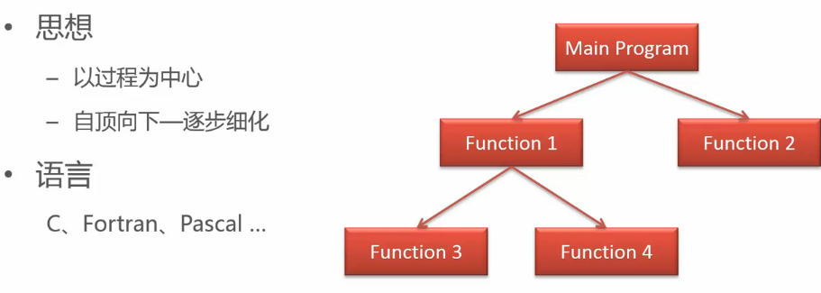
###面向对象
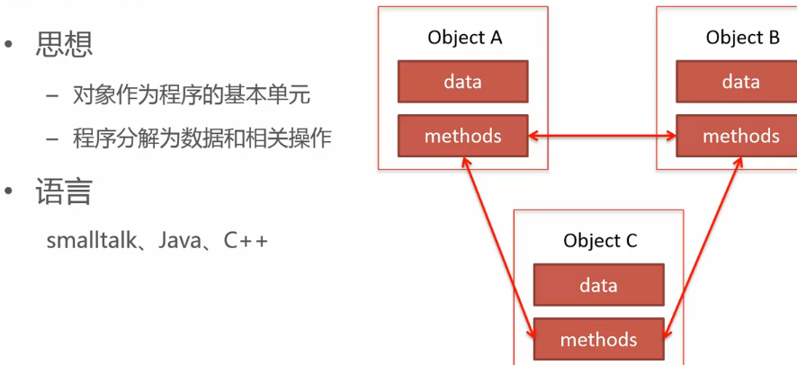
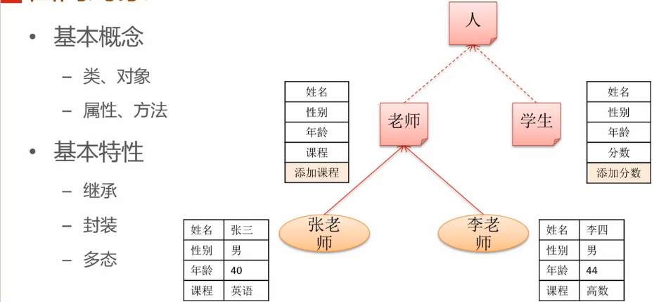
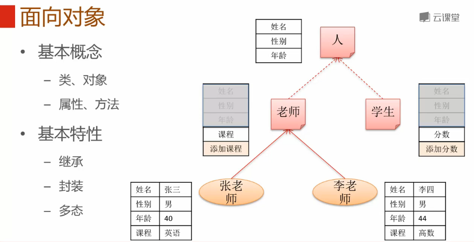
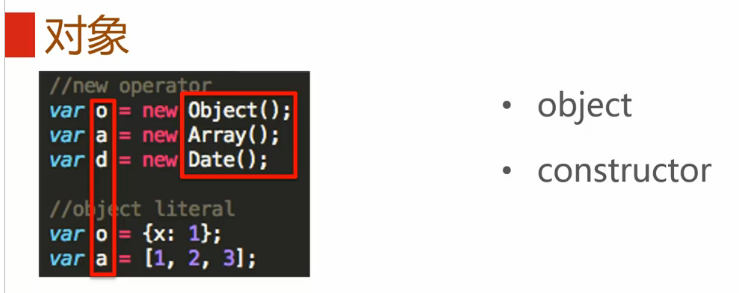
>new后面的Object()是构造器，另外还可以使用直接量创建对象。

####自定义的constructor
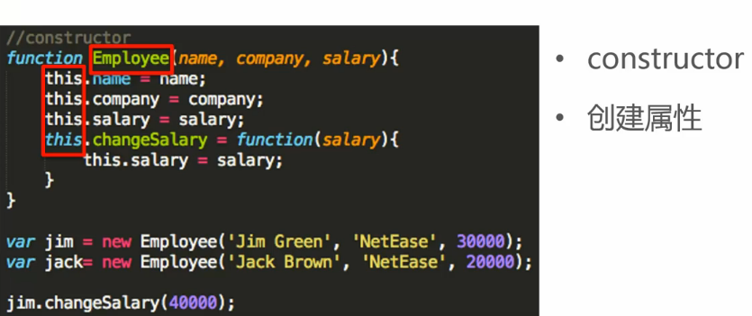
>函数内可以使用this创建属性。

 - 创建构造器
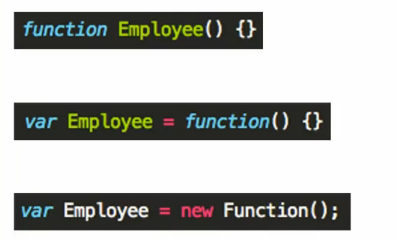

####this
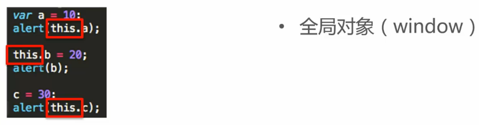
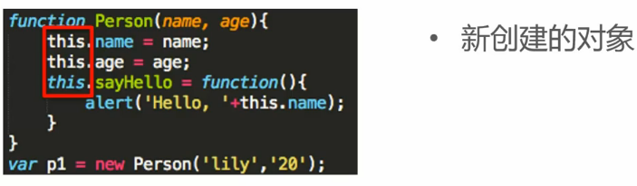
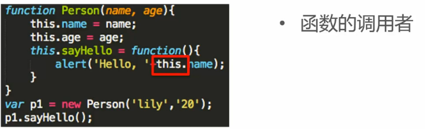
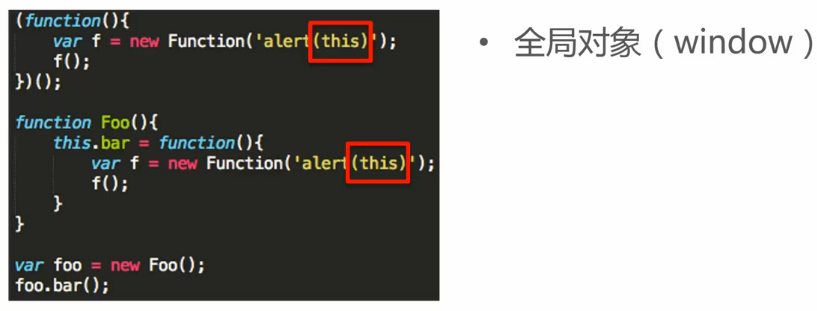
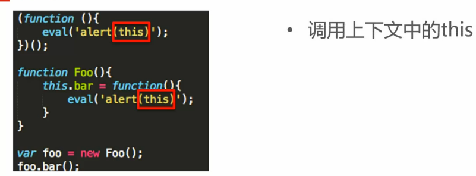
 - 总结
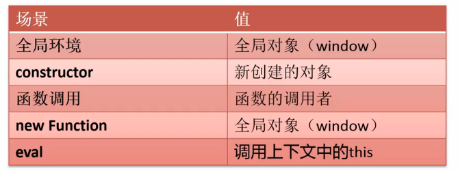
####apply与call
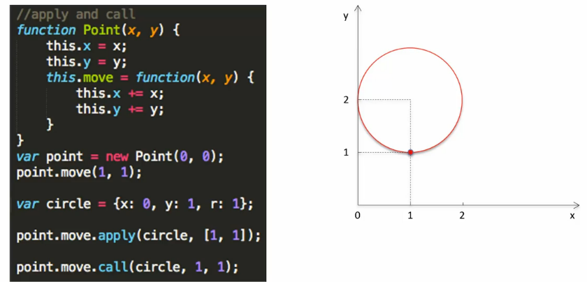

##原型
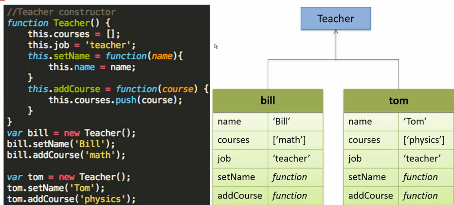
###prototype
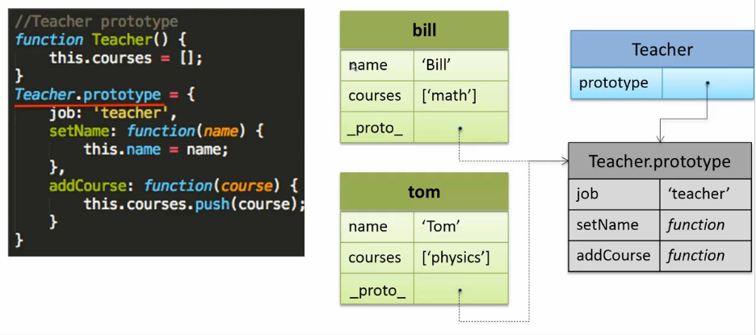
 - 原型链
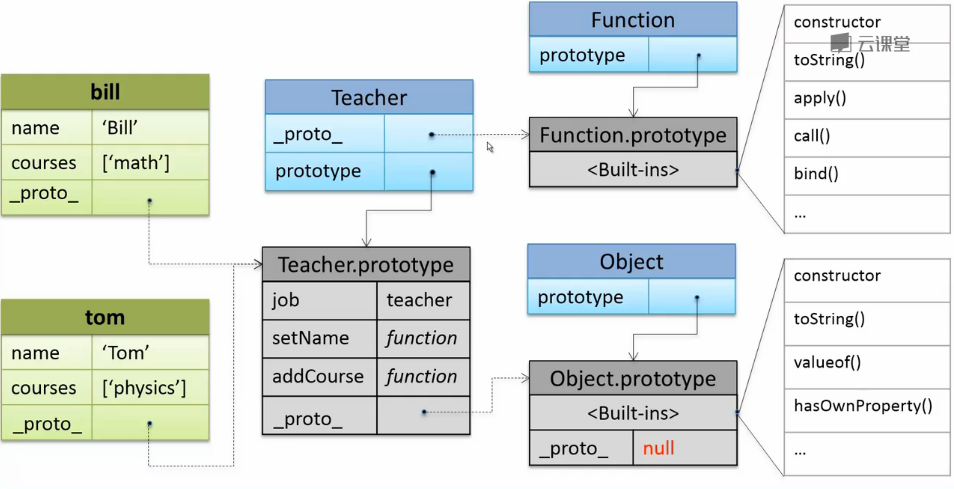

 - 原型链-属性查找
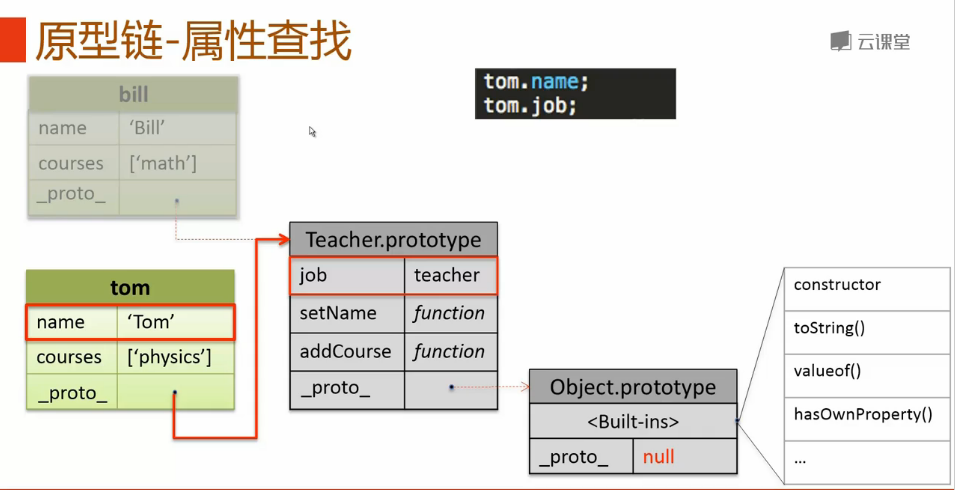
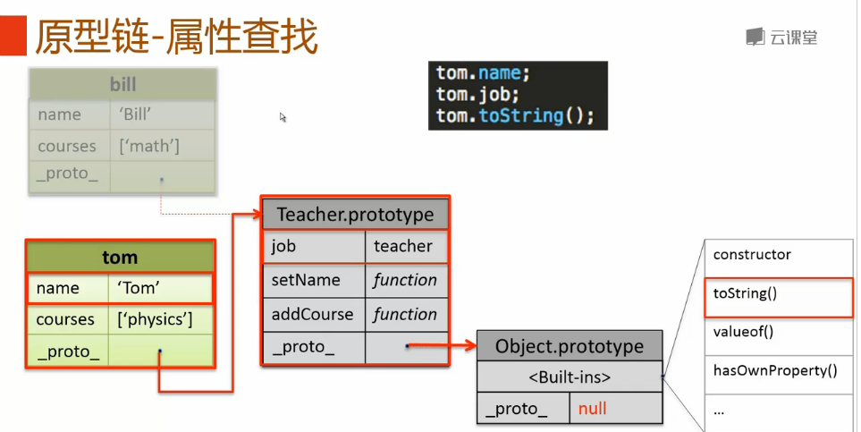

 - 原型链-属性修改
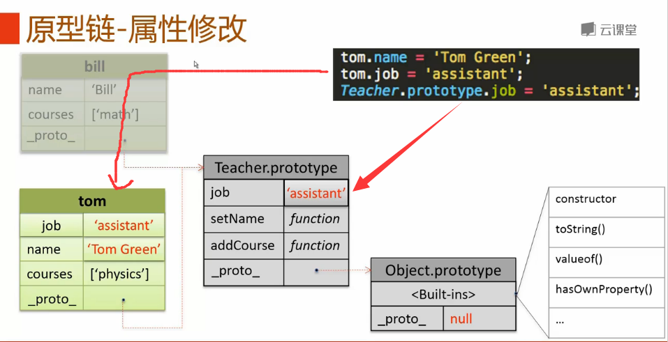

 - 原型链-删除属性

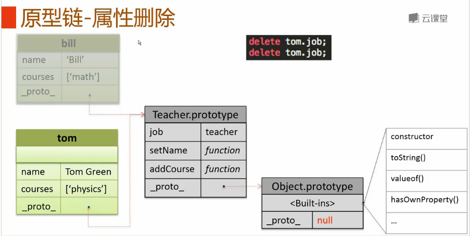
>无法删除原型上的属性。

**思考**
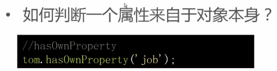

**ES5中的原型继承**
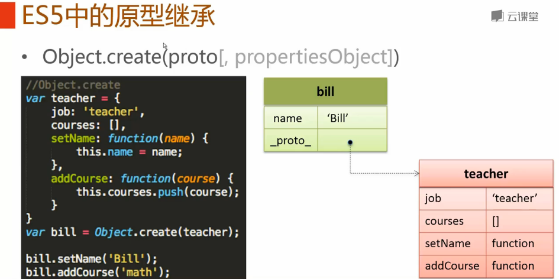

##javascript面向对象编程
###全局变量
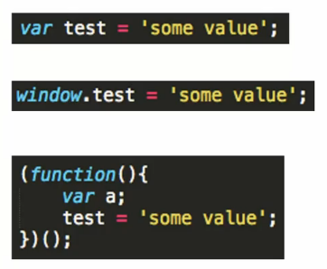

 - 信息隐藏
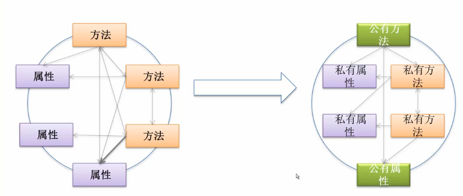

 - 封装
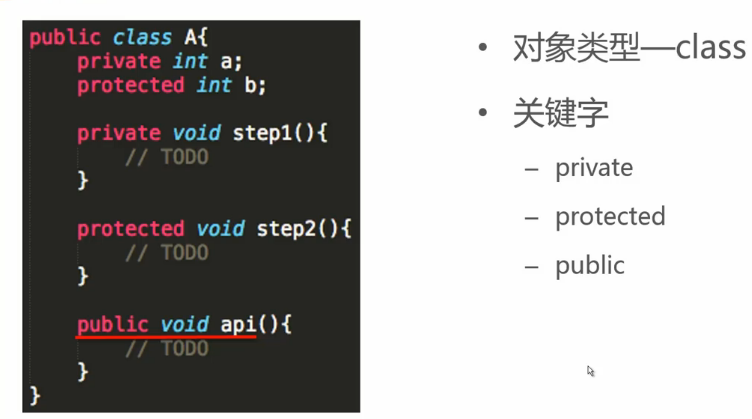

 - 封装问题-信息隐藏
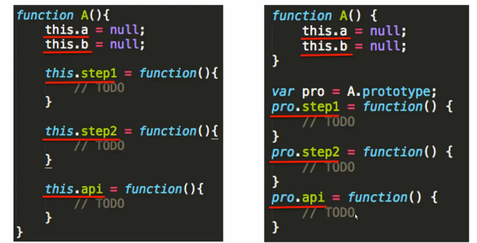

 - 封装形式
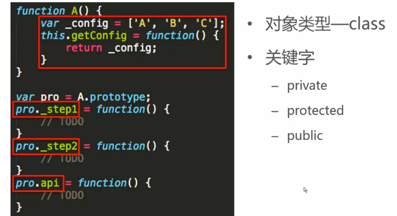

**类继承**
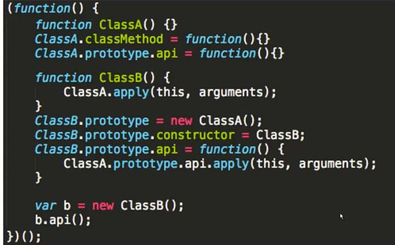
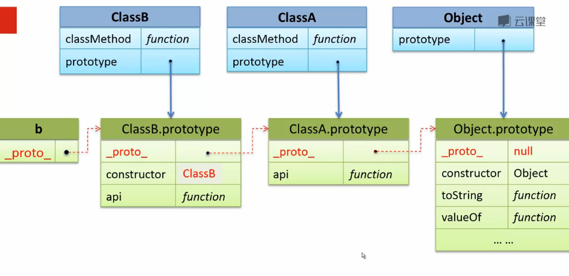

**原型继承**
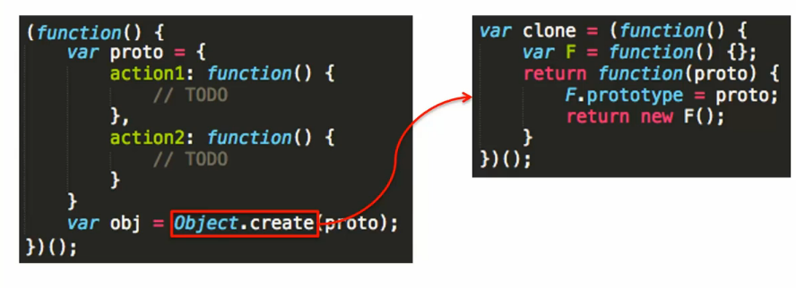

---

>常见格式：**(function() { /* code */ })()**;

解释：包围函数（function(){})的第一对括号向脚本返回未命名的函数，随后一对空括号立即执行返回的未命名函数，括号内为匿名函数的参数。
作用：可以用它创建命名空间，只要把自己所有的代码都写在这个特殊的函数包装内，那么外部就不能访问，除非你允许(变量前加上window，这样该函数或变量就成为全局)。各JavaScript库的代码也基本是这种组织形式。
总结一下，执行函数的作用主要为 匿名 和 自动执行,代码在被解释时就已经在运行了。

>**其他写法**

(function () { /* code */ } ()); 

!function () { /* code */ } ();

~function () { /* code */ } ();

-function () { /* code */ } ();

+function () { /* code */ } ();