**目录**：

>笔记持续更新，原地址: https://github.com/Niefee/Wangyi-Note ;

<ul>
<li><a href="#面向对象与事件处理">面向对象与事件处理</a><ul>
<li><a href="#对象">对象</a><ul>
<li><a href="#创建对象">创建对象</a></li>
<li><a href="#访问对象属性">访问对象属性</a></li>
<li><a href="#删除对象">删除对象</a></li>
</ul>
</li>
<li><a href="#遍历所有-属性">遍历所有 属性</a></li>
<li><a href="#构造方法">构造方法</a></li>
<li><a href="#原型对象">原型对象</a><ul>
<li><a href="#原型问题">原型问题</a></li>
<li><a href="#组合原型和构造方法">组合原型和构造方法</a></li>
</ul>
</li>
<li><a href="#全局对象">全局对象</a></li>
<li><a href="#事件处理器">事件处理器</a><ul>
<li><a href="#简单对话框">简单对话框</a></li>
<li><a href="#状态栏">状态栏</a></li>
</ul>
</li>
<li><a href="#定时器">定时器</a></li>
</ul>
</li>
</ul>
#面向对象与事件处理
##对象
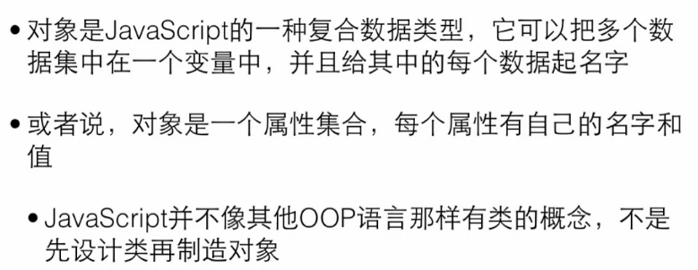
###创建对象
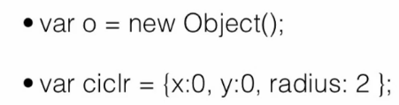
>ciclr有三个属性。

###访问对象属性
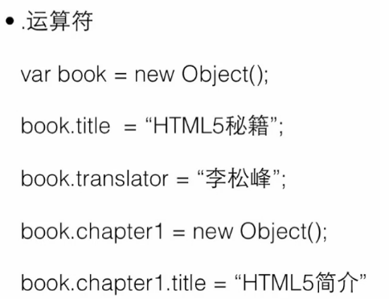
###删除对象
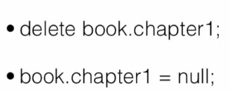
>null一个对象，但是为空。因为是对象，所以 typeof null 返回 'object' 。 
>undefined是window对象的一个属性。
>[null与undefined对比](http://www.jb51.net/article/20396.htm )

##遍历所有 属性
 - for( var x in o )
```
	var o=new.Object
	o.name="John Mike";
	o.age=30;
	o.salary=300;
	
	第一种情况：
	for（var x in o){
	alert(x)
}
//结果是：name/age/salary
x去获取o的每一个属性的名字。
	
	第二种情况：
	for(var x in o){
	alert (x+"="+o[x]);
}
//结果是：name=John Mike/age=30/salary=300；
对象可以想数组那样访问对象属性的值。
```

>

##构造方法
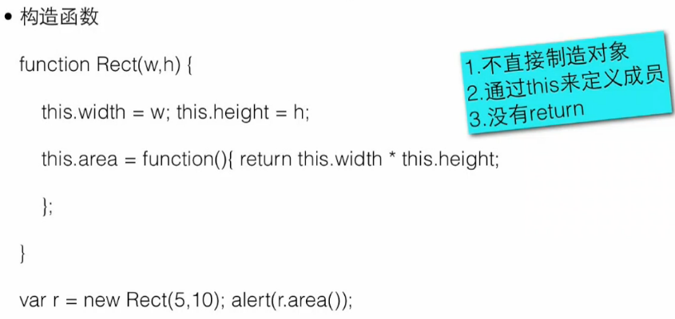
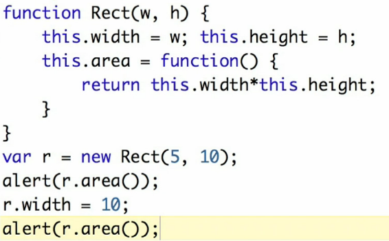
>第一次结果是50，第二次是100；

##原型对象
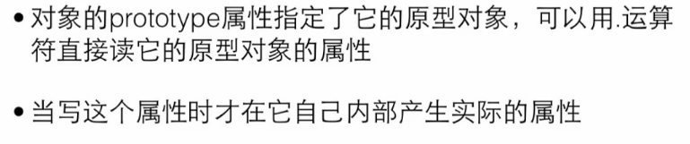
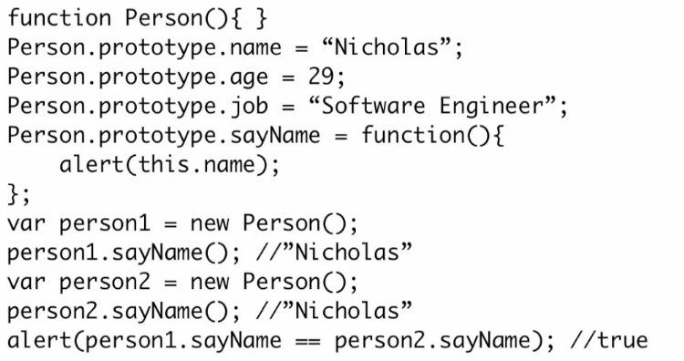


###原型问题
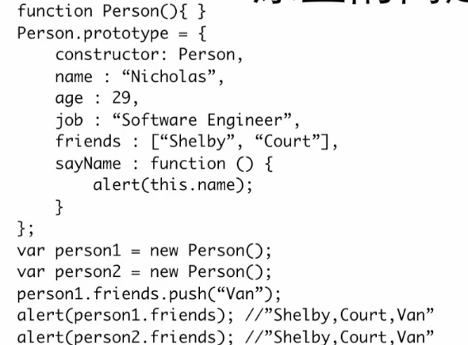
###组合原型和构造方法
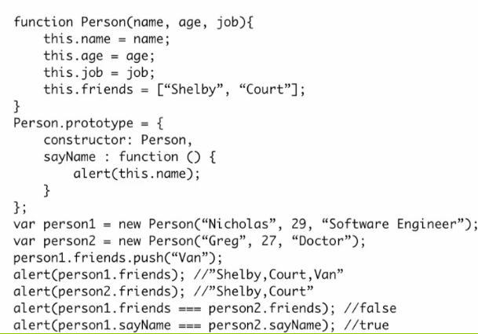
##全局对象
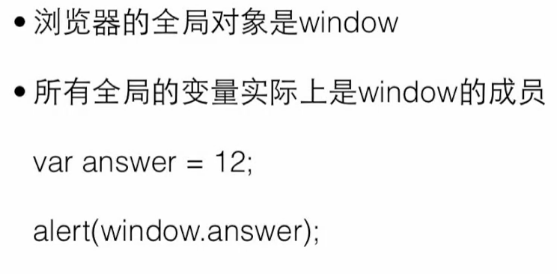
  - document
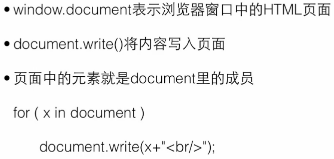
	```
for (x in window.document){
document.write(x+"< br/>")
}
 ```
  - document.model
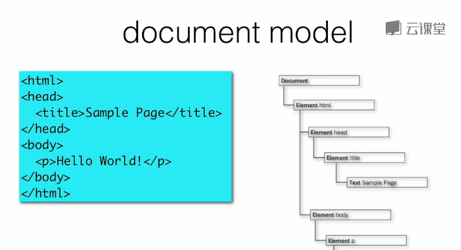

 - HTML中的javascript
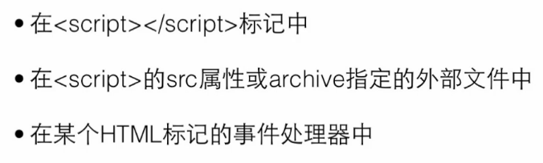

##事件处理器
 -  <p onMouseOver="alert('hi')";>

**body事件**
 - onLoad
 - onUnload

###简单对话框
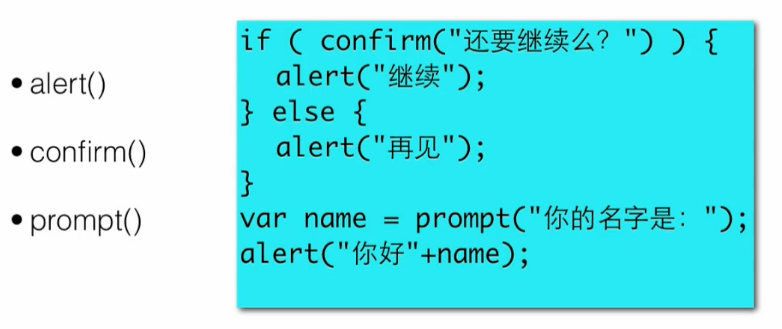
###状态栏
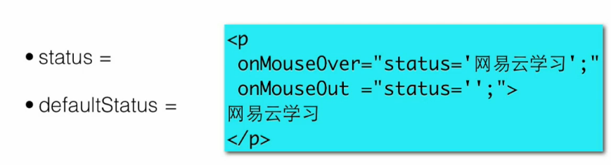
>据我们所知，不少浏览器已经关闭了脚本化它们的状态栏的功能。这是一项安全措施，防止隐藏了超链接真正目的的钓鱼攻击。
>现在在谷歌浏览器只有< a >链接可以有效显示。

##定时器
 -  setInterval（）
setInterval() 方法可按照指定的周期（以毫秒计）来调用函数或计算表达式。
setInterval() 方法会不停地调用函数，直到 clearInterval() 被调用或窗口被关闭。由 setInterval() 返回的 ID 值可用作 clearInterval() 方法的参数。
>语法：
setInterval(code,millisec[,"lang"])

 
