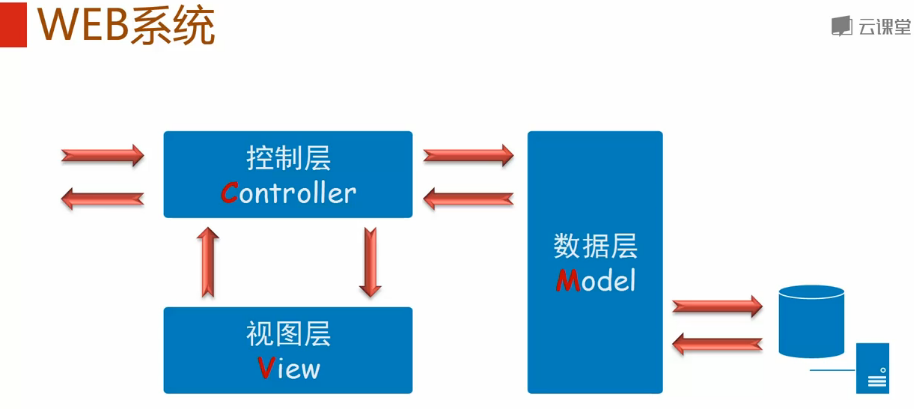
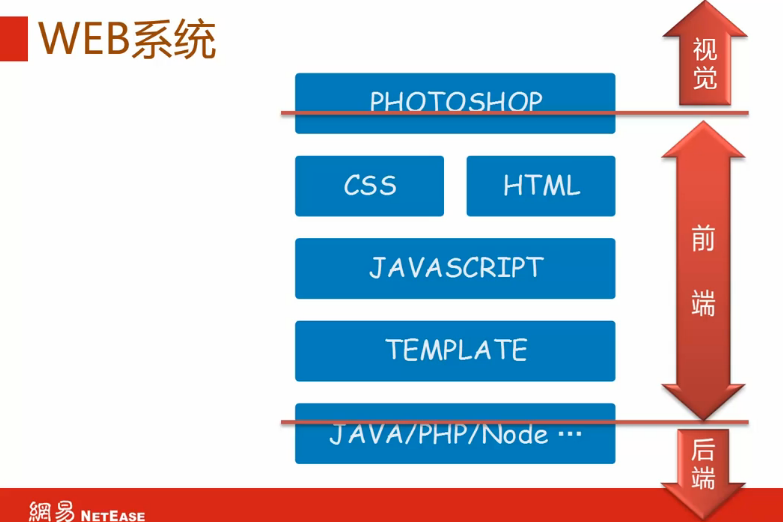
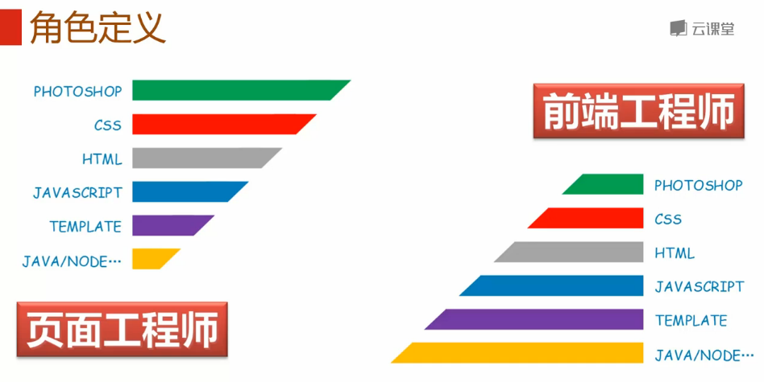
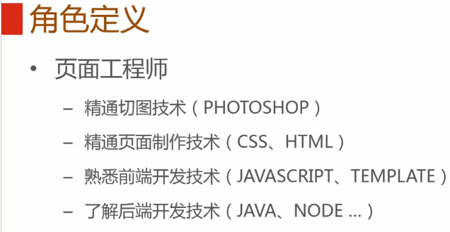
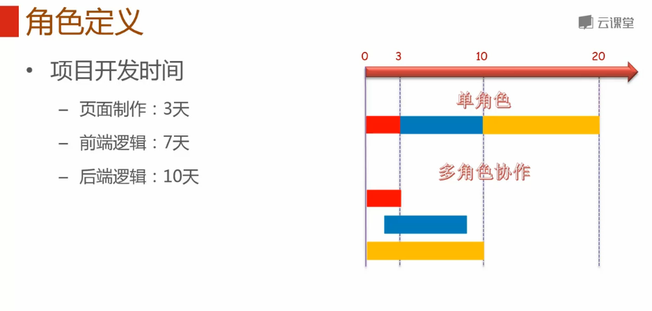
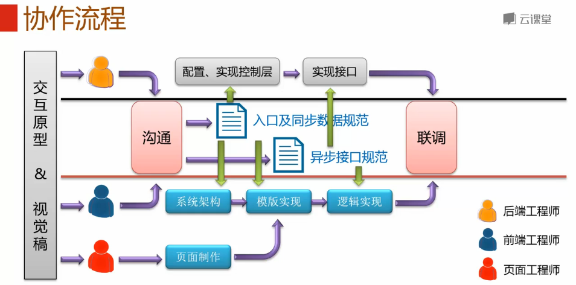
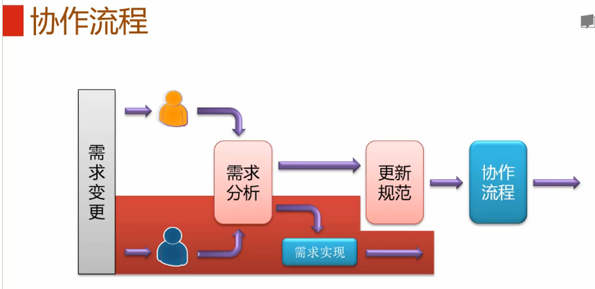
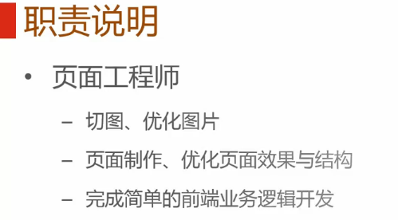
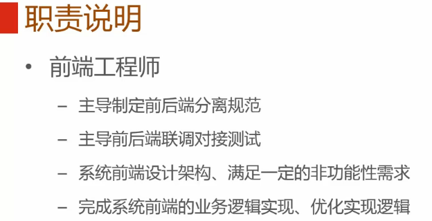
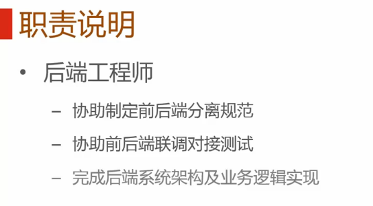

**目录**：

>笔记持续更新，原地址 : https://github.com/Niefee/Wangyi-Note ;

<ul>
<li><a href="#协作流程">协作流程</a><ul>
<li><a href="#web系统">WEB系统</a></li>
<li><a href="#角色定义">角色定义</a></li>
<li><a href="#协作流程-1">协作流程</a></li>
<li><a href="#职责说明">职责说明</a></li>
</ul>
</li>
</ul>
#协作流程
##WEB系统

##角色定义

 - 视觉工程师
 - 前端工程师
 - 后端 工程师

##协作流程

 - 页面入口规范
 - 同步数据规范 
 - 异步接口规范

##职责说明

