**目录**：

>笔记持续更新，原地址: https://github.com/Niefee/Wangyi-Note ;

<ul>
<li><a href="#开发实践">开发实践</a><ul>
<li><a href="#系统设计">系统设计</a><ul>
<li><a href="#交互文稿">交互文稿</a></li>
<li><a href="#系统分解">系统分解</a></li>
<li><a href="#接口设计">接口设计</a></li>
<li><a href="#工程构建">工程构建</a></li>
</ul>
</li>
<li><a href="#系统实现">系统实现</a><ul>
<li><a href="#组件提取">组件提取</a></li>
<li><a href="#组件封装">组件封装</a></li>
</ul>
</li>
<li><a href="#逻辑实现">逻辑实现</a></li>
</ul>
</li>
</ul>
#开发实践
##系统设计
###交互文稿
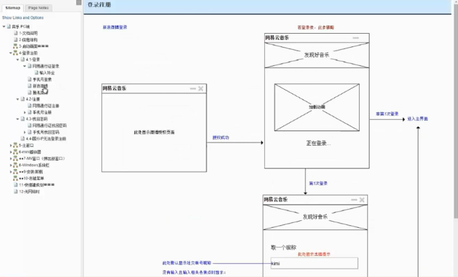
###系统分解
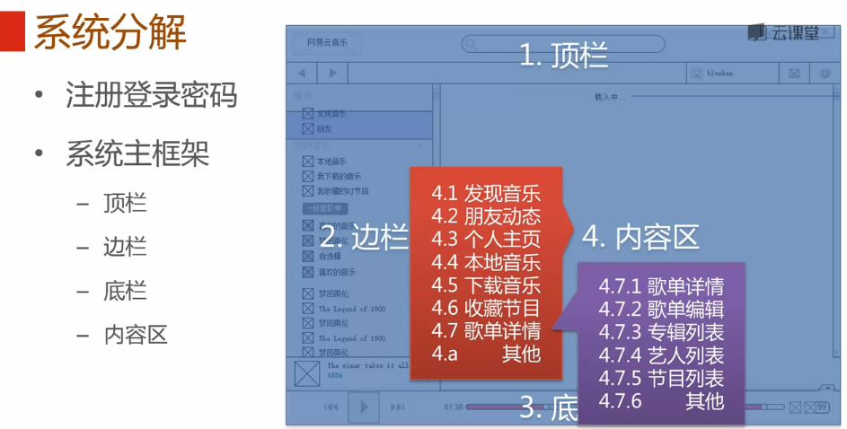
###接口设计
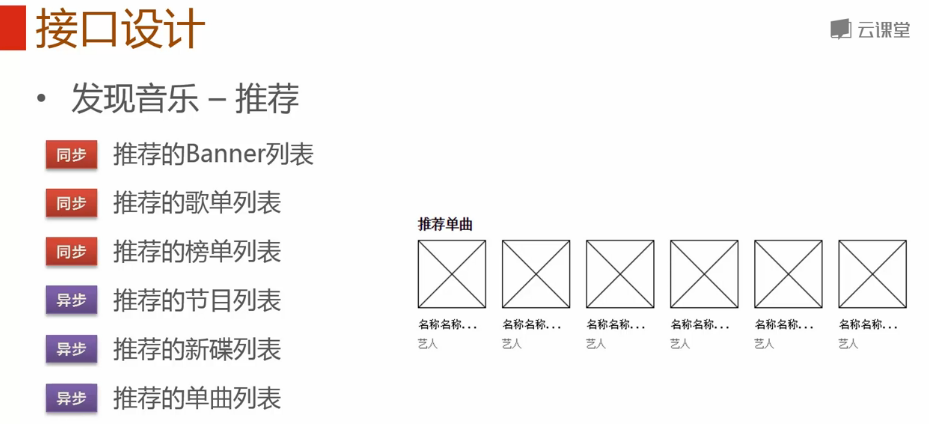
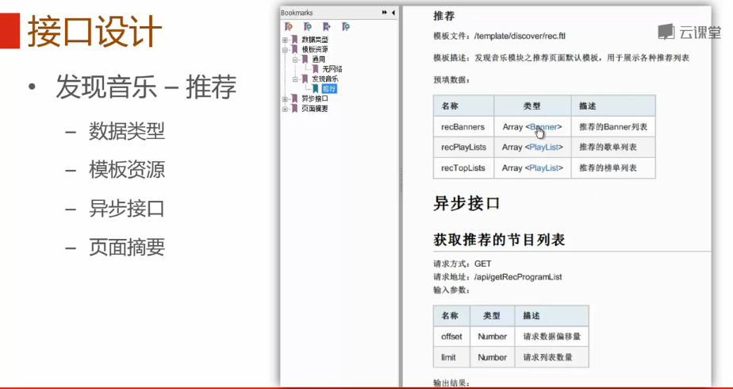
###工程构建
 - 项目结构
	 - 后端模版
	 - 前端实现

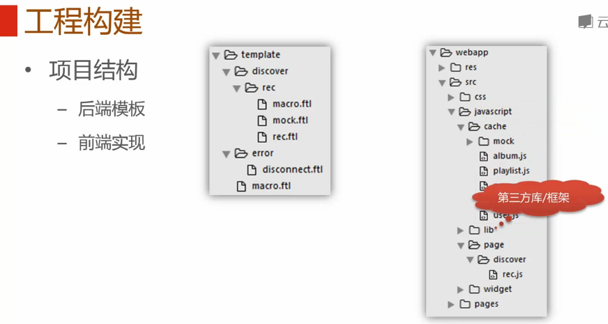

 - 初始代码
	 - rec.ftl

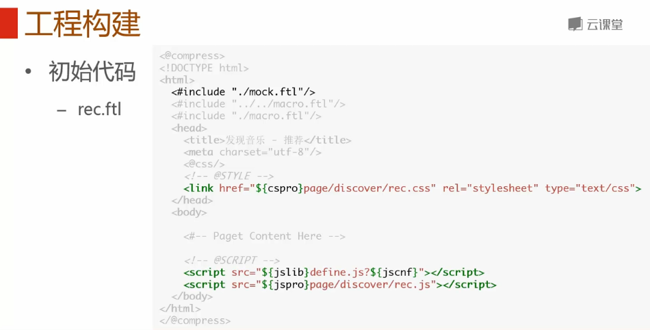

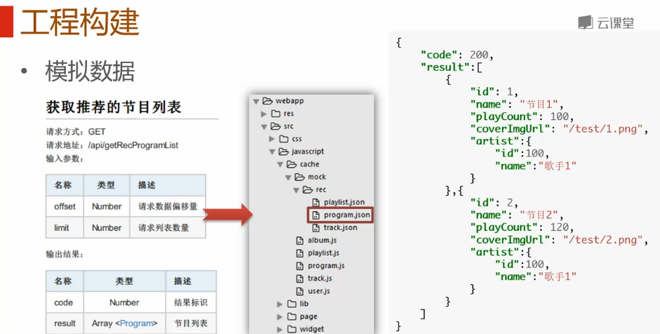

##系统实现
###组件提取
 - 通用元件

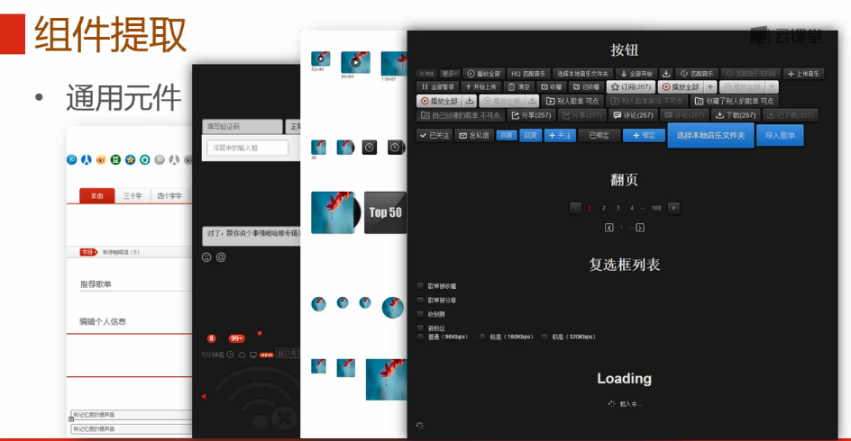

 - 通用列表

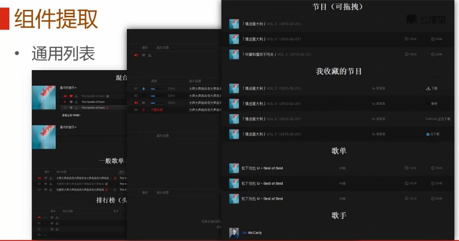

 - 复合组件

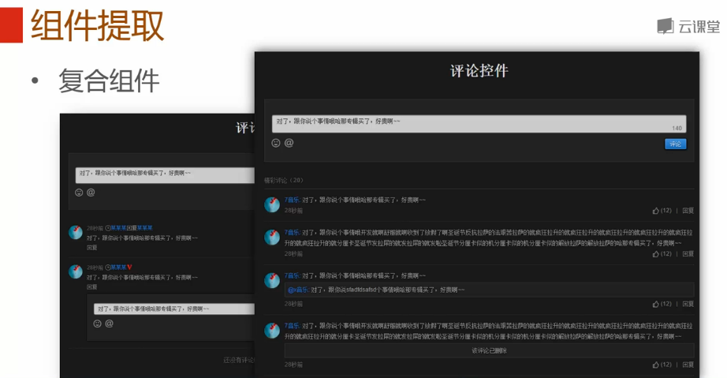

 - 浮层弹窗

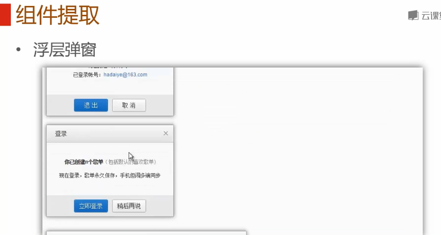

###组件封装
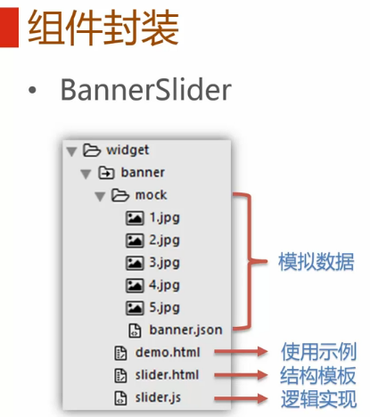
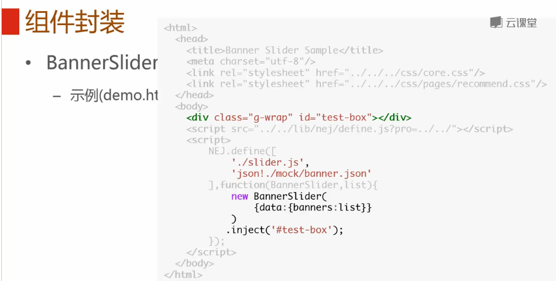

##逻辑实现
1、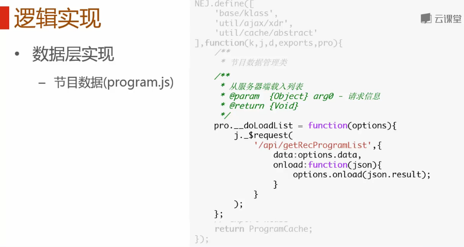
2、 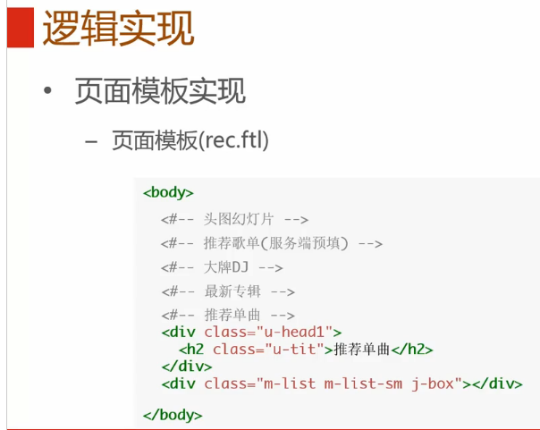
3、 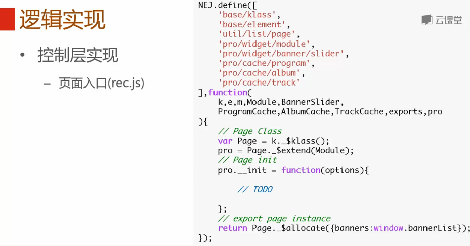
4、 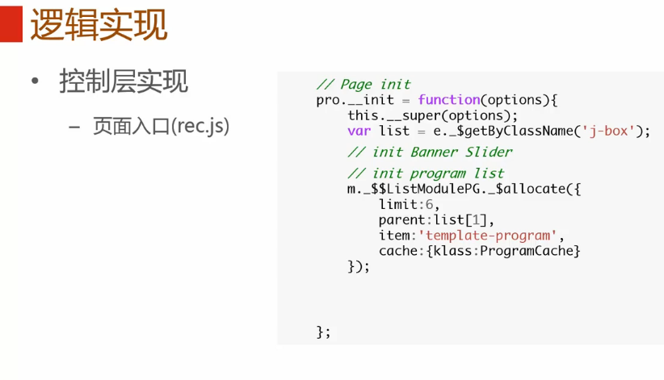
	 

