**目录**：

>笔记持续更新，原地址 : https://github.com/Niefee/Wangyi-Note ;

<ul>
<li><a href="#接口设计">接口设计</a><ul>
<li><a href="#概述">概述</a></li>
<li><a href="#接口规范">接口规范</a><ul>
<li><a href="#页面入口">页面入口</a></li>
<li><a href="#模版列表">模版列表</a></li>
<li><a href="#同步数据">同步数据</a></li>
<li><a href="#异步接口">异步接口</a></li>
</ul>
</li>
<li><a href="#规范应用">规范应用</a><ul>
<li><a href="#开发">开发</a></li>
</ul>
</li>
</ul>
</li>
</ul>
#接口设计
##概述
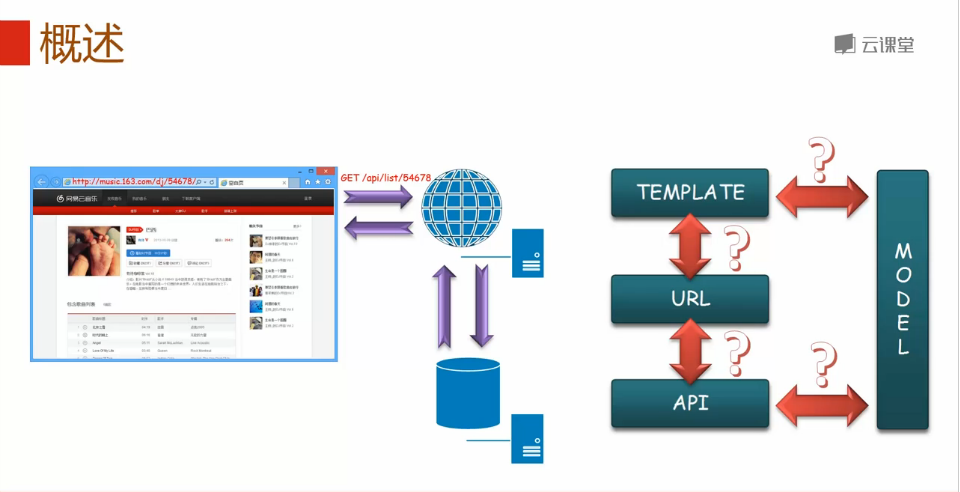
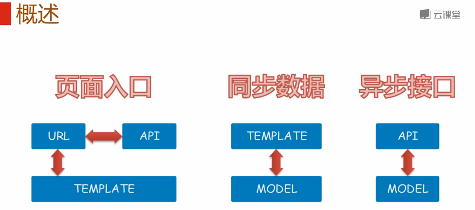

##接口规范
###页面入口
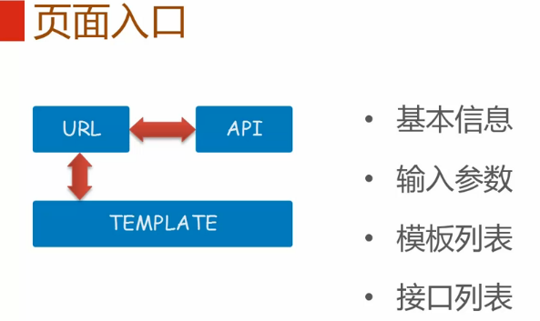

###模版列表

###同步数据
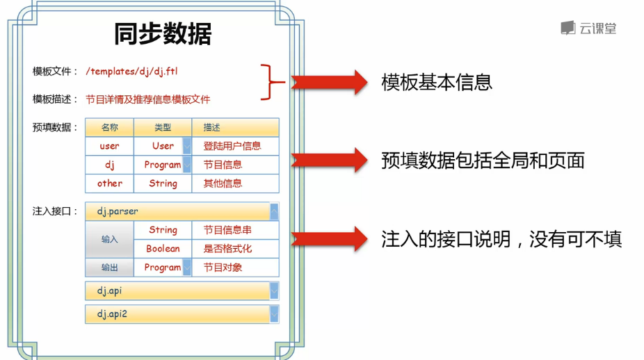

###异步接口
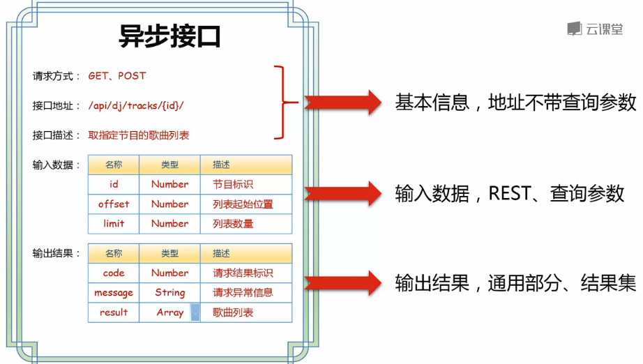

##规范应用
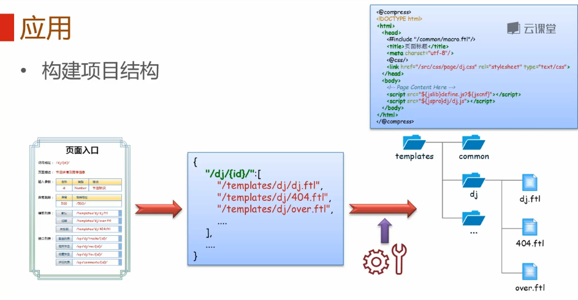
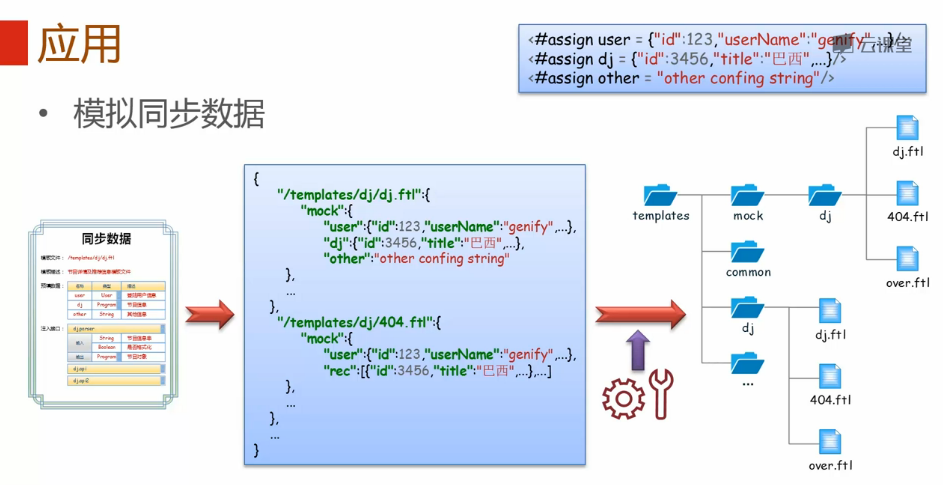
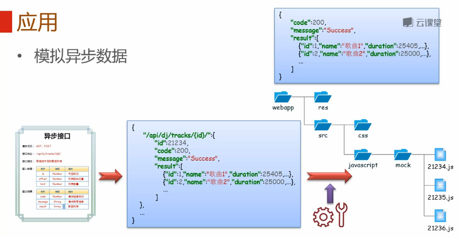

###开发
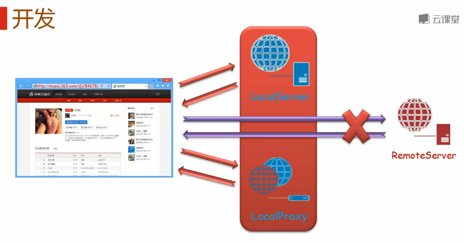
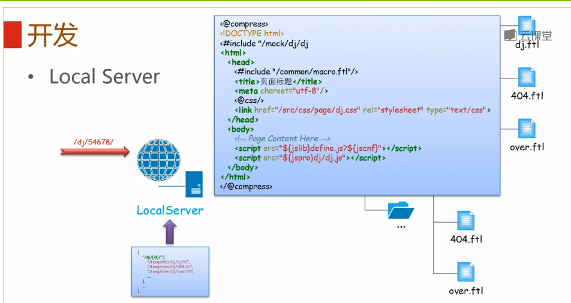
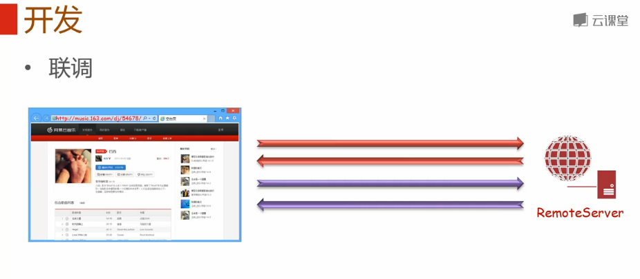
