**目录**：

>笔记持续更新，原地址: https://github.com/Niefee/Wangyi-Note ;

<ul>
<li><a href="#规范与模块化">规范与模块化</a><ul>
<li><a href="#规范">规范</a><ul>
<li><a href="#文件规范">文件规范</a></li>
<li><a href="#注释规范">注释规范</a></li>
<li><a href="#命名规范">命名规范</a></li>
<li><a href="#书写规范">书写规范</a></li>
<li><a href="#其他规范">其他规范</a></li>
<li><a href="#总结">总结</a></li>
</ul>
</li>
<li><a href="#模块化">模块化</a><ul>
<li><a href="#做法">做法</a></li>
</ul>
</li>
</ul>
</li>
</ul>
#规范与模块化
##规范

###文件规范

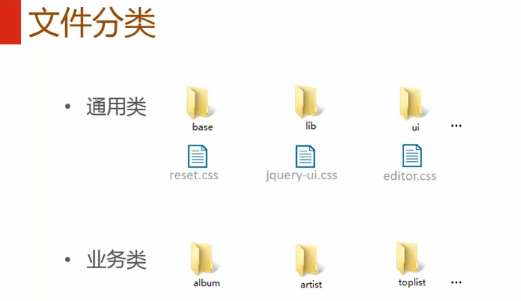
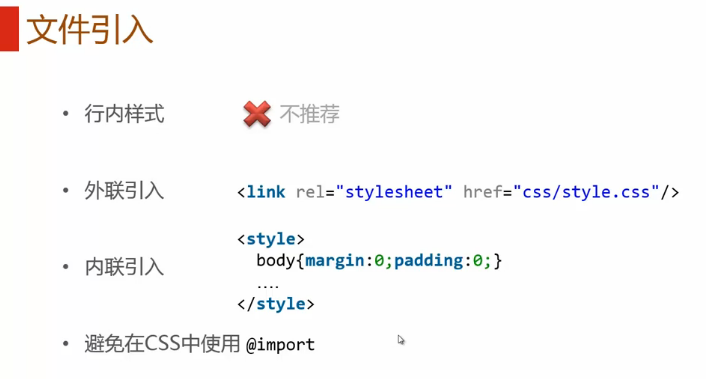
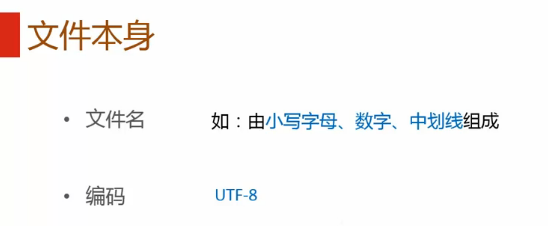
###注释规范

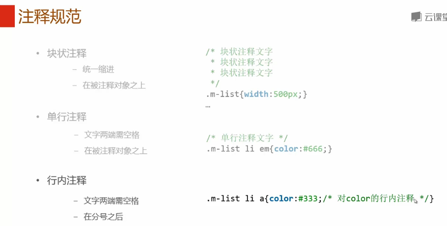
###命名规范

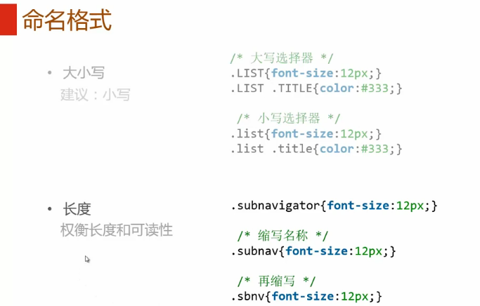
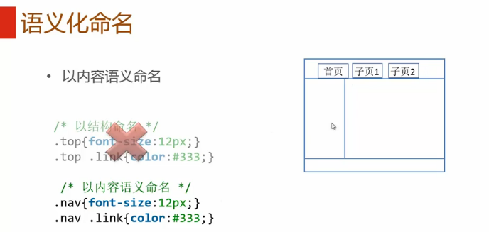
###书写规范
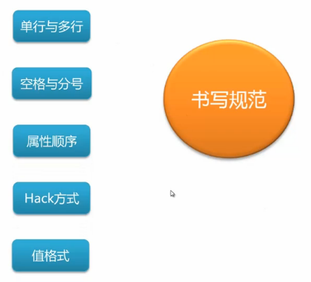
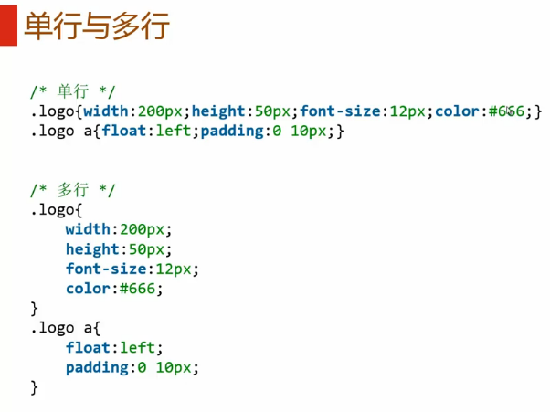
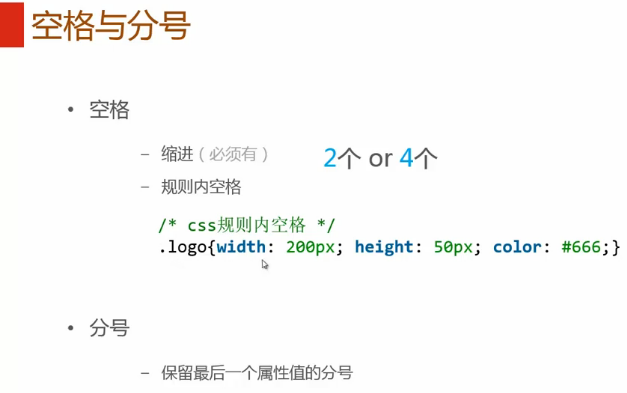
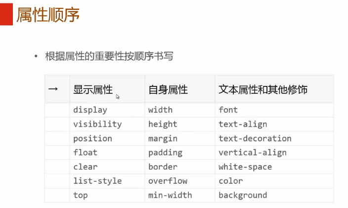
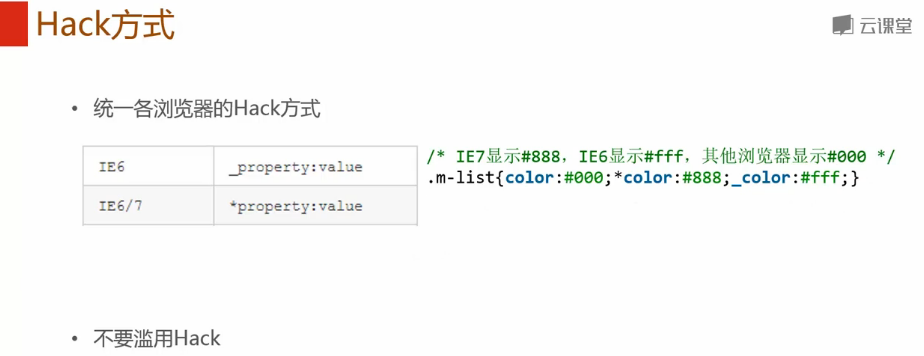
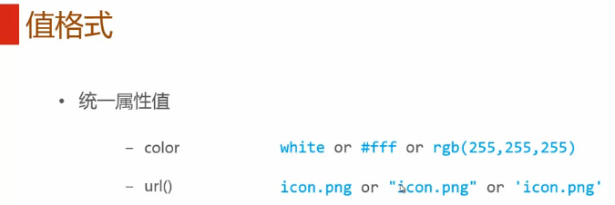
###其他规范
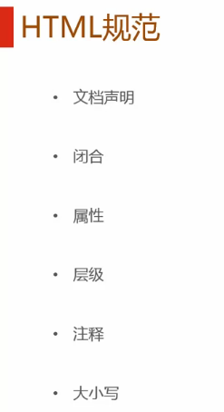
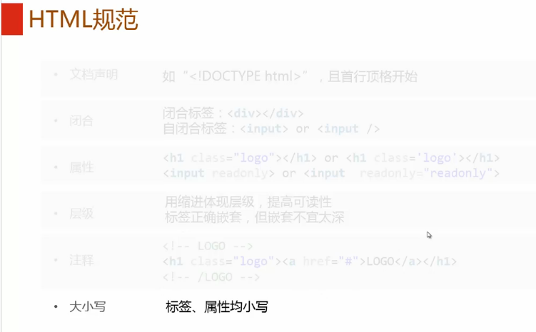
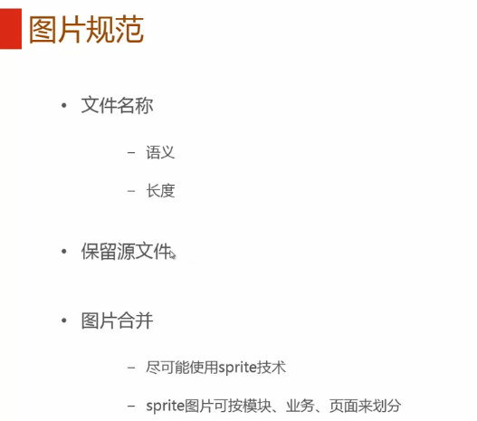

###总结
一、文件规范
1、文件均归档至约定的目录中。
具体要求通过豆瓣的CSS规范进行讲解：
所有的CSS分为两大类：通用类和业务类。通用的CSS文件，放在如下目录中：
基本样式库 /css/core
通用UI元素样式库 /css/lib
JS组件相关样式库 /css/ui

业务类的CSS是指和具体产品相关的文件，放在如下目录中：
读书 /css/book/
电影 /css/movie/
音乐 /css/music/
社区 /css/sns/
小站 /css/site/
同城 /css/location/
电台 /css/radio/

外联CSS文件适用于全站级和产品级通用的大文件。内联CSS文件适用于在一个或几个页面共用的CSS。另外一对具体的CSS进行文档化的整理。如：
util-01 reset /css/core/reset.css
util-02 通用模块容器 /css/core/mod.css
ui-01. 喜欢按钮 /css/core/fav_btn.css
ui-02. 视频/相册列表项 /css/core/media_item.css
ui-03. 评星 /css/core/rating.css
ui-04. 通用按钮 /css/core/common_button.css
ui-05. 分页 /css/core/pagination.css
ui-06. 推荐按钮 /css/core/rec_btn.css
ui-07. 老版对话框 /css/core/old_dialog.css
ui-08. 老版Tab /css/core/old_tab.css
ui-09. 老版成员列表 /css/core/old_userlist.css
ui-10. 老版信息区 /css/core/notify.css
ui-11. 社区用户导航 /css/core/profile_nav.css
ui-12. 当前大社区导航 /css/core/site_nav.css
ui-13. 加载中 /css/lib/loading.css

2、文件引入可通过外联或内联方式引入。
外联方式：（类型声明type=”text/css”可以省略）
内联方式： （类型声明type=”text/css”可以省略）
link和style标签都应该放入head中，原则上，不允许在html上直接写样式。避免在CSS中使用@import，嵌套不要超过一层。

3、文件名、文件编码及文件大小
文件名必须由小写字母、数字、中划线组成
文件必须用UTF-8编码，使用UTF-8（非BOM），在HTML中指定UTF-8编码，在CSS中则不需要特别指定因为默认就是UTF-8。
单个CSS文件避免过大（建议少于300行）

二、注释规范
1、文件顶部注释（推荐使用）
/*
* @description: 中文说明
* @author: name
* @update: name (2013-04-13 18:32)
*/
复制代码
2、模块注释
/* module: module1 by 张三 */
…
/* module: module2 by 张三 */
复制代码
模块注释必须单独写在一行

3、 单行注释与多行注释
/* this is a short comment */
单行注释可以写在单独一行，也可以写在行尾，注释中的每一行长度不超过40个汉字，或者80个英文字符。
/*
* this is comment line 1.
* this is comment line 2.
*/
多行注释必须写在单独行内

4、特殊注释
/* TODO: xxxx by name 2013-04-13 18:32 */
/* BUGFIX: xxxx by name 2012-04-13 18:32 */
用于标注修改、待办等信息

5、区块注释
/* Header */
/* Footer */
/* Gallery */
复制代码
对一个代码区块注释（可选），将样式语句分区块并在新行中对其注释。

三、命名规范
使用有意义的或通用的ID和class命名：ID和class的命名应反映该元素的功能或使用通用名称，而不要用抽象的晦涩的命名。反映元素的使用目的是首选；使用通用名称代表该元素不表特定意义，与其同级元素无异，通常是用于辅助命名；使用功能性或通用的名称可以更适用于文档或模版变化的情况。
/* 不推荐: 无意义 */ #yee-1901 {}
/* 不推荐: 与样式相关 */ .button-green {}.clear {}
/* 推荐: 特殊性 */ #gallery {}#login {}.video {}
/* 推荐: 通用性 */ .aux {}.alt {}

常用命名（多记多查英文单词）：page、wrap、layout、header(head)、footer(foot、ft)、content(cont)、menu、nav、main、submain、sidebar(side)、logo、banner、title(tit)、popo(pop)、icon、note、btn、txt、iblock、window(win)、tips等
ID和class命名越简短越好，只要足够表达涵义。这样既有助于理解，也能提高代码效率。
/* 不推荐 */ #navigation {}.atr {}
/* 推荐 */ #nav {}.author {}

类型选择器避免同时使用标签、ID和class作为定位一个元素选择器；从性能上考虑也应尽量减少选择器的层级。
/* 不推荐 */ul#example {}div.error {}
/* 推荐 */#example {}.error {}

命名时需要注意的点：
规则命名中，一律采用小写加中划线的方式，不允许使用大写字母或 _
命名避免使用中文拼音，应该采用更简明有语义的英文单词进行组合
命名注意缩写，但是不能盲目缩写，具体请参见常用的CSS命名规则
不允许通过1、2、3等序号进行命名
避免class与id重名
id用于标识模块或页面的某一个父容器区域，名称必须唯一，不要随意新建id
class用于标识某一个类型的对象，命名必须言简意赅。
尽可能提高代码模块的复用，样式尽量用组合的方式
规则名称中不应该包含颜色（red/blue）、定位（left/right）等与具体显示效果相关的信息。应该用意义命名，而不是样式显示结果命名。

1、常用id的命名：
(1)页面结构
容器: container
页头：header
内容：content/container
页面主体：main
页尾：footer
导航：nav
侧栏：sidebar
栏目：column
页面外围控制整体布局宽度：wrapper
左右中：left right center

(2)导航
导航：nav
主导航：mainbav
子导航：subnav
顶导航：topnav
边导航：sidebar
左导航：leftsidebar
右导航：rightsidebar
菜单：menu
子菜单：submenu
标题: title
摘要: summary

(3)功能
标志：logo
广告：banner
登陆：login
登录条：loginbar
注册：regsiter
搜索：search
功能区：shop
标题：title
加入：joinus
状态：status
按钮：btn
滚动：scroll
标签页：tab
文章列表：list
提示信息：msg
当前的: current
小技巧：tips
图标: icon
注释：note
指南：guild
服务：service
热点：hot
新闻：news
下载：download
投票：vote
合作伙伴：partner
友情链接：link
版权：copyright

2、常用class的命名：
(1)颜色:使用颜色的名称或者16进制代码,如
.red { color: red; }
.f60 { color: #f60; }
.ff8600 { color: #ff8600; }

(2)字体大小,直接使用”font+字体大小”作为名称,如
.font12px { font-size: 12px; }
.font9pt {font-size: 9pt; }

(3)对齐样式,使用对齐目标的英文名称,如
.left { float:left; }
.bottom { float:bottom; }

(4)标题栏样式,使用”类别+功能”的方式命名,如
.barnews { }
.barproduct { }

四、书写规范
1、排版规范
(1)使用4个空格，而不使用tab或者混用空格+tab作为缩进；
(2)规则可以写成单行，或者多行，但是整个文件内的规则排版必须统一；
单行形式书写风格的排版约束
如果是在html中写内联的css，则必须写成单行；
每一条规则的大括号 { 前后加空格 ；
每一条规则结束的大括号 } 前加空格；
属性名冒号之前不加空格，冒号之后加空格；
每一个属性值后必须添加分号; 并且分号后空格；
多个selector共用一个样式集，则多个selector必须写成多行形式 ；

多行形式书写风格的排版约束
每一条规则的大括号 { 前添加空格;
多个selector共用一个样式集，则多个selector必须写成多行形式 ;
每一条规则结束的大括号 } 必须与规则选择器的第一个字符对齐 ;
属性名冒号之前不加空格，冒号之后加空格;
属性值之后添加分号;

2、属性编写顺序
显示属性：display/list-style/position/float/clear …
自身属性（盒模型）：width/height/margin/padding/border
背景：background
行高：line-height
文本属性：color/font/text-decoration/text-align/text-indent/vertical-align/white-space/content…
其他：cursor/z-index/zoom/overflow
CSS3属性：transform/transition/animation/box-shadow/border-radius
如果使用CSS3的属性，如果有必要加入浏览器前缀，则按照 -webkit- / -moz- / -ms- / -o- / std的顺序进行添加，标准属性写在最后。
链接的样式请严格按照如下顺序添加： a:link -> a:visited -> a:hover -> a:active

3、规则书写规范
使用单引号，不允许使用双引号;
每个声明结束都应该带一个分号，不管是不是最后一个声明;
除16进制颜色和字体设置外，CSS文件中的所有的代码都应该小写;
除了重置浏览器默认样式外，禁止直接为html tag添加css样式设置;
每一条规则应该确保选择器唯一，禁止直接为全局.nav/.header/.body等类设置属性;

4、代码性能优化
合并margin、padding、border的-left/-top/-right/-bottom的设置，尽量使用短名称。
选择器应该在满足功能的基础上尽量简短，减少选择器嵌套，查询消耗。但是一定要避免覆盖全局样式设置。
注意选择器的性能，不要使用低性能的选择器。
禁止在css中使用*选择符。
除非必须，否则，一般有class或id的，不需要再写上元素对应的tag。
0后面不需要单位，比如0px可以省略成0，0.8px可以省略成.8px。
如果是16进制表示颜色，则颜色取值应该大写。
如果可以，颜色尽量用三位字符表示，例如#AABBCC写成#ABC 。
如果没有边框时，不要写成border:0，应该写成border:none 。
尽量避免使用AlphaImageLoader 。
在保持代码解耦的前提下，尽量合并重复的样式。
background、font等可以缩写的属性，尽量使用缩写形式 。

5、CSS Hack的使用
请不用动不动就使用浏览器检测和CSS Hacks，先试试别的解决方法吧！考虑到代码高效率和易管理，虽然这两种方法能快速解决浏览器解析差异，但应被视为最后的手段。在长期的项目中，允许使用hack只会带来更多的hack，你越是使用它，你越是会依赖它！

推荐使用下面的：
 
[/url]

6、字体规则
为了防止文件合并及编码转换时造成问题，建议将样式中文字体名字改成对应的英文名字，如：黑体(SimHei) 宋体(SimSun) 微软雅黑 (Microsoft Yahei，几个单词中间有空格组成的必须加引号)
字体粗细采用具体数值，粗体bold写为700，正常normal写为400
font-size必须以px或pt为单位，推荐用px（注：pt为打印版字体大小设置），不允许使用xx-small/x-small/small/medium/large/x-large/xx-large等值
为了对font-family取值进行统一，更好的支持各个操作系统上各个浏览器的兼容性，font-family不允许在业务代码中随意设置

五、其他规范
不要轻易改动全站级CSS和通用CSS库。改动后，要经过全面测试。
避免使用filter
避免在CSS中使用expression
避免过小的背景图片平铺。
尽量不要在CSS中使用!important
绝对不要在CSS中使用”*”选择符
层级(z-index)必须清晰明确，页面弹窗、气泡为最高级（最高级为999），不同弹窗气泡之间可在三位数之间调整；普通区块为10-90内10的倍数；区块展开、弹出为当前父层级上个位增加，禁止层级间盲目攀比。
背景图片请尽可能使用sprite技术, 减小http请求, 考虑到多人协作开发, sprite按照模块、业务、页面来划分均可。

##模块化
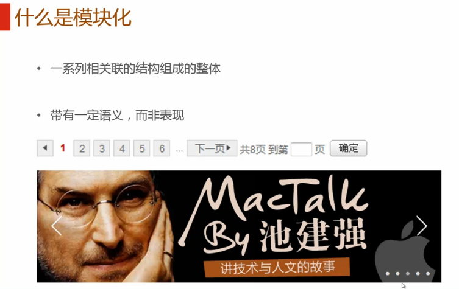
###做法
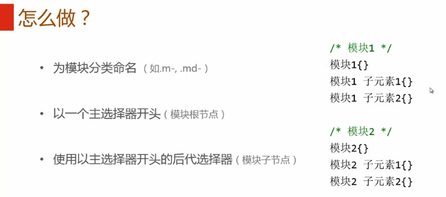
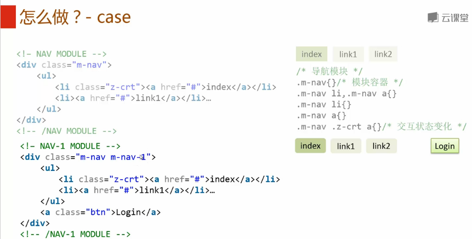
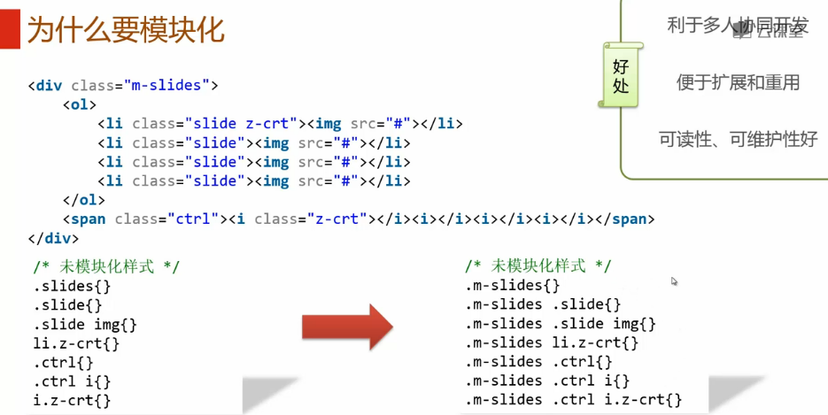

>参考：http://nec.netease.com/ 。
>http://codeguide.bootcss.com/