**目录**：

>笔记持续更新，原地址: https://github.com/Niefee/Wangyi-Note ;

<ul>
<li><a href="#页面优化">页面优化</a><ul>
<li><a href="#减少请求">减少请求</a></li>
<li><a href="#页面性能">页面性能</a></li>
</ul>
</li>
</ul>
#页面优化
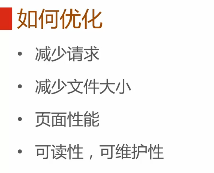

##减少请求
 - 图片合并
精灵模式

 - css文件合并

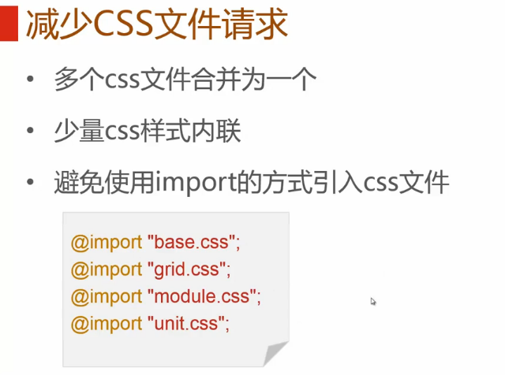

 - 减少图片大小

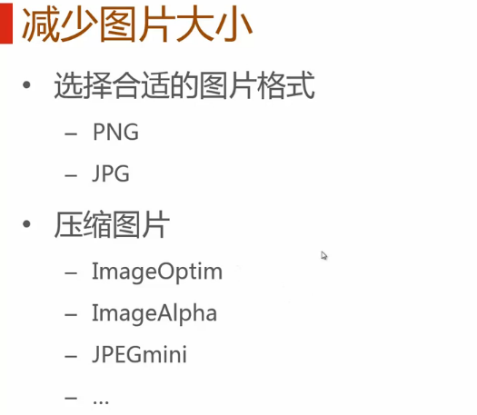

 - css值缩写

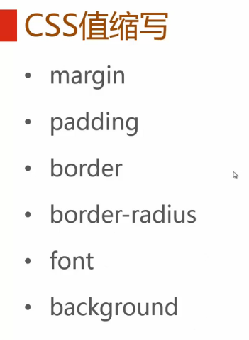

 - 省略值为0的单位

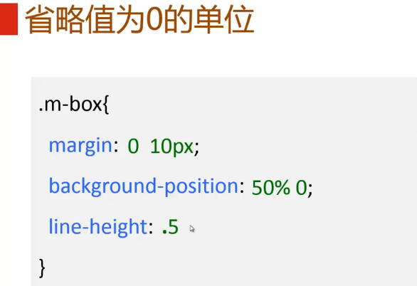

 - 颜色值最短表示

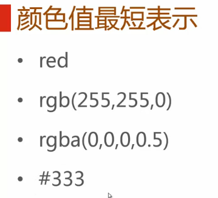

 - css选择器合并

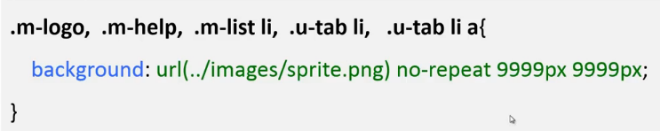
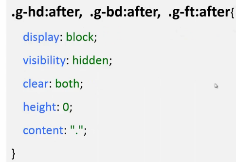
>清除浮动

##页面性能
 - 加载顺序

 - 减少标签数量
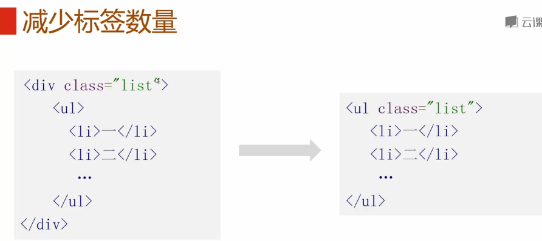

 - 选择器 长度
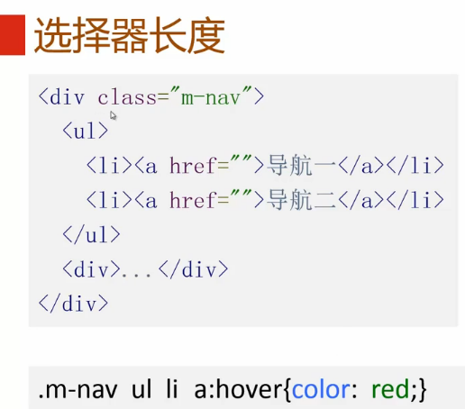
**优化后**
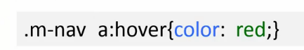

 - 耗性能属性
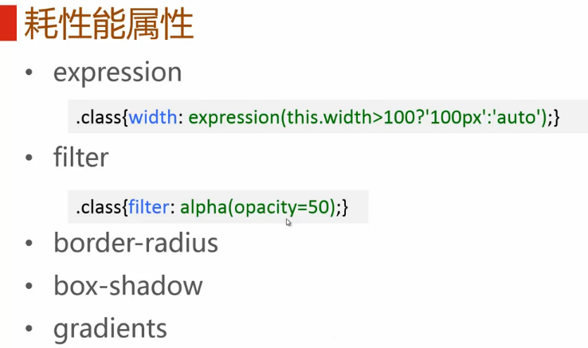

 - 设置图片宽高
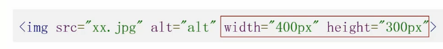

 - 所有表现用css实现
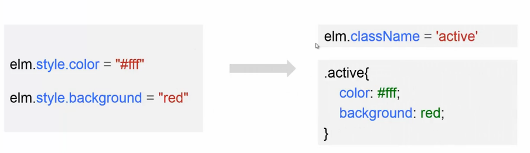

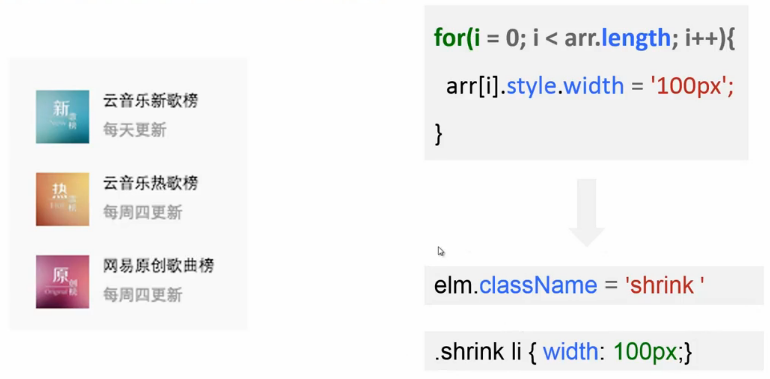

 - 可读性与可维护性	
	 - 规范
	 - 语义化
	 - 尽量避免Hack
	 - 模块化
	 - 注释
