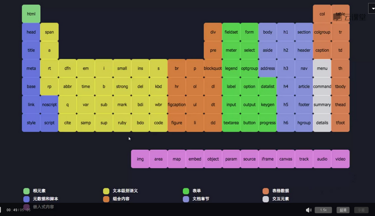
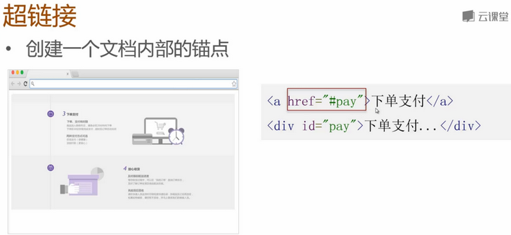
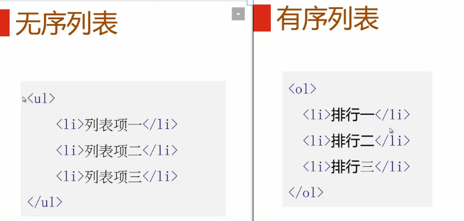
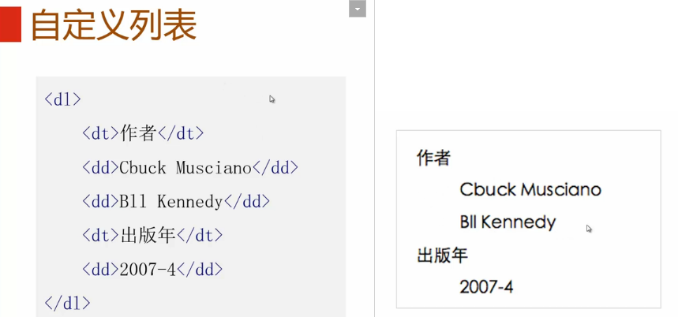
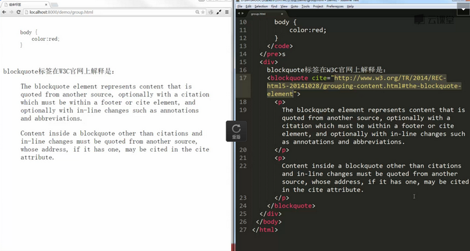
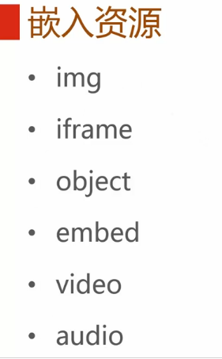
##img 
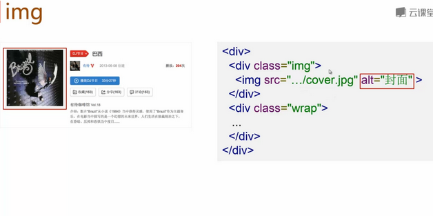
 - **alt** 
此属性的实质作用是图片在无法正确显示的时候起到文本替代的作用
 - **title** 
鼠标滑过时显示的文字提示

##iframe
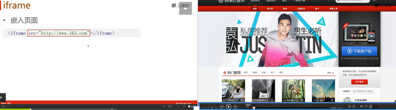
 - **补充**
iframe提供了一个简单的方式把一个网站的内容嵌入到另一个网站中。例子如下图，
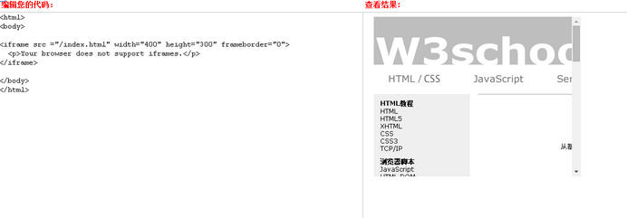
>iframe使用建议：http://www.zhihu.com/question/20653055；

##object ,embed
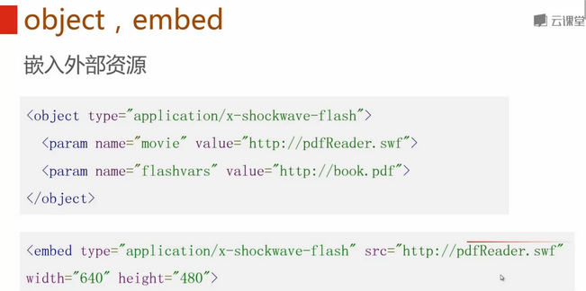
>type：资源类型
< param >：参数；value：播放器地址
data：播放器地址，ie8一下不支持；

##video
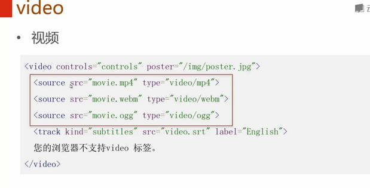
>文字内容是当浏览器不支持 这个标签时显示的。
因为浏览器支持度不同，所以要准备多个资源文件。
controls属性可以显示控制条；
poster属性可以确定视频封面；
<track> 标签为诸如 video 元素之类的媒介规定外部文本轨道。
                subtitles：该轨道定义字幕，用于在视频中显示字幕。
                src：地址；
                label：字幕名称；
autoplay：可以自动播放；
loop：循环播放；
##audio
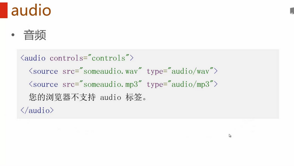
>与video标签相似。
##嵌入资源

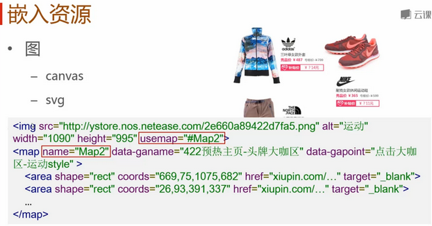
> canvas基于像素，用于实时数据，游戏。
svg是基于矢量的，用于高保真，静态的。

>热点区域
    -map
    -area
< img> 的usemap与< map>的name要相同 ，才能相关联。
area 元素永远嵌套在 map 元素内部。area 元素可定义图像映射中的区域。
< area shape=形状 coords=区域座标列表 href="URL资源地址">
参考：http://www.cnblogs.com/china-chang/archive/2012/03/27/2419734.html

#表格
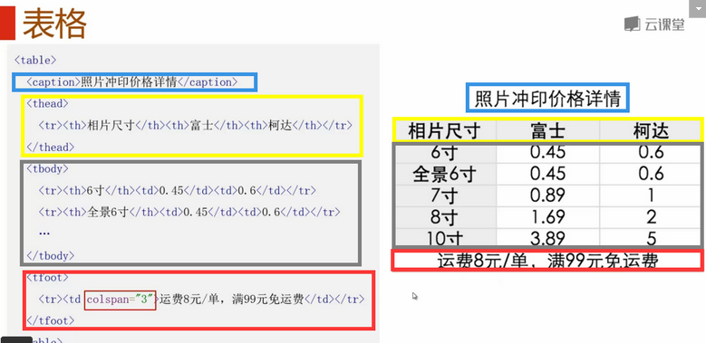
 - 相同颜色表示对应内容；
#表单
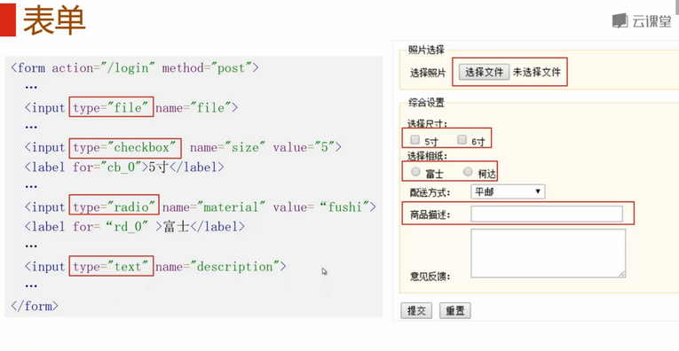
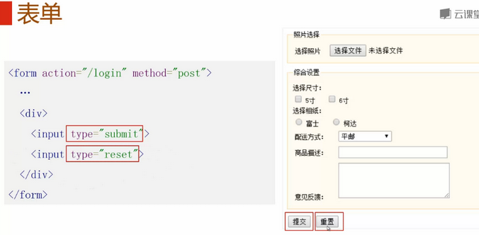
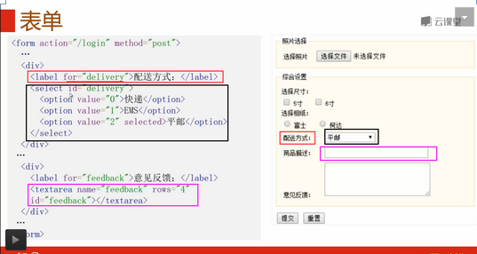
>< label>的for与< select>的id属性要 相同，< select>可以再使用< optgroup>分组。
在文本框中可以使用placeholder 提示内容，有内容就会消失。
value是默认内容。
readonly是只读属性，
< input>的type属性具体可以参考http://www.cnblogs.com/webabcd/archive/2012/02/06/2339534.html。
#实体字符
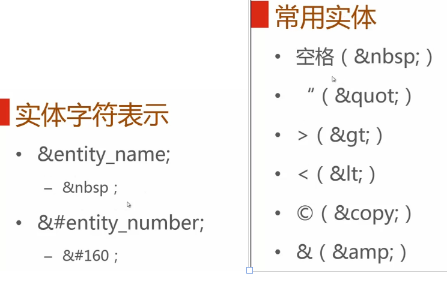
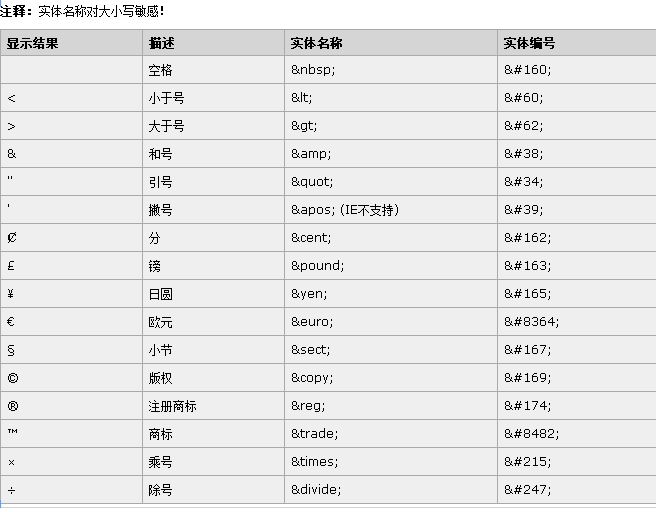

