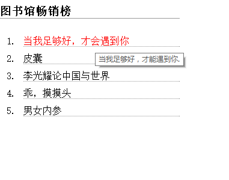

##作业代码

```
<!DOCTYPE html>
<html>
<head>
<meta charset="utf-8">
<meta http-equiv="X-UA-Compatible" content="IE=edge,chrome=1">
<title>Examples</title>
<meta name="description" content="">
<meta name="keywords" content="">
<link href="" rel="stylesheet">
<style type="text/css">
div{
	width: 300px; 
}
	h3{
		border-bottom: 1px #999 solid;
	}
	a{
		text-decoration: none;

	}
	ol li a  {
		display: inline-block;
		
		margin-top: 10px; 
			}
	ol li {
		border-bottom: 1px dotted #999; 
	}
	a:link,a:visited{
		color: black;
	}
	a:hover,a:active{
		color: red;
	}
</style>
</head>
<body>
	<div>
	<h3>图书馆畅销榜</h3>
	<ol>
    	<li><a href="">当我足够好，才会遇到你</a></li>
    	<li><a href="">皮囊</a></li>
    	<li><a href="">李光耀论中国与世界</a></li>
    	<li><a href="">乖，摸摸头</a></li>
    	<li><a href="">男女内参</a></li>
    </ol>
    </div>
</body>
</html>
```
####效果图

