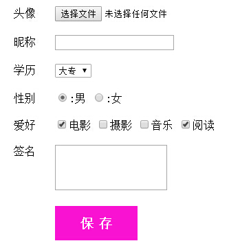

**目录**：

>笔记持续更新，原地址:https://github.com/Niefee/Wangyi-Note ;


##作业代码
###第一题

```
<!DOCTYPE html>
<html>
<head>
<meta charset="utf-8">
<meta http-equiv="X-UA-Compatible" content="IE=edge,chrome=1">
<title>Examples</title>
<meta name="description" content="">
<meta name="keywords" content="">
<link href="" rel="stylesheet">
<style type="text/css">
div{
	width: 300px; 
}
	h3{
		border-bottom: 1px #999 solid;
	}
	a{
		text-decoration: none;

	}
	ol li a  {
		display: inline-block;
		
		margin-top: 10px; 
			}
	ol li {
		border-bottom: 1px dotted #999; 
	}
	a:link,a:visited{
		color: black;
	}
	a:hover,a:active{
		color: red;
	}
</style>
</head>
<body>
	<div>
	<h3>图书馆畅销榜</h3>
	<ol>
    	<li><a href="">当我足够好，才会遇到你</a></li>
    	<li><a href="">皮囊</a></li>
    	<li><a href="">李光耀论中国与世界</a></li>
    	<li><a href="">乖，摸摸头</a></li>
    	<li><a href="">男女内参</a></li>
    </ol>
    </div>
</body>
</html>
```
####效果图

###第二题
```
<!DOCTYPE html>
<html>
<head>
<meta charset="utf-8">
<meta http-equiv="X-UA-Compatible" content="IE=edge,chrome=1">
<title>Examples</title>
<meta name="description" content="">
<meta name="keywords" content="">
<link href="" rel="stylesheet">
<style type="text/css">
	table,th,td {
		border:1px solid black;
	    height: 50px; 
	    text-align: center;


	}
	table{
		width: 700px;
		border-collapse: collapse;
	}
	thead{
		background:#eee;

	}
	

	tbody tr:nth-child(n) th:nth-of-type(1) {
			background:#eee;
		} 
	
	</style>
</head>
<body>
    <table>
		<caption>运费详情</caption>
		<thead>
			<tr>
				<th>区域</th>
				<th>寄达地</th>
				<th>首重（元/1000g）</th>
				<th>续重（元/1000g）</th>
			</tr>
		</thead>
		<tbody>
			<tr>
				<th rowspan="2">一区</th>
				<td>浙江、上海、江苏</td>
				<td>6</td>
				<td>1</td>
			</tr>
			<tr>
				<td>江西、安徽</td>
				<td>7</td>
				<td>1</td>
			</tr>
			<tr>
				<th>二区</th>
				<td>吉林、黑龙江、云南</td>
				<td>10</td>
				<td>6</td>
			</tr>
			<tr>
				<th>三区</th>
				<td>新疆、西藏</td>
				<td>15</td>
				<td>10</td>
			</tr>

		</tbody>
	</table>
</body>
</html>
```
**效果图**

###第二题 
```
<!DOCTYPE html>
<html>
<head>
<meta charset="utf-8">
<meta http-equiv="X-UA-Compatible" content="IE=edge,chrome=1">
<title>Examples</title>
<meta name="description" content="">
<meta name="keywords" content="">
<link href="" rel="stylesheet">
<style type="text/css">
	div{
		margin: 20px;
	}
	#btn{
		background: #FA12D2;
		margin-left:60px;
		width: 120px;
		height: 50px;
		font-size: 20px;
		font-weight: bolder;
		color: #fff;
		border: 0;


	}
</style>
</head>
<body>
   <form>
   <div>
	   	<label style="margin-right: 20px;">头像</label>
	   	<input type="file" name="file">
   	</div>
   	<div>
	   	<label style="margin-right: 20px;">昵称</label>
	   	<input type="text">
   	</div>
   	<div>
   		<label style="margin-right: 20px;">学历</label>
   		<select>
   			<option>大专</option>
   			<option>本科</option>
   		</select>
   	</div>
   	<div>
   		<label style="margin-right: 20px;">性别</label>
   		<label>
   			<input type="radio" checked="checked" name="sex" value="male"><span>:男</span>
   		</label>
   		<label>
   			<input type="radio"  name="sex" value="female"><span>:女</span>
   		</label>
   	</div>
   	<div>
   	<label style="margin-right: 20px;">爱好</label>
   		<label>
   			<input type="checkbox" name="" checked="">电影
   		</label>
   		<label>
   			<input type="checkbox" name="">摄影
   		</label>
   		<label>
   			<input type="checkbox" name="">音乐
   		</label>
   		<label>
   			<input type="checkbox" name="" checked="">阅读
   		</label>
   	</div>
	<div>
		<label style="margin-right: 20px; vertical-align: top;s">签名</label>
		<textarea rows="4" cols="20" style="resize: none;"></textarea>
	</div>
	<div>
		<input type="button" value="保 存"  id="btn">
	</div>
   </form>
</body>
</html>
```
**效果图**



