**目录**:

>笔记持续更新，原地址:https://github.com/Niefee/Wangyi-Note ;

<ul>
<li><a href="#背景">背景</a><ul>
<li><a href="#background-color">background-color</a></li>
<li><a href="#background-image">background-image</a></li>
<li><a href="#background-repeat">background-repeat</a><ul>
<li><a href="#space与round补充">space与round补充</a></li>
</ul>
</li>
<li><a href="#background-attachment">background-attachment</a></li>
<li><a href="#background-position">background-position</a><ul>
<li><a href="#精灵模式">精灵模式</a></li>
</ul>
</li>
<li><a href="#linear-gradient">linear-gradient</a></li>
<li><a href="#radial-gradient">radial-gradient</a></li>
<li><a href="#repeat-gradient">repeat-*-gradient</a></li>
<li><a href="#background-origin">background-origin</a></li>
<li><a href="#background-clip">background-clip</a></li>
<li><a href="#background-size">background-size</a></li>
<li><a href="#background综合写法">background综合写法</a></li>
</ul>
</li>
</ul>
##背景
###background-color
**写法**
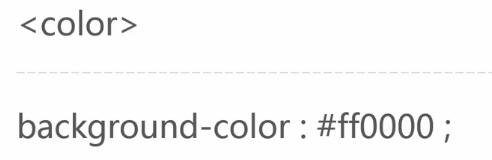

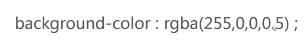
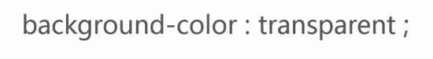

###background-image
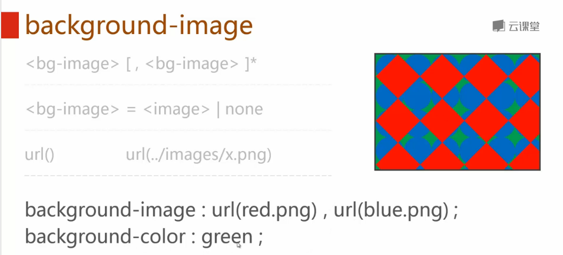
>background-color在最后面。

###background-repeat
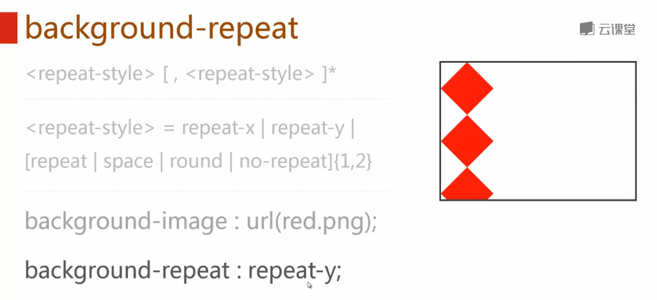

####space与round补充
>补充：
>space值的功效可以简单理解为图片的两端对齐平铺，多出来的空间用空白代替：
>

---
>round属性的效果也可以说是两端对齐，但出来空间通过自身的拉伸来填充。
>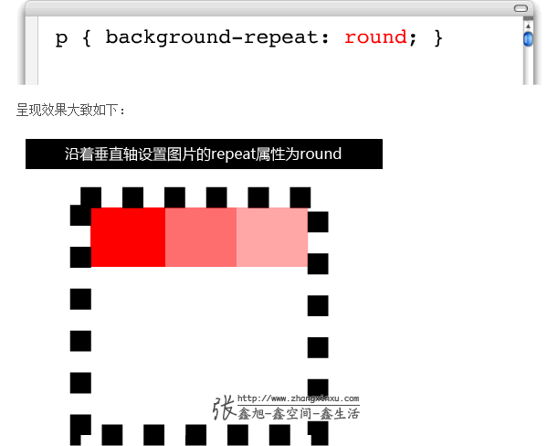

###background-attachment
> - 规定背景图像是否固定或者随着页面的其余部分滚动。

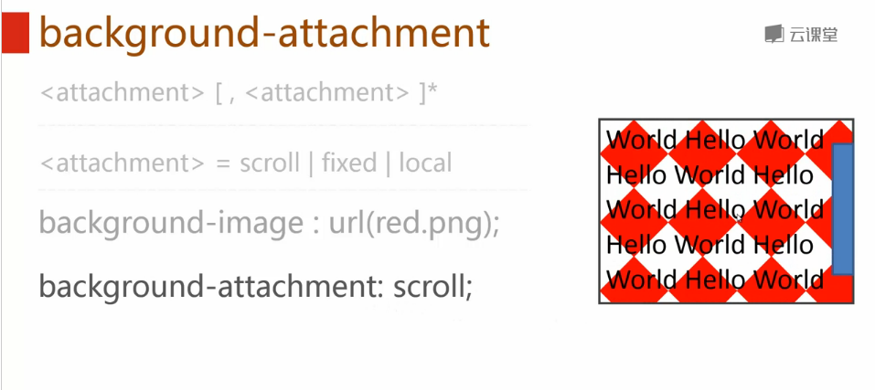
>fixed的参照物是整个页面，好少用，不建议使用。

###background-position
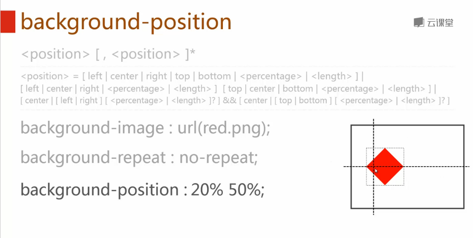
>图片的百分百跟页面的百分百位置重合。

####精灵模式
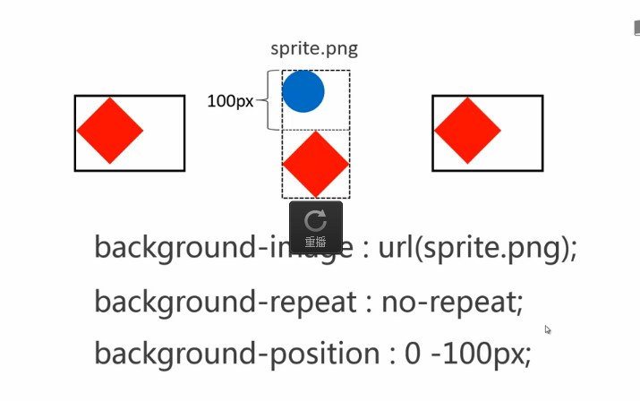

###linear-gradient
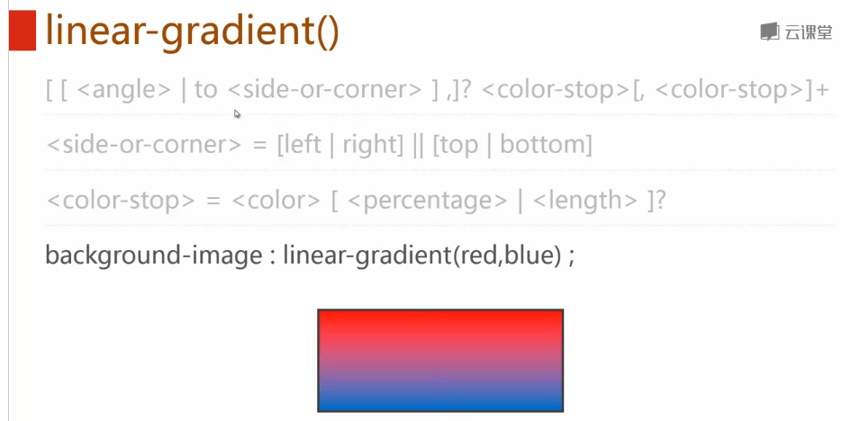
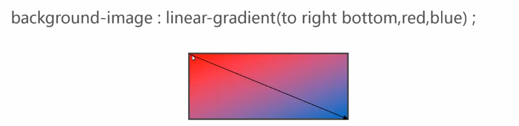
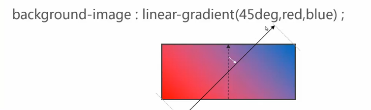
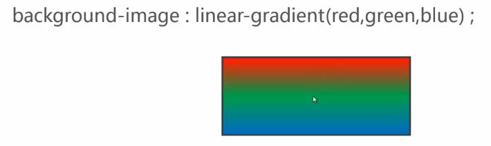
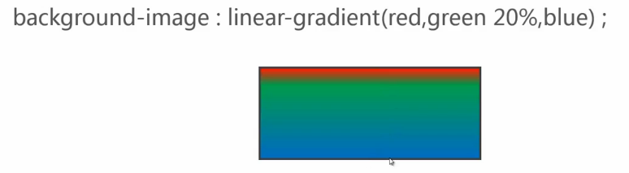
###radial-gradient
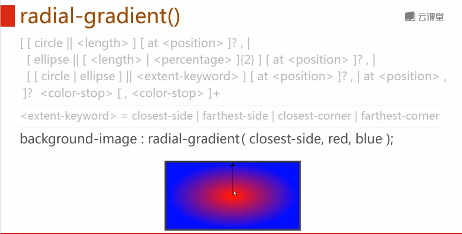
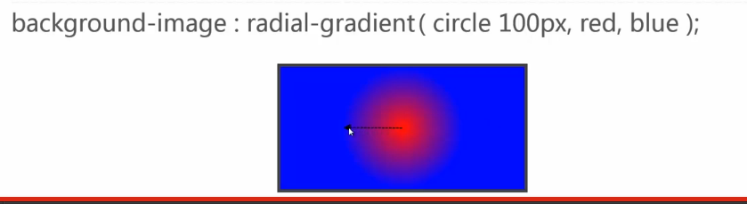

> - circle 100px 意思是 半径为100px的圆。

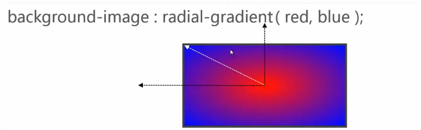
> - 椭圆经过左上角，且椭圆的半径比例是跟长方形的宽高本来相同。

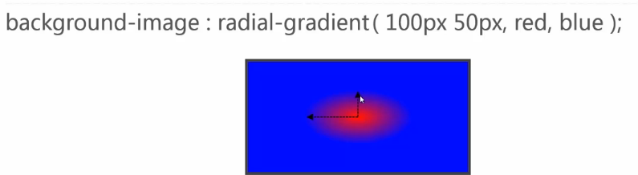
> - 或者可以设置一个椭圆，指定半径。

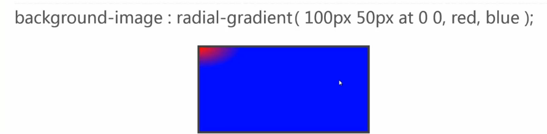
> - at指定了椭圆的圆心位置。

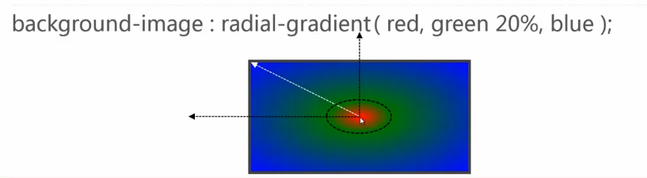
> - green20%指定了这个属性值的位置。

###repeat-*-gradient
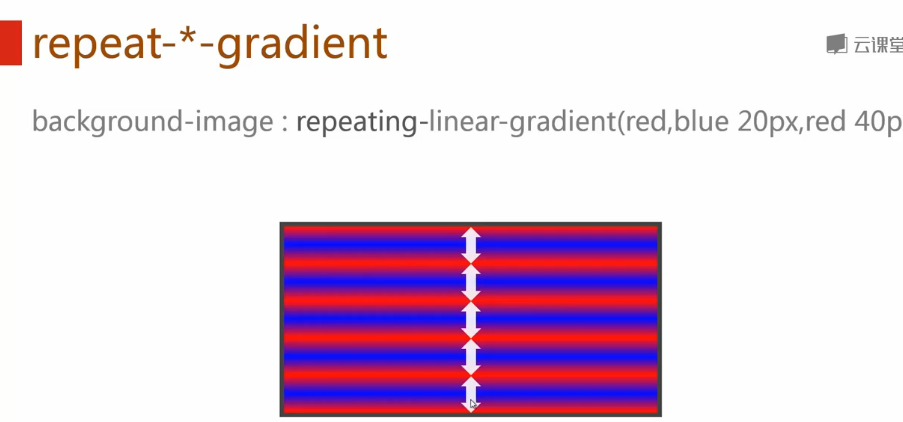
> - 从距离起点40px的地方开始，又按照这样的分布距离开始重复。

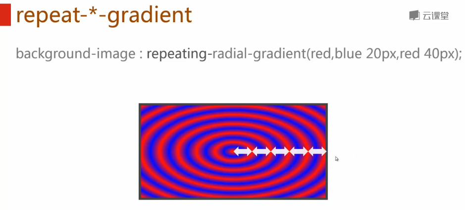
###background-origin
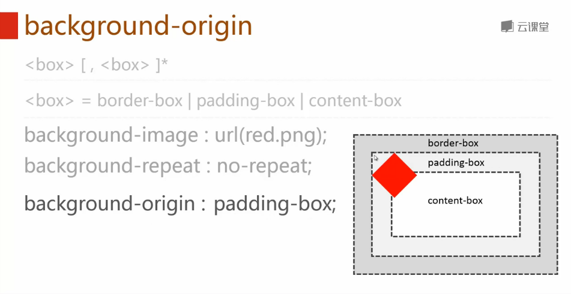
> - 背景从padding开始

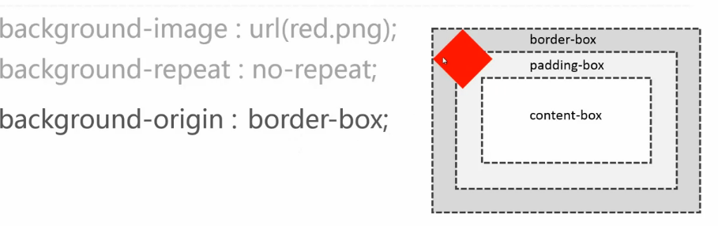
> - 背景从border开始

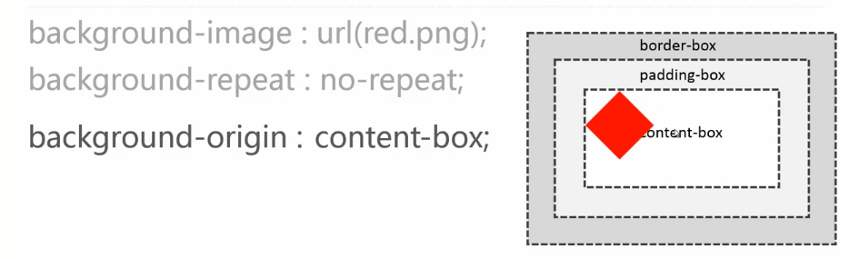
> - 背景冲content开始
###background-clip
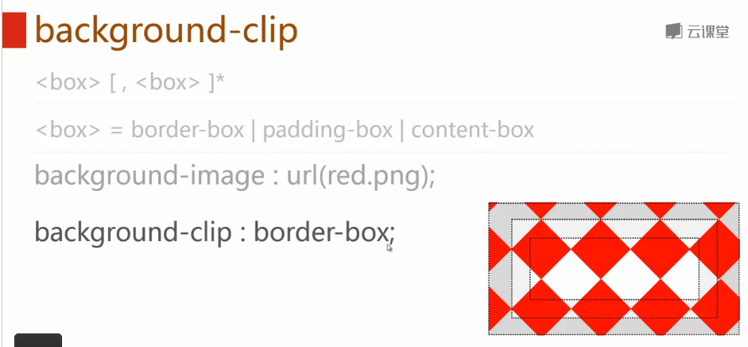
> - 背景包括border在内。

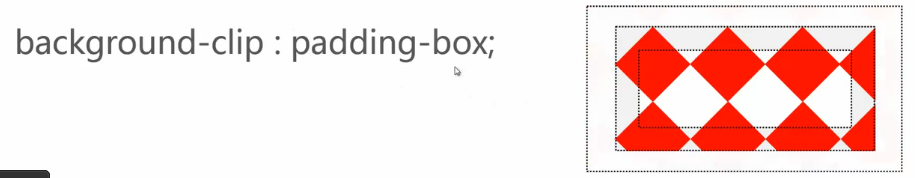
> - 背景包括padding在内。

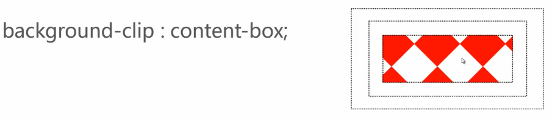
> - 背景包括content在内。

###background-size
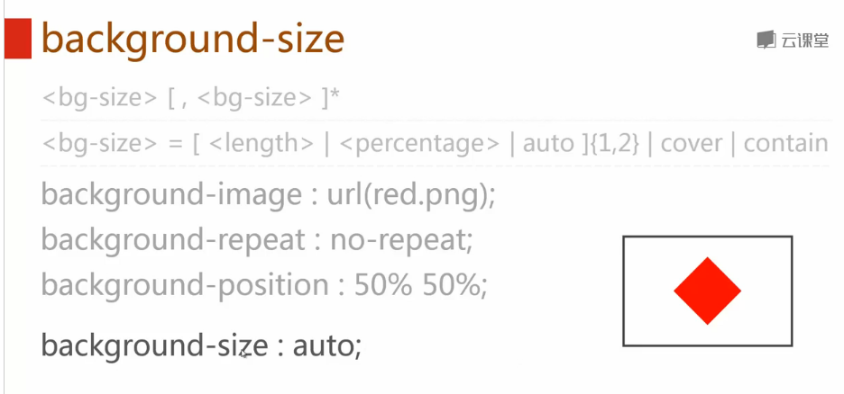
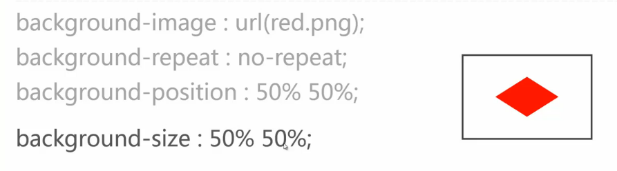
> - 宽跟高的比例变成容器宽、高的50%。

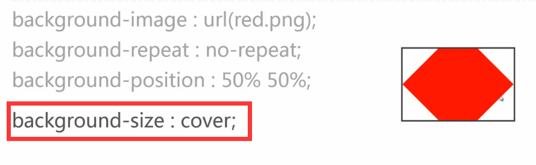
> - 图片尽可能小，但最少都不可以少于容器的宽或者高。

> - 图片尽可能大，但最大都不可以大于容器的宽或者高。

###background综合写法
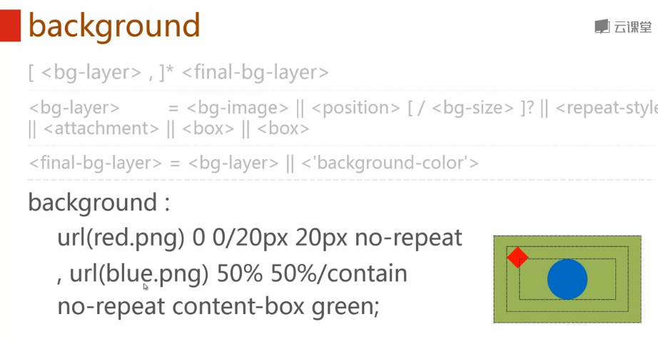

---

>背景的兼容性问题说明：
>本节所讲语法和案例，均以W3规范为准，所有案例在webkit内核的高版本浏览器（如chrome）中测试通过。
>部分语法和案例在低版本浏览器（如IE6、IE7、IE8等）中不支持，比如：多背景图、渐变背景、background-size、background-origin、background-clip等。

