**目录**：

>笔记持续更新，原地址: https://github.com/Niefee/Wangyi-Note ;

<ul>
<li><a href="#css简介">css简介</a><ul>
<li><a href="#历史">历史</a></li>
<li><a href="#引入">引入</a></li>
<li><a href="#语法">语法</a></li>
<li><a href="#属性值语法">属性值语法</a><ul>
<li><a href="#基本元素">基本元素</a></li>
<li><a href="#组合符号">组合符号</a></li>
<li><a href="#数量符号">数量符号</a></li>
<li><a href="#规则语法">@规则语法</a></li>
</ul>
</li>
</ul>
</li>
</ul>
----
###css简介
 - Cascading Style Sheet
 - 页面的表现

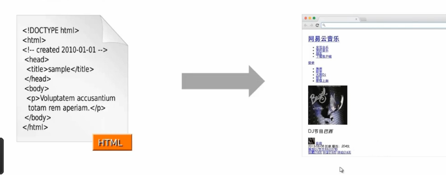
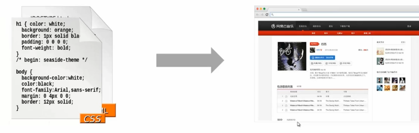
####历史
 - 1996 ------css1
 - 1998 ------css2

 - 2001 ------css3着手准备
 - 2007 ------css2.1

####引入
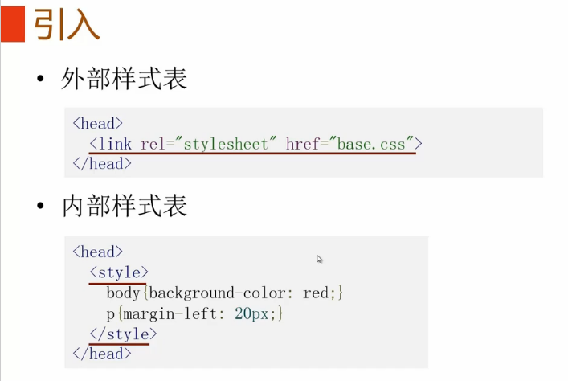
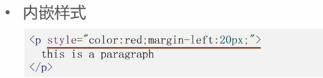
####语法
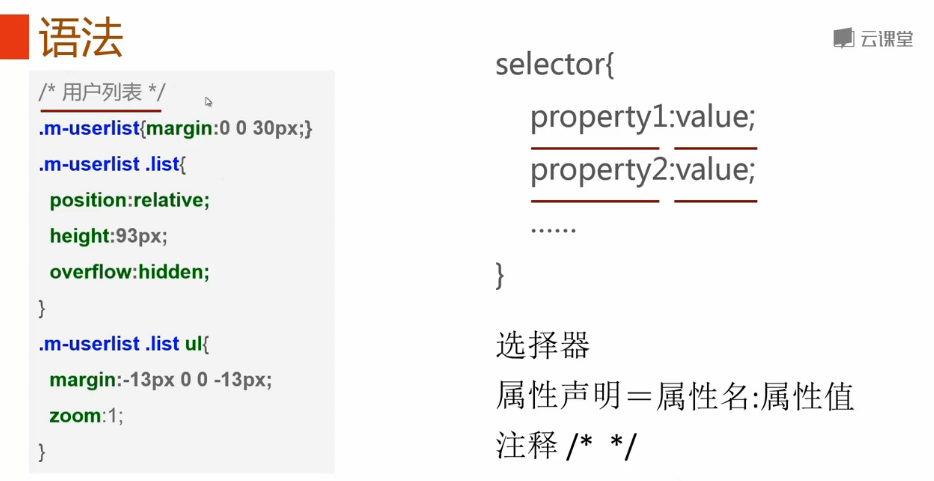
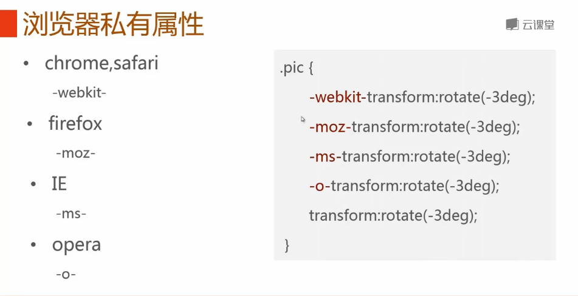
####属性值语法
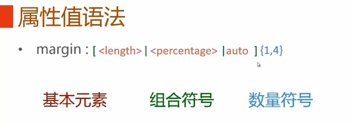
#####基本元素
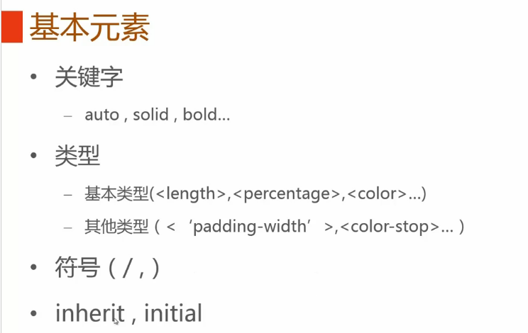
#####组合符号
 - 空格
 
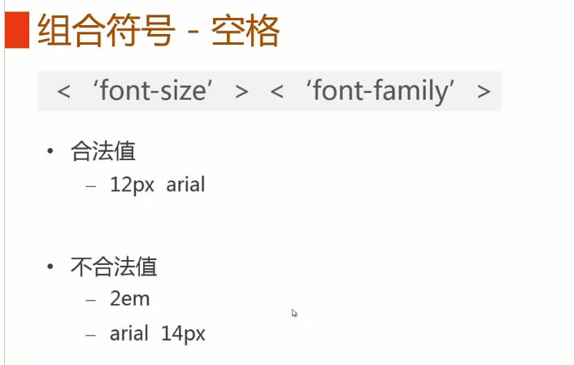
>并置是指将数个关键字、符号或类型，用**空格**分开写在一起。并置中所有的元素都必须出现并且按所规定的顺序出现

 - &&
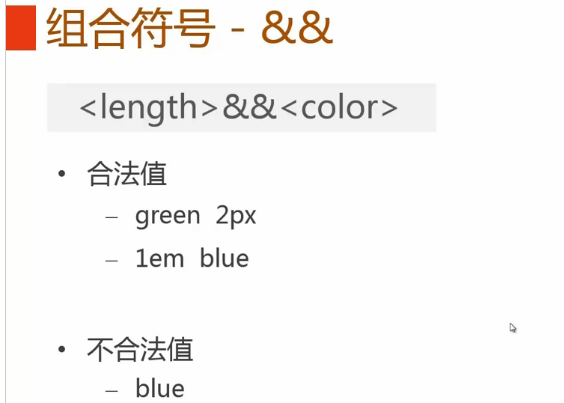
>与”组合符连接的各个部分都必须出现，但是顺序任意

 - ||
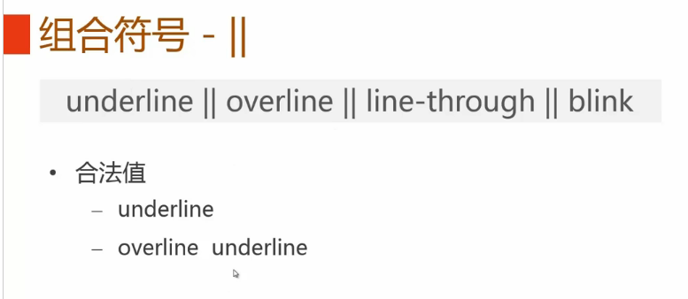
>或”组合符表示其连接的所有组成元素是可选的，次序任意，但是至少其中一个要出现，“或”组合符通常用来描述属性缩写中的各部分。

 - |
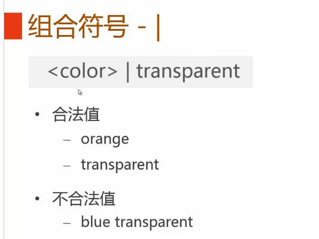
>互斥”组合符表示各组成部分中只能恰好出现一个，通常用来分隔一个属性的所有可选值。

 - []
 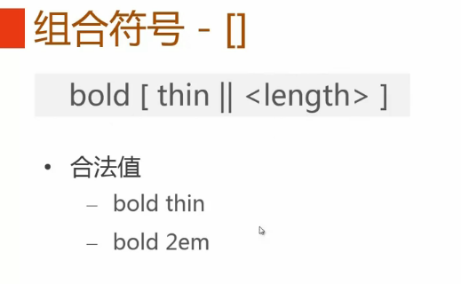
>方括号将数个基本元素组成一个整体，用来强调组合的优先级

----------

##### 数量符号
 - 无
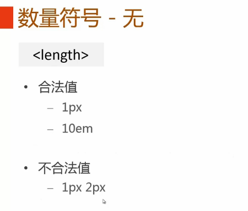

 - +
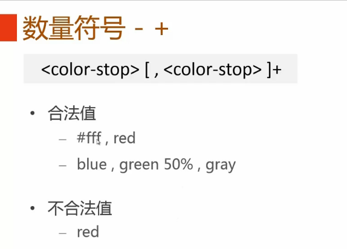
>加号表示可以出现一次或多次。
>
 - ？
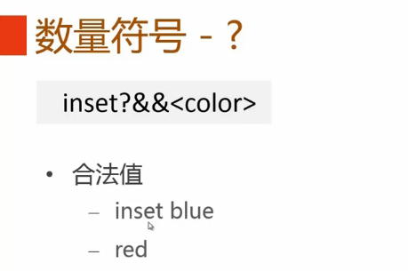
>问号表示可选，即出现零次或一次。

- {}
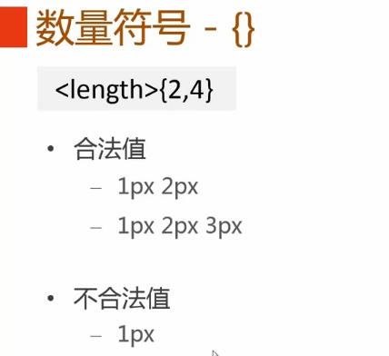
>大括号包含两个以逗号分隔的整数A与B，表示最少出现A次，且最多出现B次。

 - *

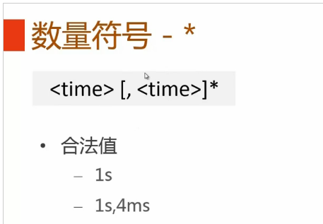
>星号表示可以出现零次（即不出现），一次，或任意多次

 - #

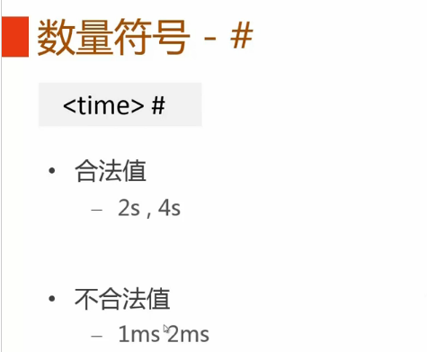
>井号表示可以出现一次或多次，与加号相似。但是其多次出现必须以**逗号**分隔。

**语法总结**

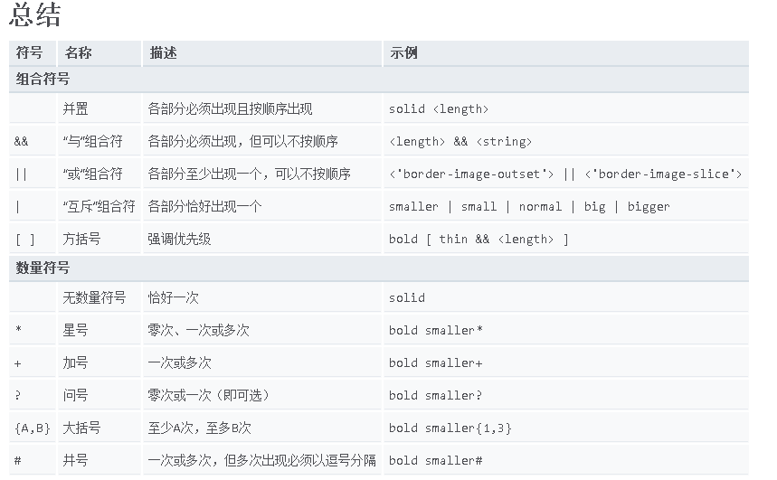
>参考资料：https://developer.mozilla.org/zh-CN/docs/Web/CSS/Value_definition_syntax

#####@规则语法
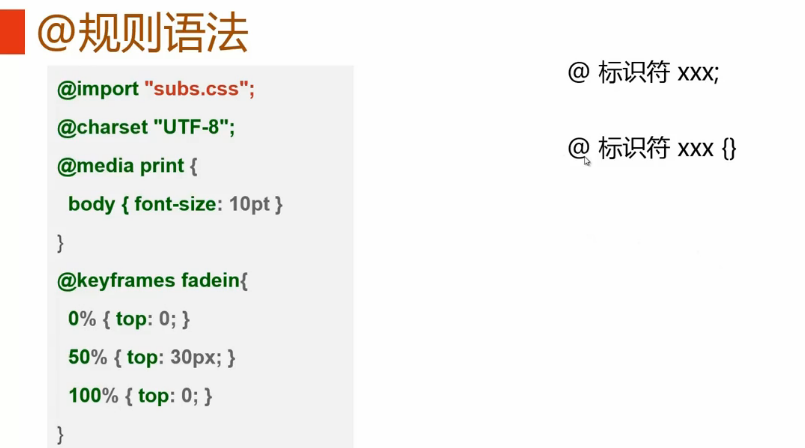
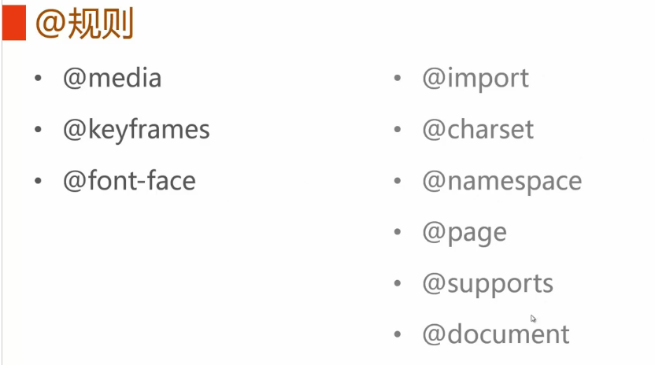

>@font-face补充：

    @font-face {
      font-family: <YourWebFontName>;
      src: <source> [<format>][,<source> [<format>]]*;
      [font-weight: <weight>];
      [font-style: <style>];
    }

>取值说明

>1、YourWebFontName:此值指的就是你自定义的字体名称，最好是使用你下载的默认字体，他将被引用到你的Web元素中的font-family。如“font-family:"YourWebFontName";”

>2、source:此值指的是你自定义的字体的存放路径，可以是相对路径也可以是绝路径；

>3、format：此值指的是你自定义的字体的格式，主要用来帮助浏览器识别，其值主要有以下几种类型：truetype,opentype,truetype-aat,embedded-opentype,avg等；

>4、weight和style:这两个值大家一定很熟悉，weight定义字体是否为粗体，style主要定义字体样式，如斜体。 

---

>**!important**是CSS1就定义的语法，作用是提高指定样式规则的应用优先权。语法格式{ cssRule !important }，即写在定义的最后面，例如：box{color:red !important;}。
在CSS中，通过对某一样式声明! important ，可以更改默认的CSS样式优先级规则，使该条样式属性声明具有最高优先级，也就是相当于写在最下面。
