**目录**：

>笔记持续更新，原地址:https://github.com/Niefee/Wangyi-Note ;

<ul>
<li><a href="#变形">变形</a><ul>
<li><a href="#transform">transform</a><ul>
<li><a href="#rotate">rotate</a></li>
</ul>
</li>
<li><a href="#translate">translate</a></li>
<li><a href="#scale">scale</a></li>
<li><a href="#skew">skew</a></li>
<li><a href="#transform-transform-function">transform:&lt; transform-function &gt;+</a></li>
<li><a href="#transform-origin">transform-origin</a></li>
<li><a href="#perspective">perspective</a><ul>
<li><a href="#perspective-origin">perspective-origin</a></li>
</ul>
</li>
<li><a href="#translate3d">translate3d()</a></li>
<li><a href="#scale3d">scale3d()</a></li>
<li><a href="#rotate3d">rotate3d()</a></li>
<li><a href="#transform-style">transform-style</a></li>
<li><a href="#backface-visibity">backface-visibity</a></li>
</ul>
</li>
</ul>
##变形
###transform
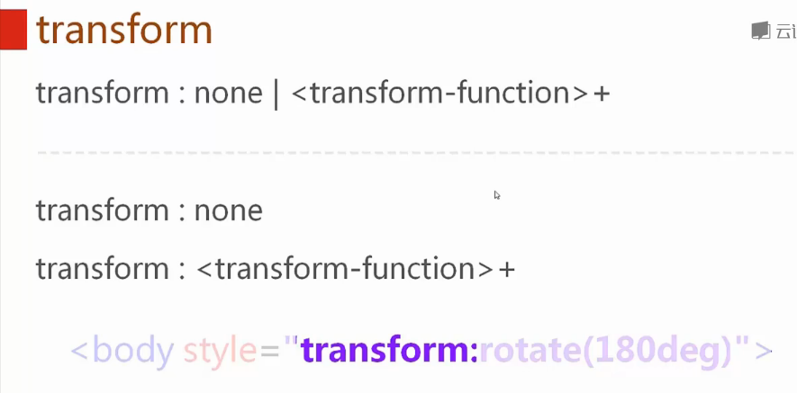
####rotate
 rotate(< angle>)
 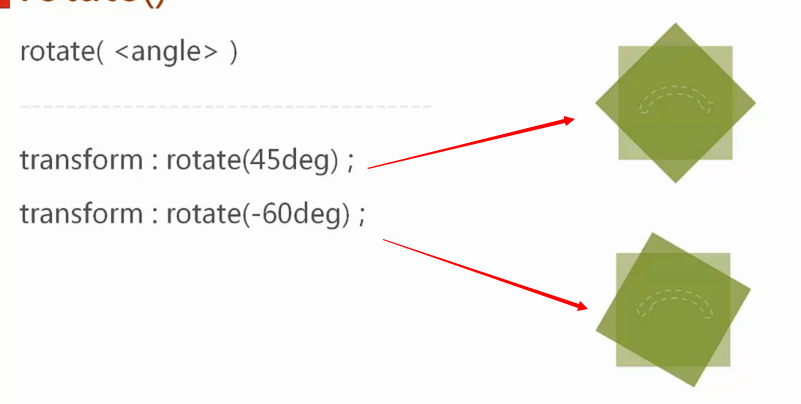
 
###translate
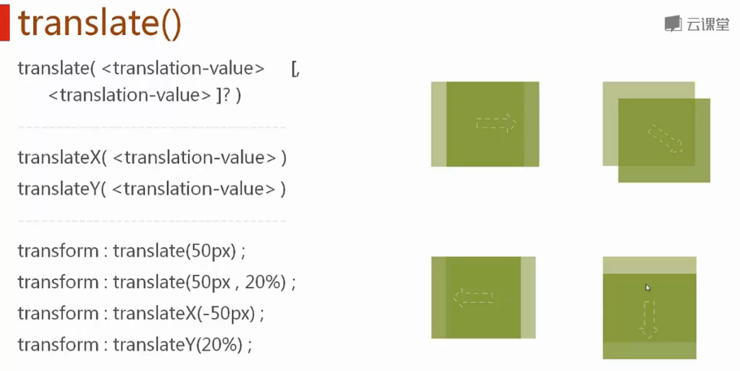
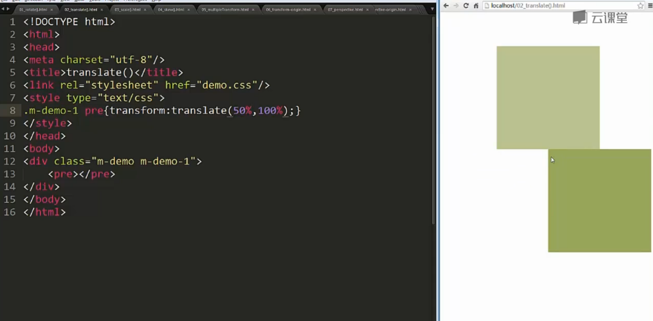
>百分百的取值基础是容器的宽或高。

###scale
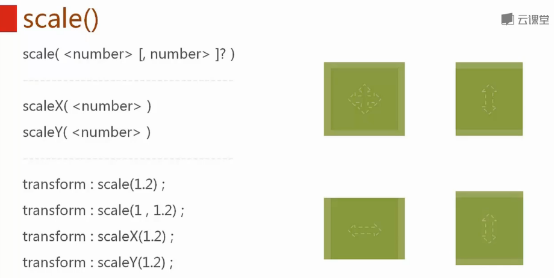
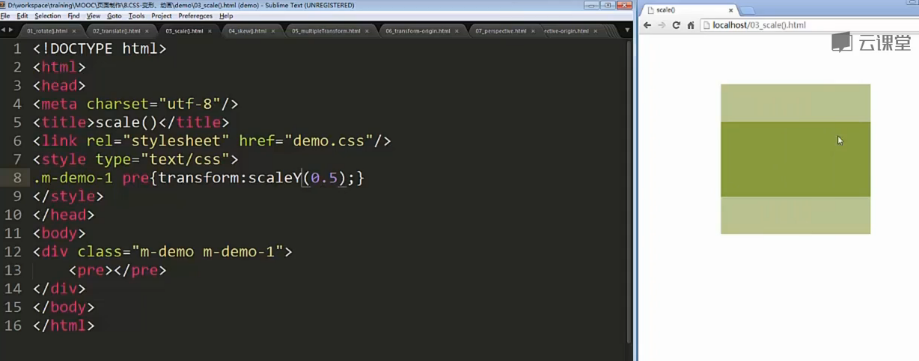

###skew
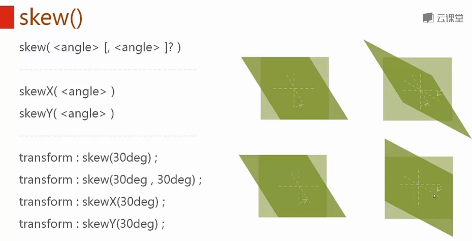

###transform:< transform-function >+
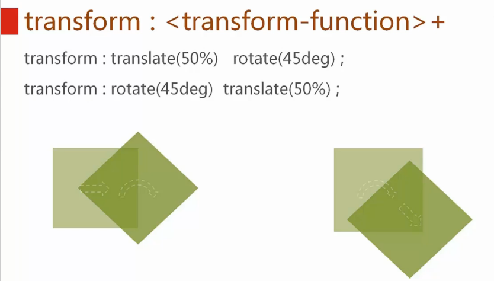

 - 顺序对比
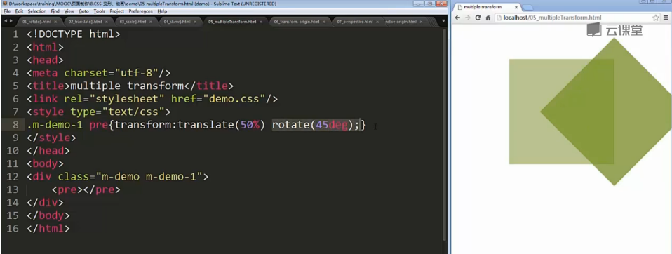
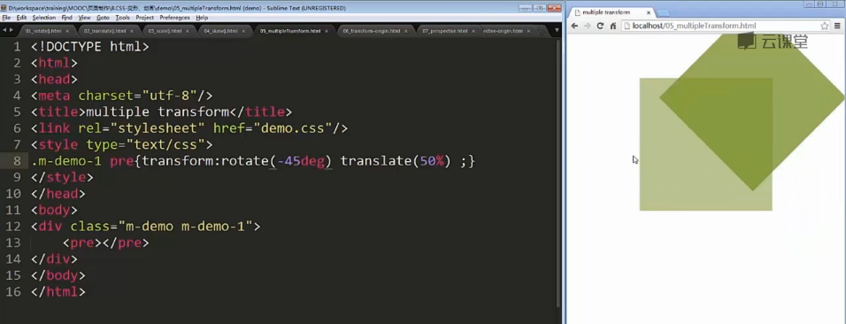

###transform-origin
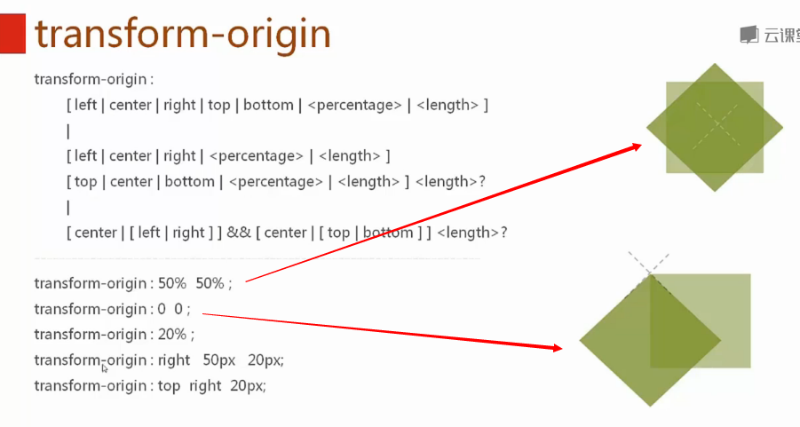
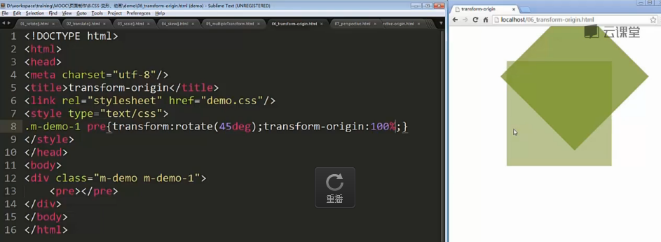

###perspective
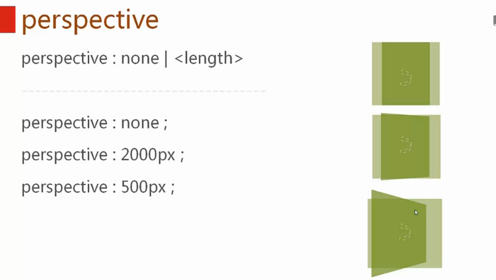
>length的取值意思是人眼到物体的距离

####perspective-origin
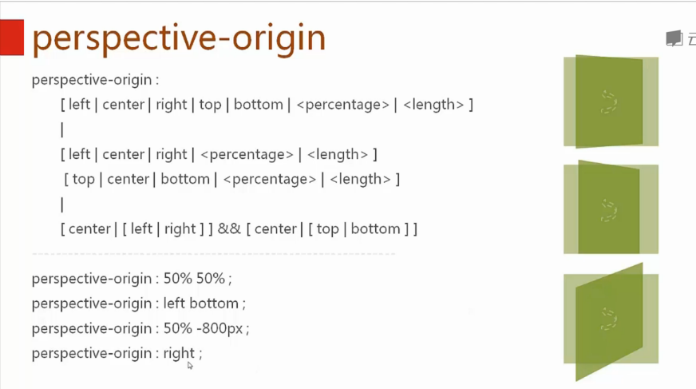

###translate3d()
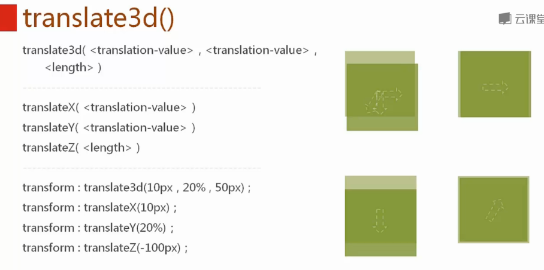

###scale3d()
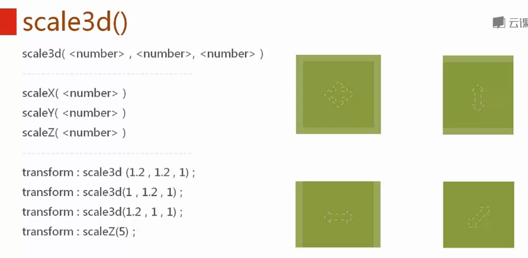

###rotate3d()
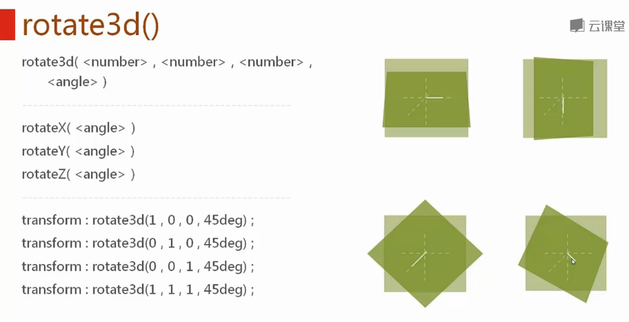

###transform-style

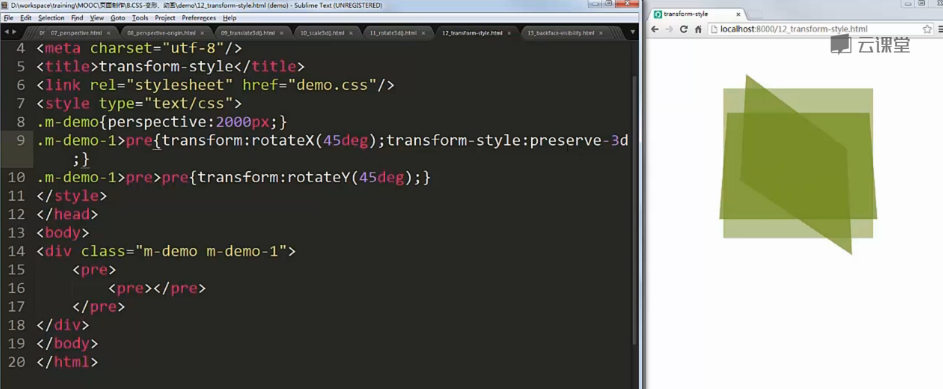

###backface-visibity
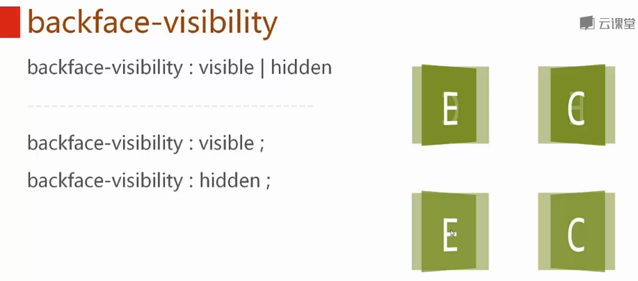

>变形的兼容性问题说明：
>本节所讲语法和案例，均以W3规范为准，所有案例在webkit内核的高版本浏览器（如chrome）中测试通过。
>本节所讲语法和案例在低版本浏览器（如IE6、IE7、IE8等）中不支持。