<ul>
<li><ul>
<li><a href="#文本">文本</a><ul>
<li><a href="#font-size">font-size</a></li>
<li><a href="#font-family">font-family</a></li>
<li><a href="#font-weight">font-weight</a></li>
<li><a href="#font-style">font-style</a></li>
<li><a href="#line-height">line-height</a></li>
<li><a href="#font">font</a></li>
<li><a href="#color">color</a></li>
</ul>
</li>
</ul>
</li>
<li><ul>
<li><a href="#text">text</a><ul>
<li><a href="#text-align">text-align</a></li>
<li><a href="#vertical-align">vertical-align</a></li>
<li><a href="#textindent">text—indent</a></li>
<li><a href="#white-space">white-space</a></li>
<li><a href="#word-wrap">word-wrap</a></li>
<li><a href="#word-break">word-break</a></li>
<li><a href="#text-shadow">text-shadow</a></li>
<li><a href="#text-decoration">text-decoration</a></li>
<li><a href="#text-text-overflow">text-text-overflow</a></li>
<li><a href="#cursor">cursor</a></li>
<li><a href="#inherit继承">inherit(继承)</a></li>
</ul>
</li>
</ul>
</li>
</ul>
###文本
####font-size
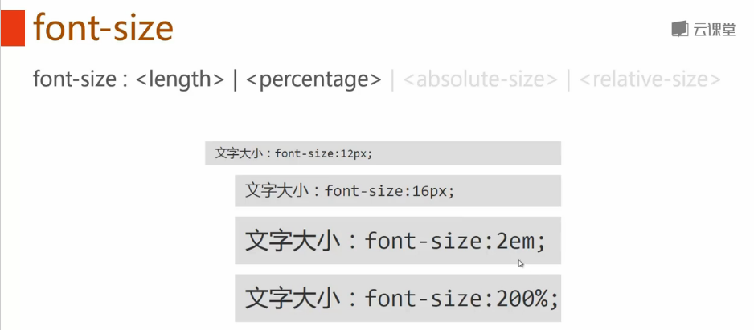
####font-family
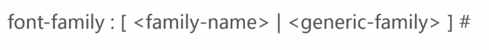

####font-weight
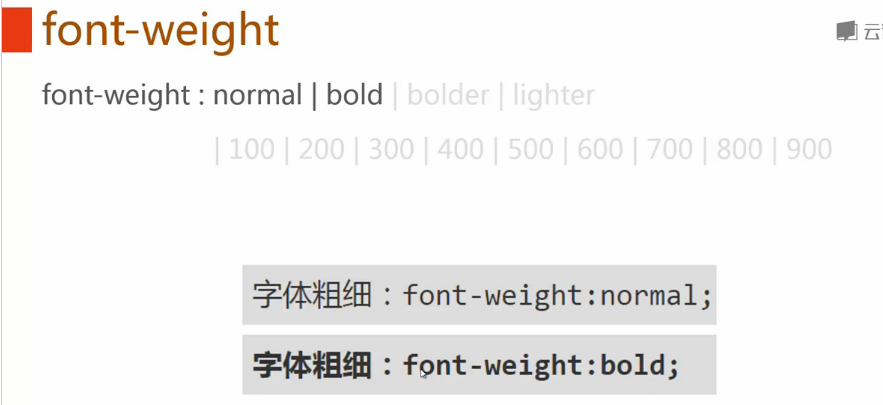
####font-style
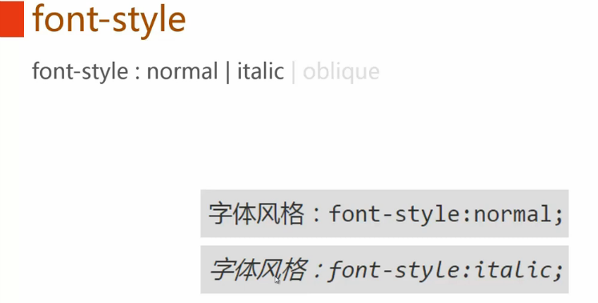
>italic:斜体；
>oblique:倾斜，有斜体就斜体，没有斜体就强制倾斜

####line-height
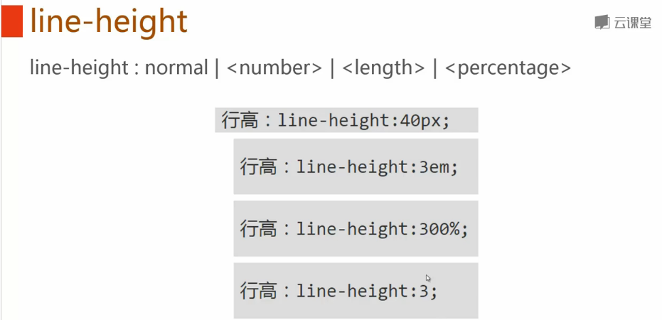
>如何使用百分比，是先计算再继承；如果使用数字，就直接继承。

####font
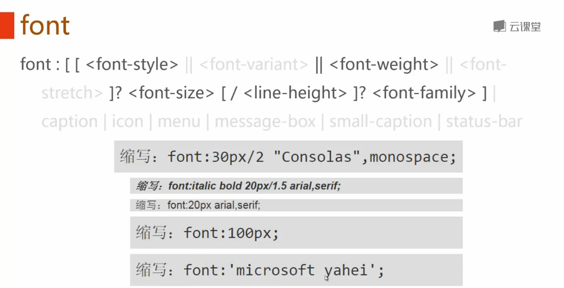
####color
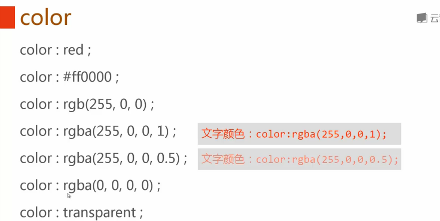
---
###text
####text-align
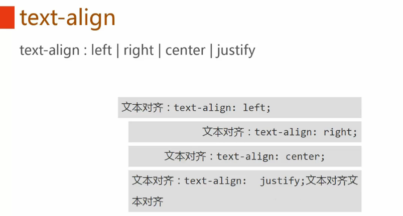
####vertical-align
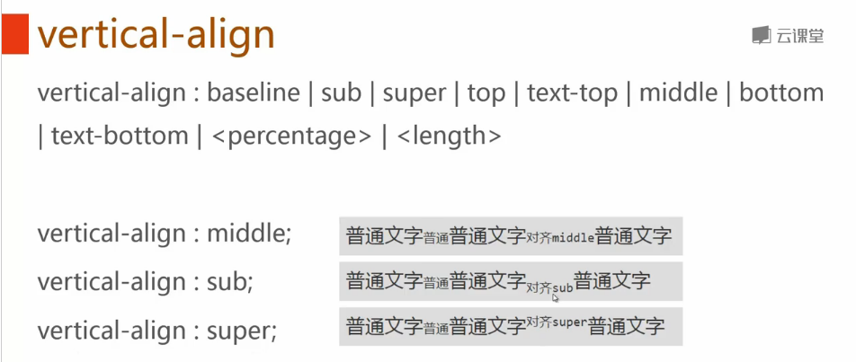
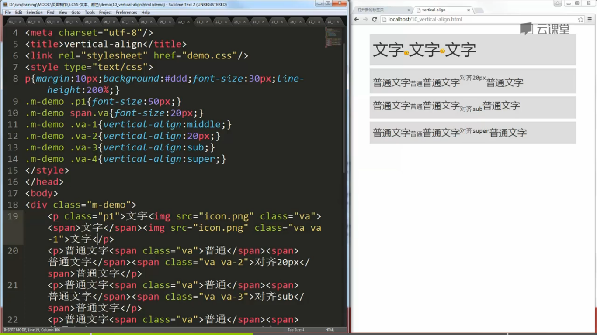
####text—indent
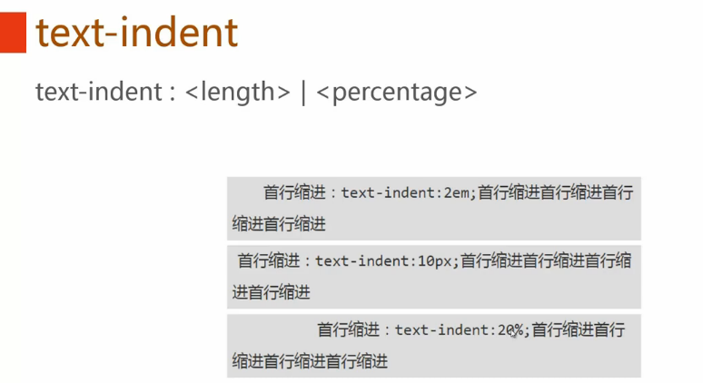
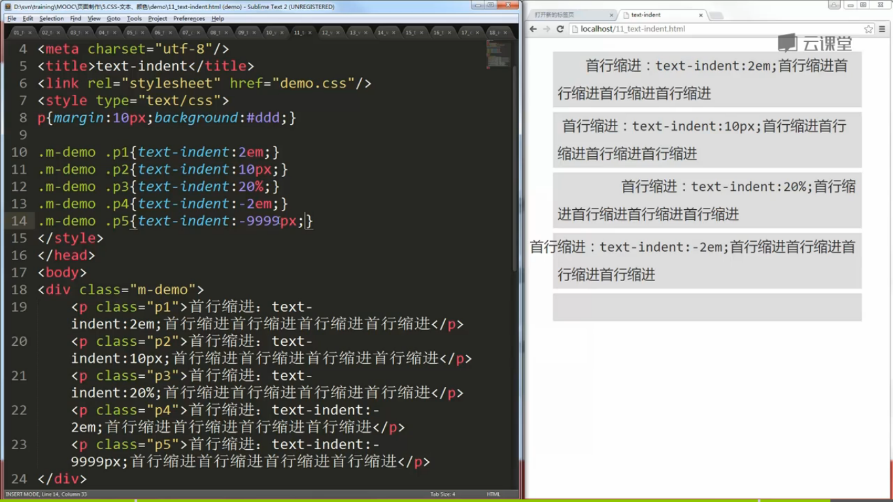
####white-space
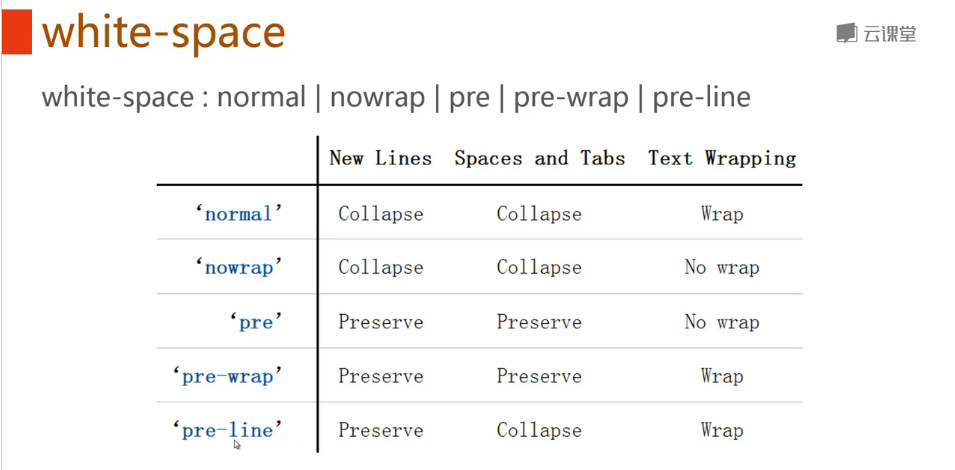
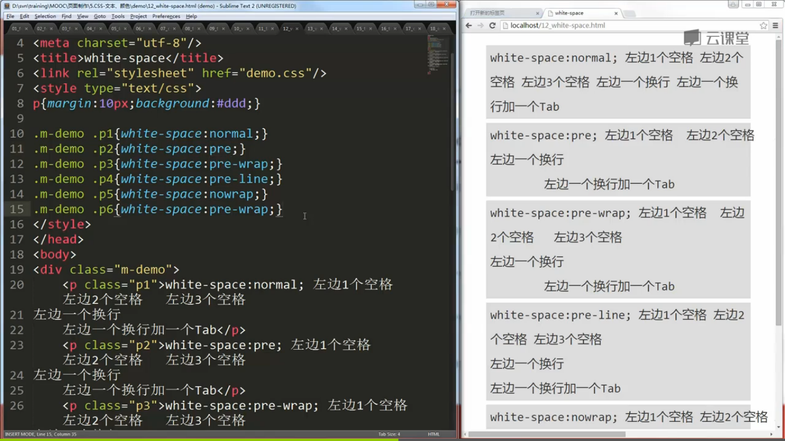
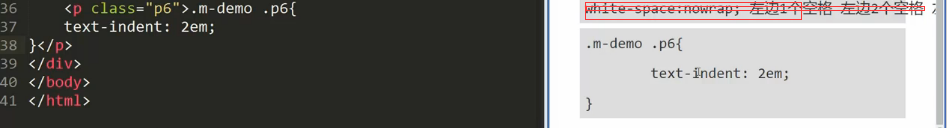

####word-wrap
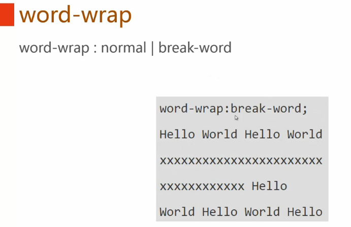

####word-break
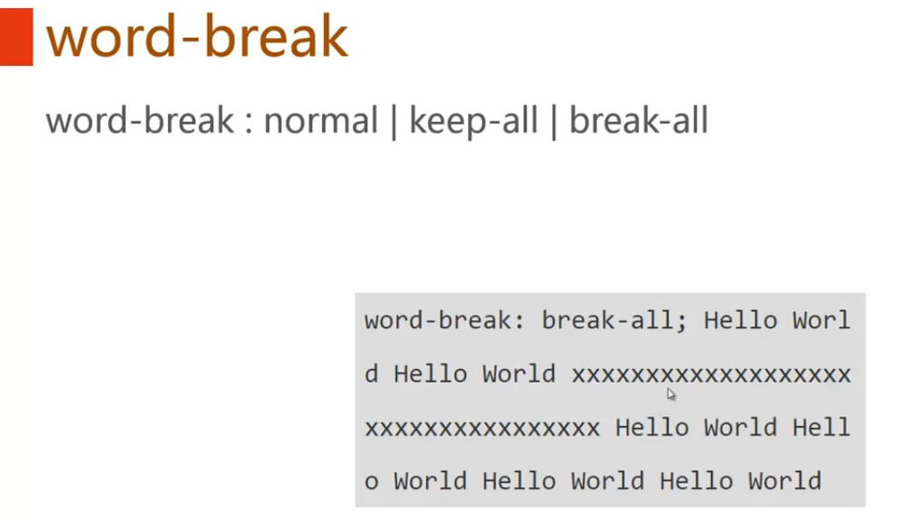
####text-shadow
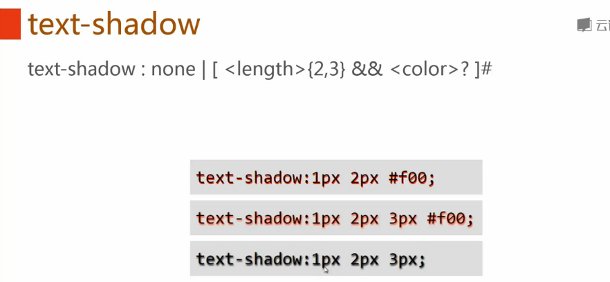
####text-decoration
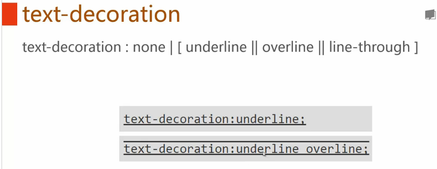
####text-text-overflow
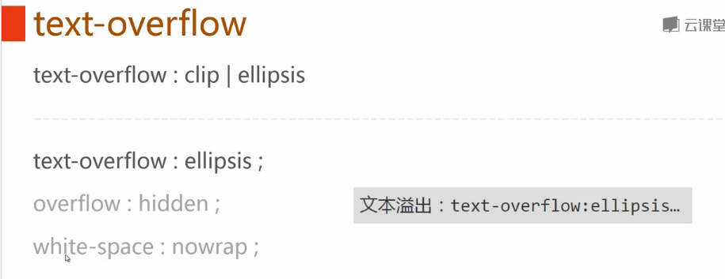
####cursor
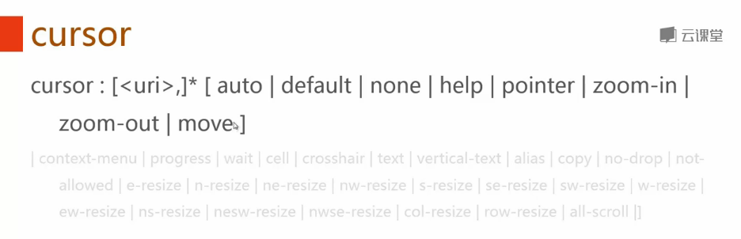
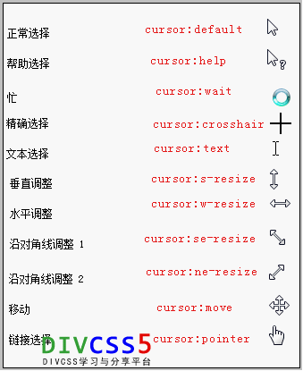
####inherit(继承)
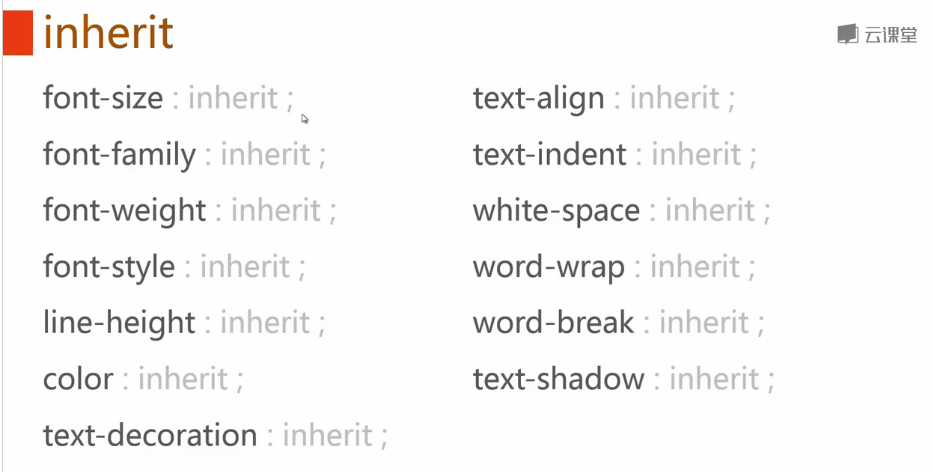

