<ul>
<li><a href="#盒模型">盒模型</a><ul>
<li><a href="#盒子模型">盒子模型</a></li>
<li><a href="#width">width</a></li>
<li><a href="#height">height</a></li>
<li><a href="#padding">padding</a><ul>
<li><a href="#padding的缩写">padding的缩写</a></li>
</ul>
</li>
<li><a href="#margin">margin</a></li>
<li><a href="#border">border</a><ul>
<li><a href="#border-style">border-style</a></li>
<li><a href="#border-radius">border-radius</a></li>
</ul>
</li>
<li><a href="#overflow">overflow</a></li>
</ul>
</li>
<li><a href="#box盒模型">box–盒模型</a><ul>
<li><a href="#box-sizing">box-sizing</a></li>
<li><a href="#box-shadow">box-shadow</a></li>
<li><a href="#outline">outline</a></li>
</ul>
</li>
</ul>
##盒模型
###盒子模型
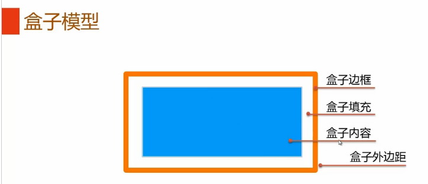

###width
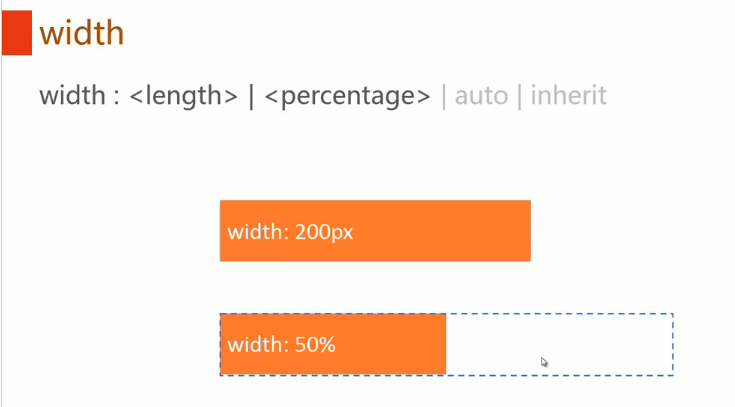
>引申：max-width\min-width
###height
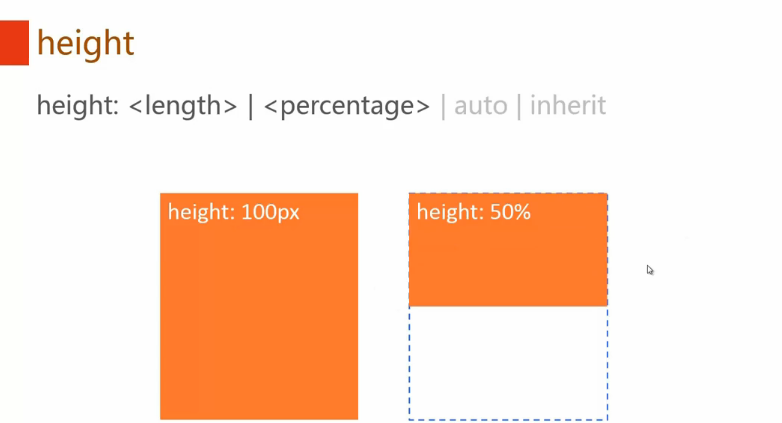
###padding
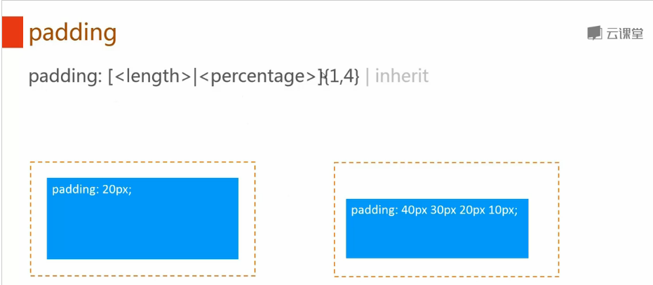
####padding的缩写 
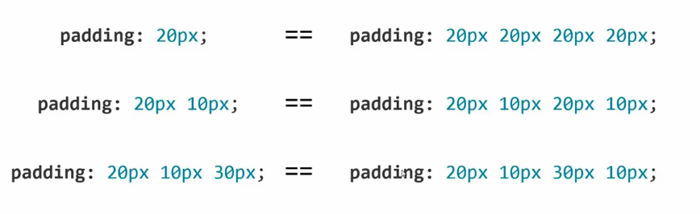
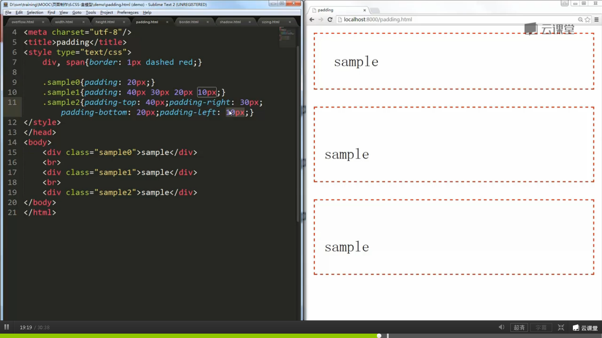
###margin
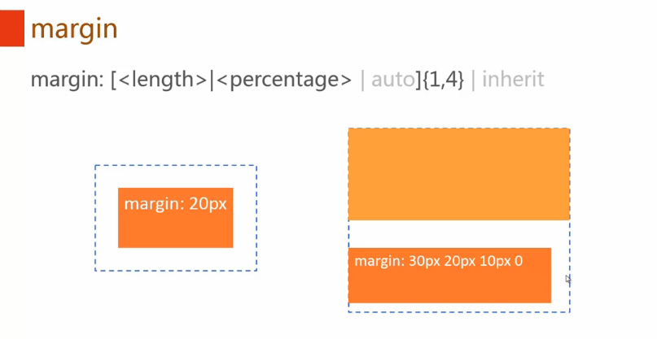
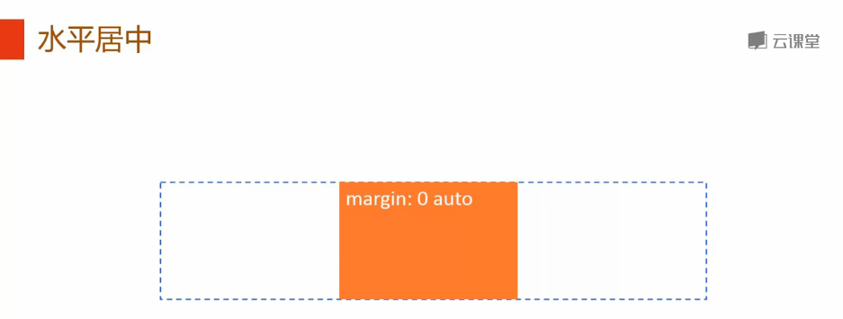
###border
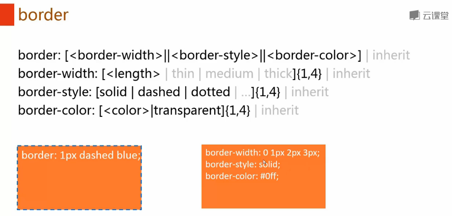
####border-style
>border-style样式补充：
>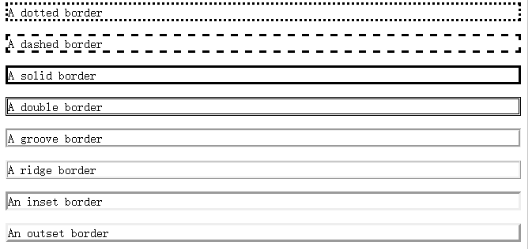

####border-radius
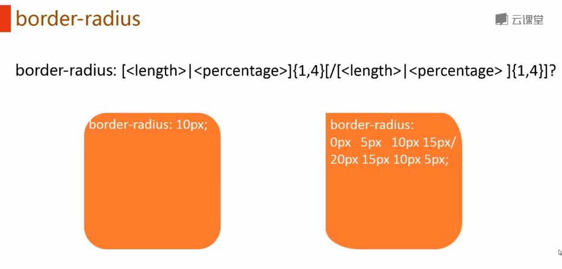
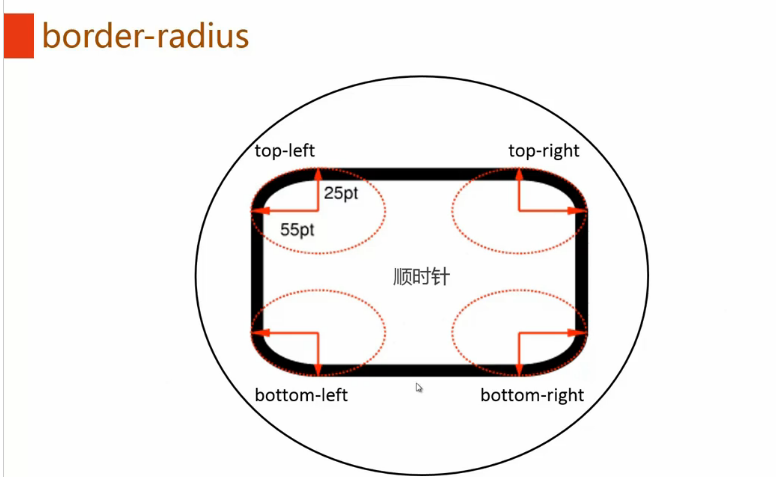
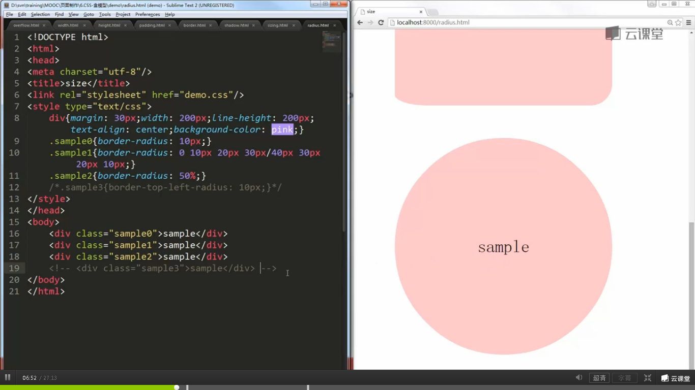
###overflow
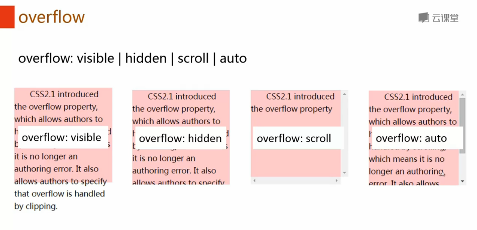
>引申：overflow-x,overflow-y

##box--盒模型

###box-sizing
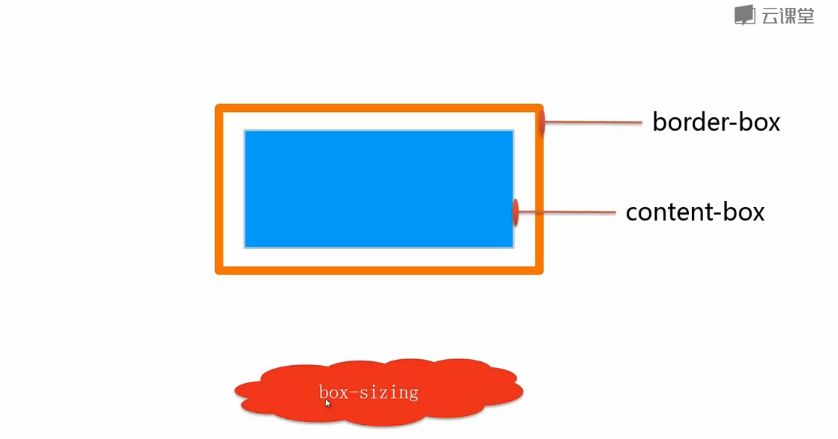
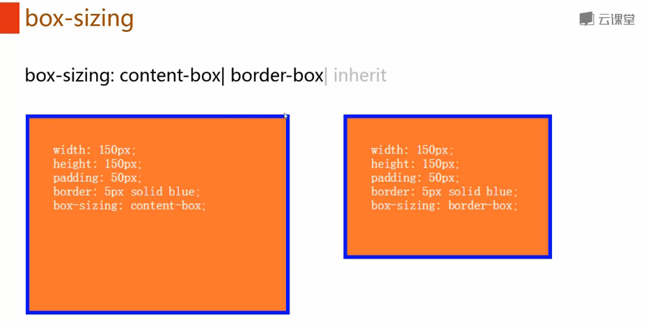
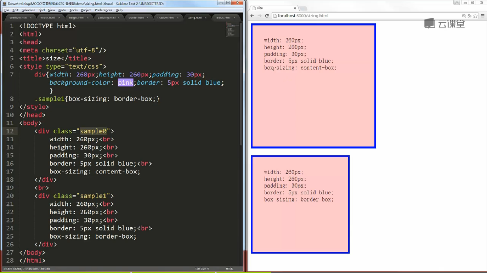
###box-shadow
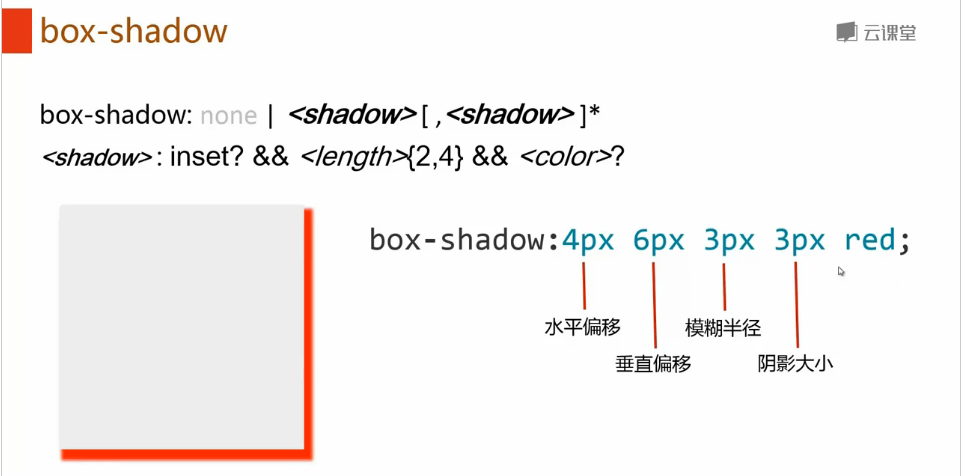
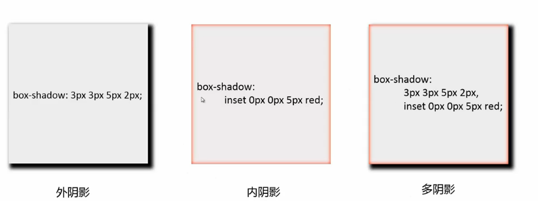
###outline
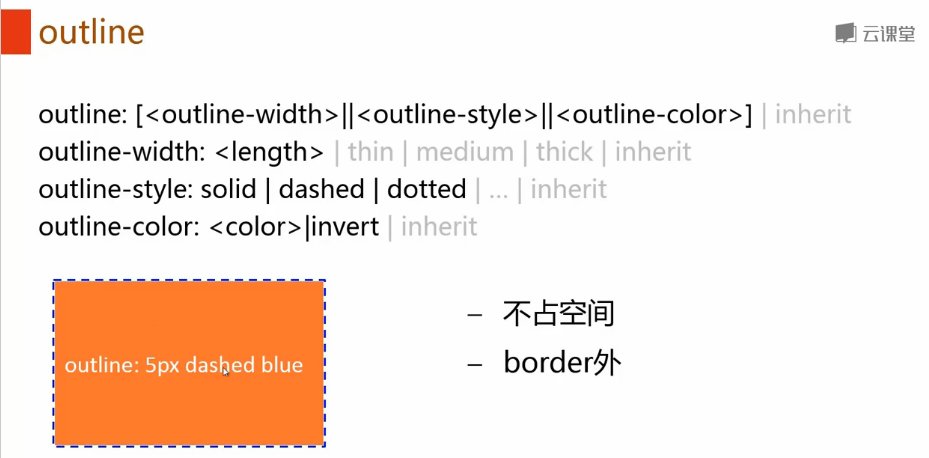
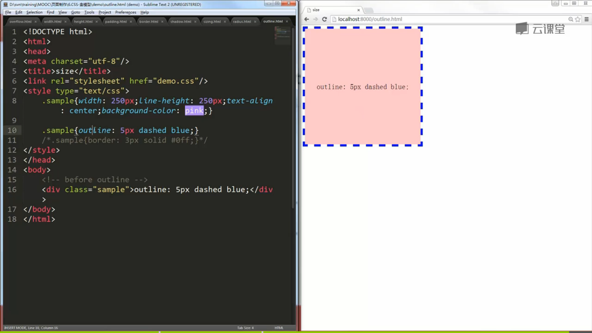
>关于CSS属性的浏览器兼容性，可以通过 [caniuse](http://caniuse.com/) 查询。
>border-radius ie8及以下不支持
>box-sizing ie7及以下不支持
>box-shadow ie8及以下不支持
>outline ie7及以下不支持