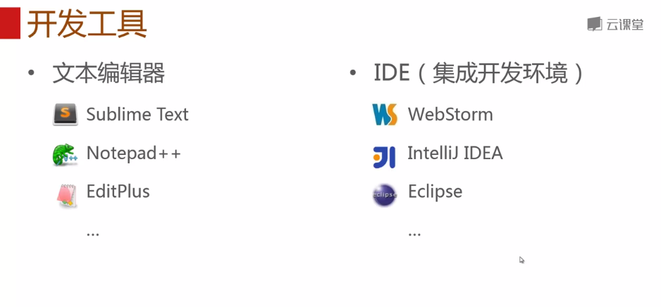
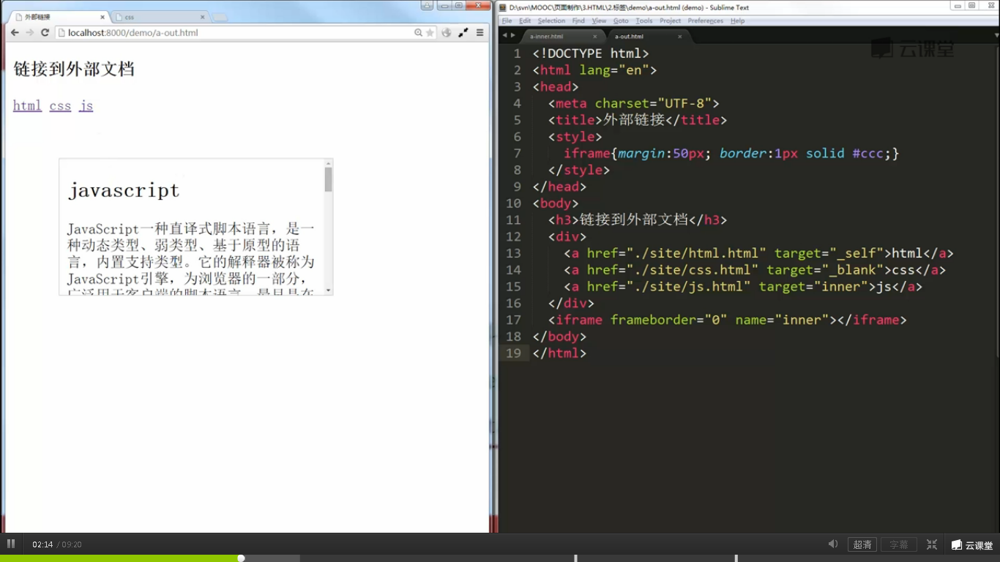
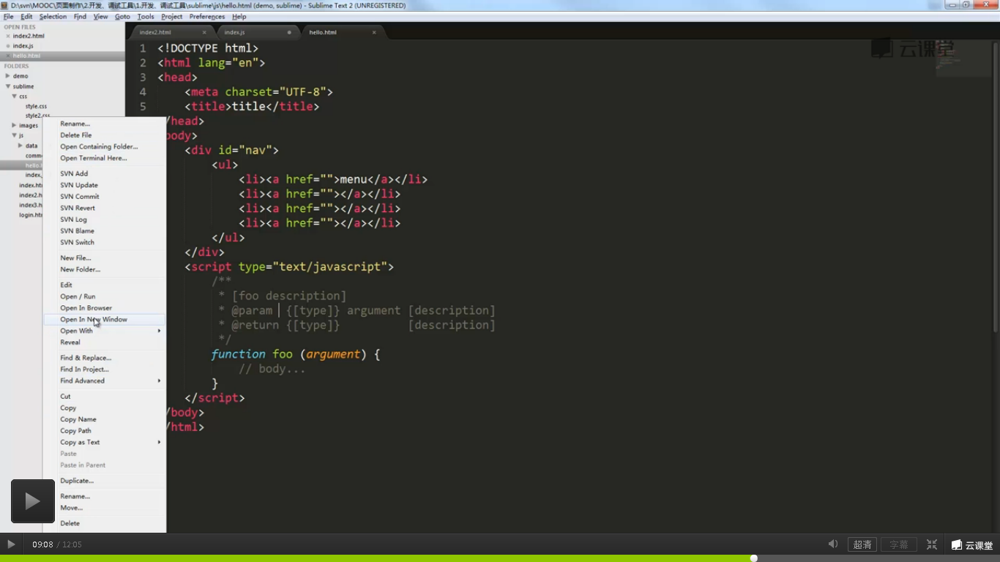

**目录**：

>笔记持续更新，原地址 :https://github.com/Niefee/Wangyi-Note ;

##sublime text快捷键
查找（Ctrl+P） 
- ：    行 
- @    函数名 
- #     关键字 
命令面板（Ctrl+shift+P） 
多行选择（Ctrl+D ，Ctrl+shift+L）ctrl+k可以取消选择当前选项

##代码片段：
	<snippet>
	    <content><![CDATA[ 你需要插入的代码片段${1:name} ]]></content>
	    <!-- 可选：快捷键，利用Tab自动补全代码的功能 -->
	    <tabTrigger>xyzzy</tabTrigger>
	    <!-- 可选：使用范围，不填写代表对所有文件有效。附：source.css和test.html分别对应不同文件。 -->
	    <scope>source.python</scope>
	    <!-- 可选：在snippet菜单中的显示说明（支持中文）。如果不定义，菜单则显示当前文件的文件名。 -->
	    <description>My Fancy Snippet</description>
	</snippet>
- ${1:name}表示代码插入后，光标所停留的位置，可同时插入多个。其中:name为自定义参数（可选）。 
- ${2}表示代码插入后，按Tab键，光标会根据顺序跳转到相应位置（以此类推）。
###一个实例：
	<snippet>
	     <content>
	     <![CDATA[
	     <footer>
	          
Copyright © 2008-2012 ${1:bluesdream}.com

	          
增值电信业务经营许可证 沪B2-${2} <a href="#">沪ICP备号${3}</a>

	     </footer>
	     ]]>
	     </content>
	     <tabTrigger>cft</tabTrigger>
	     <description>custom-footer</description>
	     <scope>text.html</scope>
	</snippet>
- 创建完毕以后，保存在\Packages\User目录下（例 X:\Sublime Text 2.0\Data\Packages\User），文件命名为cft-code，后缀名.sublime-snippet。 
- 此时我们打开一个html文件，输入cft，再按Tab键，刚才我们所编写的代码段，就插入了进来。并且此时的光标停留在我们所标记的${1}位置处，如果我们再按下Tab，那么光标就跳转到${2}的位置。由于我们在scope中定义了仅在html文件中使用，所以此时如果我们打开的是css或其他格式的文件，那将无法插入代码段。 
- 补充：除了利用快捷键Tab出代码之外，我们还能通过菜单来加载，打开Tools > Snippet，选择Snippet: custom-footer。如果你没有定义description，那此时便会看到以我们文件名为命名的Snippet: cft-code选项。