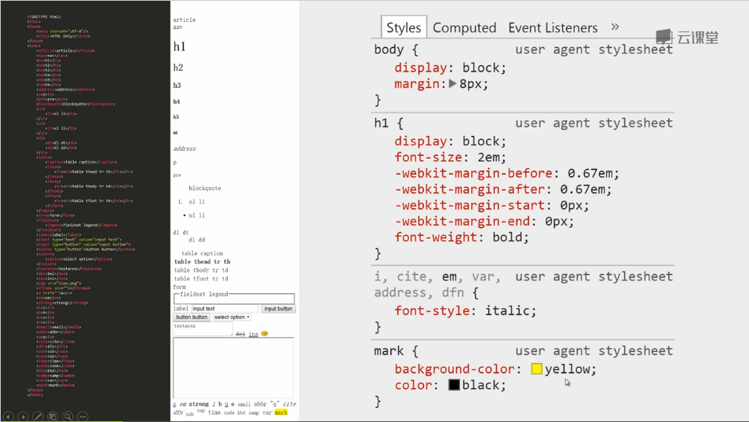
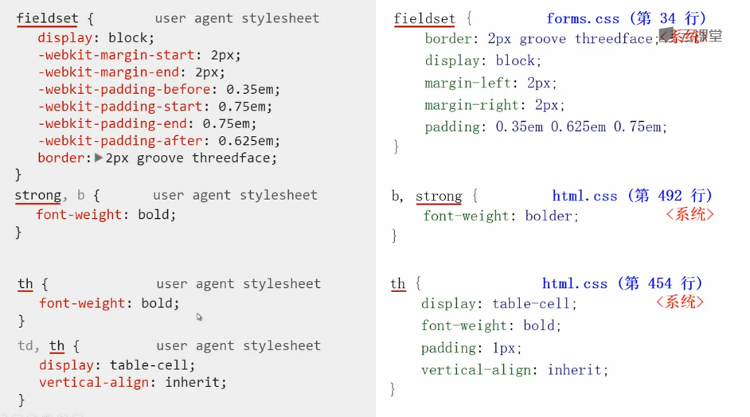
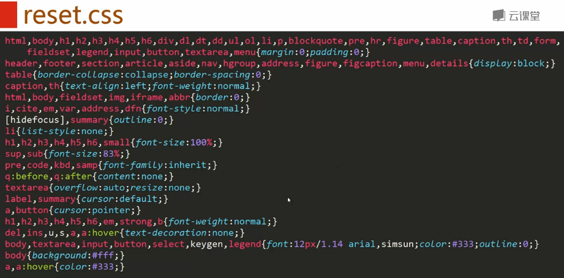
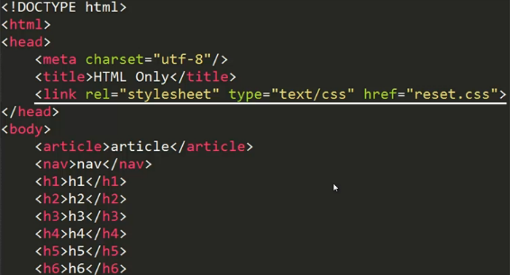
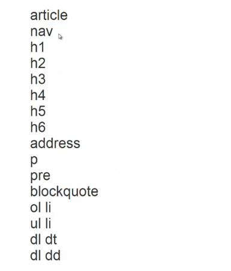
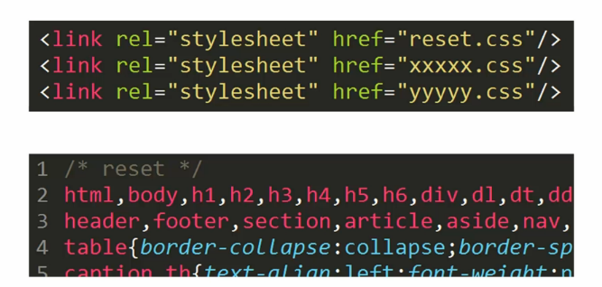

**目录**：

>笔记持续更新，原地址 : https://github.com/Niefee/Wangyi-Note ;

<ul>
<li><a href="#css-reset">CSS Reset</a><ul>
<li><a href="#常用标签">常用标签</a></li>
<li><a href="#效果图">效果图</a></li>
<li><a href="#部分标签的默认样式">部分标签的默认样式</a></li>
<li><a href="#css-reset-1">CSS Reset</a></li>
<li><a href="#去除默认样式的状态">去除默认样式的状态</a></li>
</ul>
</li>
</ul>
#CSS Reset
##常用标签
```
	<article>article</article>
	<nav>nav</nav>
	<h1>h1</h1>
	<h2>h2</h2>
	<h3>h3</h3>
	<h4>h4</h4>
	<h5>h5</h5>
	<h6>h6</h6>
	<address>address</address>
	<p>p</p>
	<pre>pre</pre>
	<blockquote>blockquote</blockquote>
	<ol>
		<li>ol li</li>
	</ol>
	<ul>
		<li>ul li</li>
	</ul>
	<dl>
		<dt>dl dt</dt>
		<dd>dl dd</dd>
	</dl>
	<table>
		<caption>table caption</caption>
		<thead>
			<tr><th>table thead tr th</th></tr>
		</thead>
		<tbody>
			<tr><td>table tbody tr td</td></tr>
		</tbody>
		<tfoot>
			<tr><td>table tfoot tr td</td></tr>
		</tfoot>
	</table>
	<form>form</form>
	<fieldset>
		<legend>fieldset legend</legend>
	</fieldset>
	<label>label</label>
	<input type="text" value="input text">
	<input type="button" value="input button">
	<button type="button">button button</button>
	<select>
		<option>select option</option>	
	</select>
	<textarea>textarea</textarea>
	<del>del</del>
	<ins>ins</ins>
	
	<iframe src=""></iframe>
	<a href="">a</a>
	<em>em</em>
	<strong>strong</strong>
	<i>i</i>
	<b>b</b>
	<u>u</u>
	<s>s</s>
	<small>small</small>
	<abbr>abbr</abbr>
	<q>q</q>
	<cite>cite</cite>
	<dfn>dfn</dfn>
	<sub>sub</sub>
	<sup>sup</sup>
	<time>time</time>
	<code>code</code>
	<kbd>kbd</kbd>
	<samp>samp</samp>
	<var>var</var>
	<mark>mark</mark>
```

##效果图
<article>article</article>
	<nav>nav</nav>
	<h1>h1</h1>
	<h2>h2</h2>
	<h3>h3</h3>
	<h4>h4</h4>
	<h5>h5</h5>
	<h6>h6</h6>
	<address>address</address>
	<p>p</p>
	<pre>pre</pre>
	<blockquote>blockquote</blockquote>
	<ol>
		<li>ol li</li>
	</ol>
	<ul>
		<li>ul li</li>
	</ul>
	<dl>
		<dt>dl dt</dt>
		<dd>dl dd</dd>
	</dl>
	<table>
		<caption>table caption</caption>
		<thead>
			<tr><th>table thead tr th</th></tr>
		</thead>
		<tbody>
			<tr><td>table tbody tr td</td></tr>
		</tbody>
		<tfoot>
			<tr><td>table tfoot tr td</td></tr>
		</tfoot>
	</table>
	<form>form</form>
	<fieldset>
		<legend>fieldset legend</legend>
	</fieldset>
	<label>label</label>
	<input type="text" value="input text">
	<input type="button" value="input button">
	<button type="button">button button</button>
	<select>
		<option>select option</option>	
	</select>
	<textarea>textarea</textarea>
	<del>del</del>
	<ins>ins</ins>
	
	<iframe src=""></iframe>
	<a href="">a</a>
	<em>em</em>
	<strong>strong</strong>
	<i>i</i>
	<b>b</b>
	<u>u</u>
	<s>s</s>
	<small>small</small>
	<abbr>abbr</abbr>
	<q>q</q>
	<cite>cite</cite>
	<dfn>dfn</dfn>
	<sub>sub</sub>
	<sup>sup</sup>
	<time>time</time>
	<code>code</code>
	<kbd>kbd</kbd>
	<samp>samp</samp>
	<var>var</var>
	<mark>mark</mark>


---

---

>以上的都是表情的效果图。

##部分标签的默认样式



>左边是谷歌，右边是火狐。默认样式在不同的浏览器是不一样的。
>大部分是不需要的。

##CSS Reset

>去除没有用的样式，可以减少以后逐渐修改的工作负担。

##去除默认样式的状态



**CSS Reset不仅仅去除默认样式 ，重新定义全局样式。**


>CSS Reset应该放在最前面。


