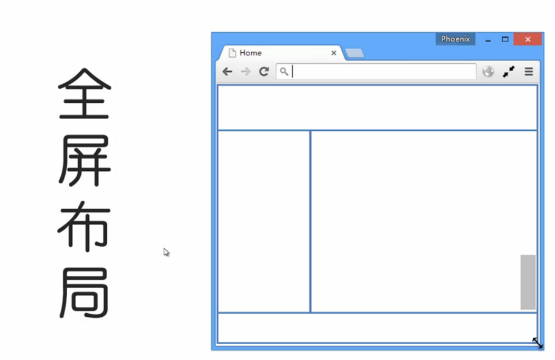
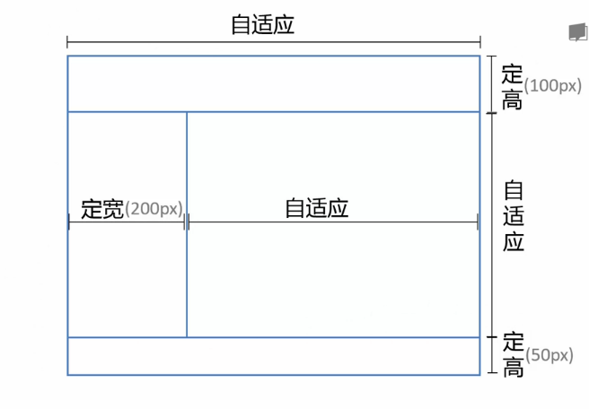
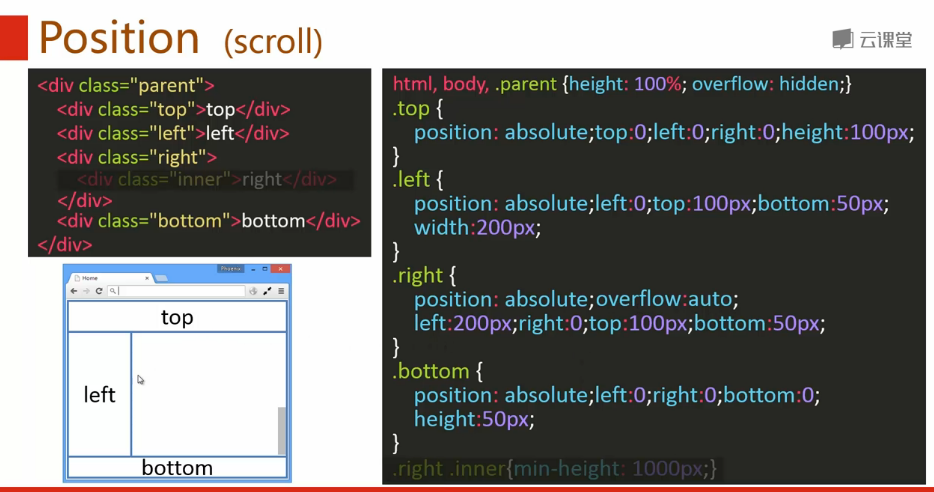
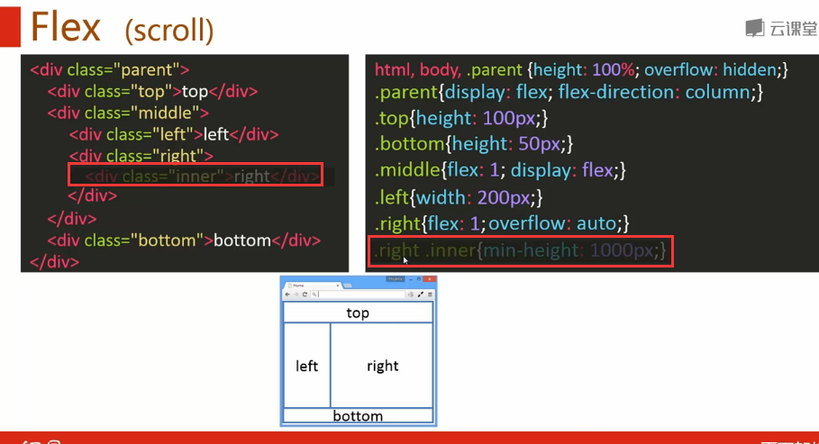
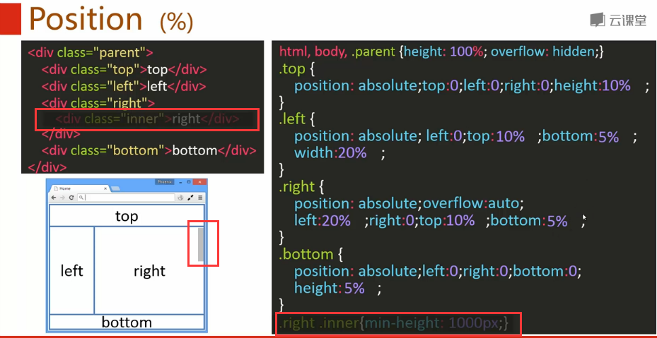
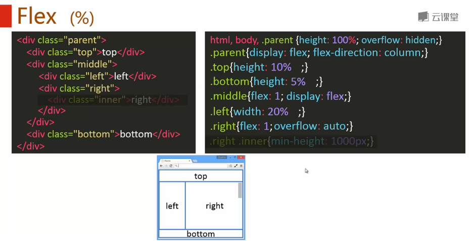
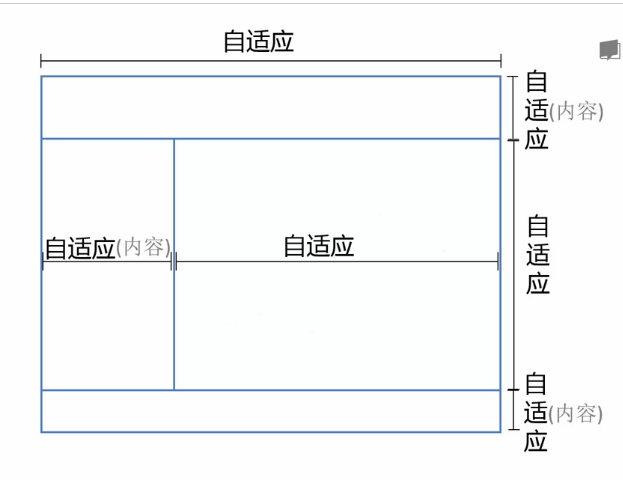
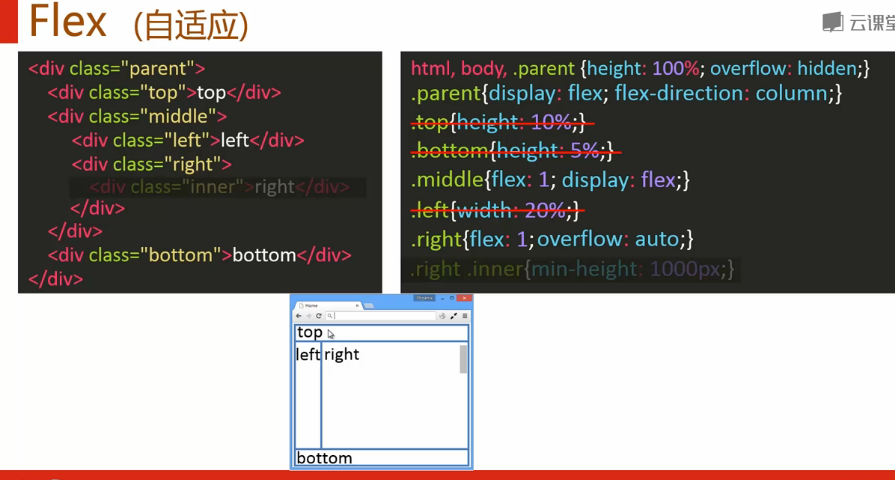
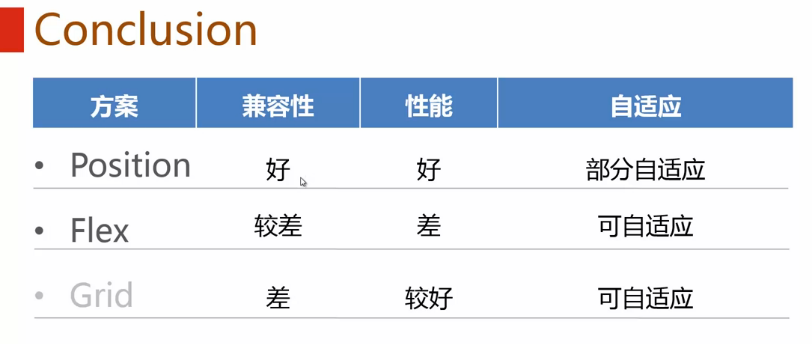

**目录**：

>笔记持续更新，原地址 : https://github.com/Niefee/Wangyi-Note ;

<ul>
<li><a href="#全屏布局">全屏布局</a><ul>
<li><a href="#position">Position</a><ul>
<li><a href="#兼容性">兼容性</a></li>
</ul>
</li>
<li><a href="#flex">Flex</a><ul>
<li><a href="#兼容性-1">兼容性</a></li>
</ul>
</li>
<li><a href="#使用百分百的方案">使用百分百的方案</a><ul>
<li><a href="#position-1">Position</a></li>
<li><a href="#flex-1">Flex</a></li>
</ul>
</li>
<li><a href="#全部自适应">全部自适应</a><ul>
<li><a href="#flex-2">Flex</a></li>
</ul>
</li>
<li><a href="#总结">总结</a></li>
</ul>
</li>
</ul>
#全屏布局

**需求**

 - 实现方案
	 - Position
	 - Flex

##Position

###兼容性

##Flex

###兼容性

##使用百分百的方案
###Position

###Flex

##全部自适应

>Position实现不了。

###Flex

##总结

>Grid自适应布局参考：http://www.w3cplus.com/css3/create-an-adaptive-layout-with-css-grid.html 。
