**目录**：

>笔记持续更新，原地址 : https://github.com/Niefee/Wangyi-Note ;

<ul>
<li><ul>
<li><a href="#多列布局">多列布局</a><ul>
<li><a href="#一列定宽与一列自适应">一列定宽与一列自适应</a></li>
<li><a href="#一列定宽与两列自适应">一列定宽与两列自适应</a></li>
<li><a href="#一列不定宽与一列自适应">一列不定宽与一列自适应</a></li>
<li><a href="#两列不定宽与一列自适应">两列不定宽与一列自适应</a></li>
<li><a href="#等分布局">等分布局</a></li>
<li><a href="#等高">等高</a></li>
</ul>
</li>
</ul>
</li>
</ul>

##多列布局
###一列定宽与一列自适应
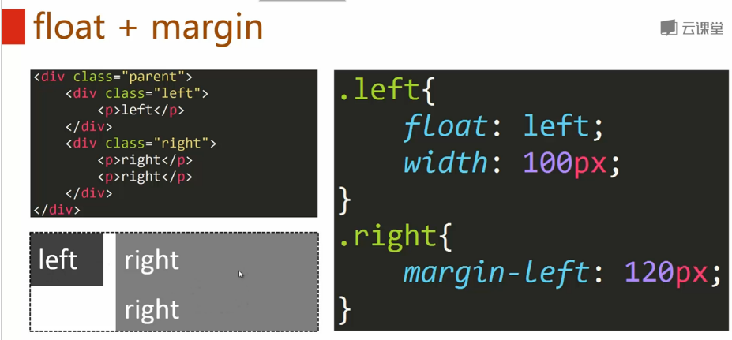
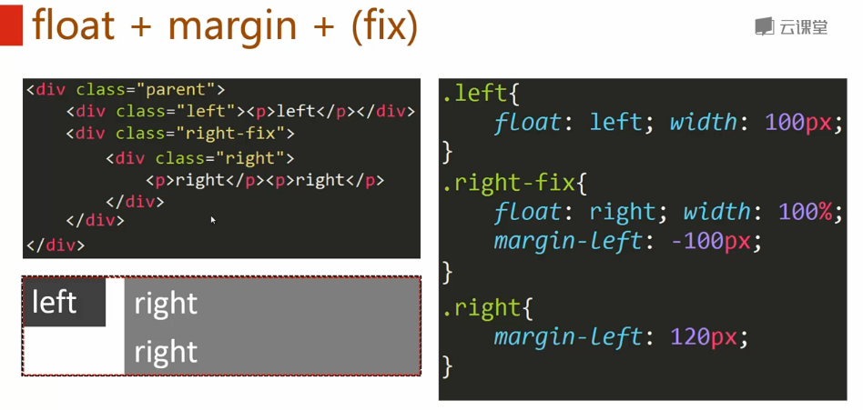
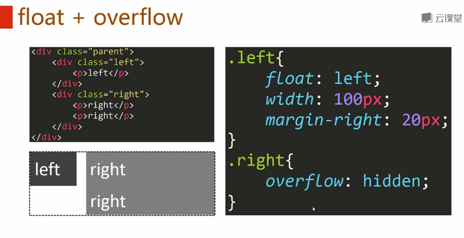
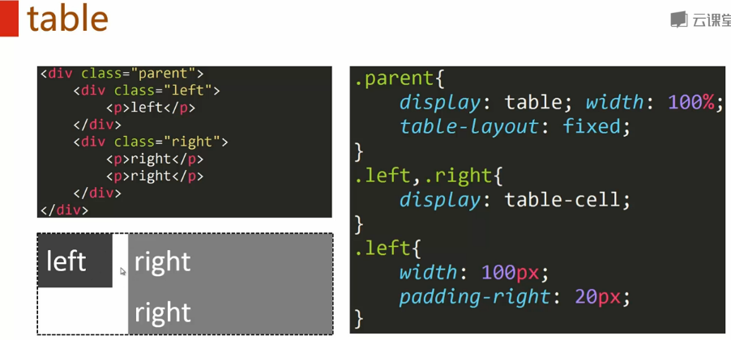
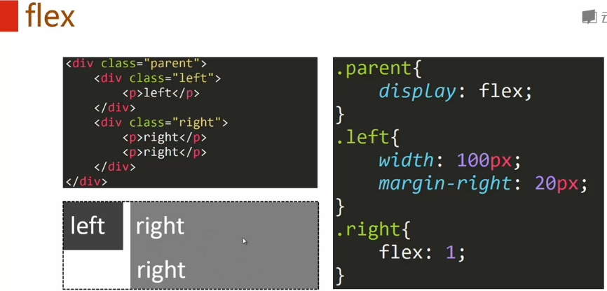

###一列定宽与两列自适应
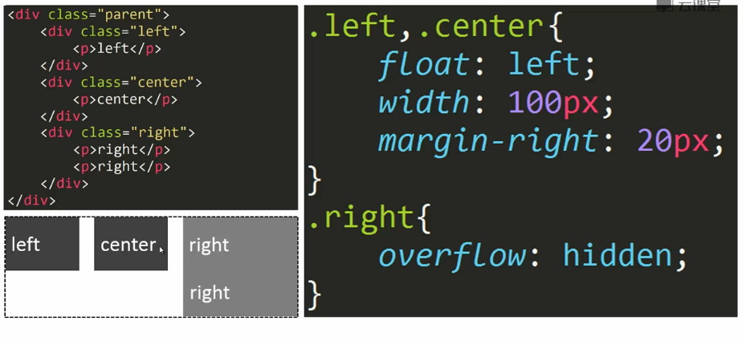

###一列不定宽与一列自适应
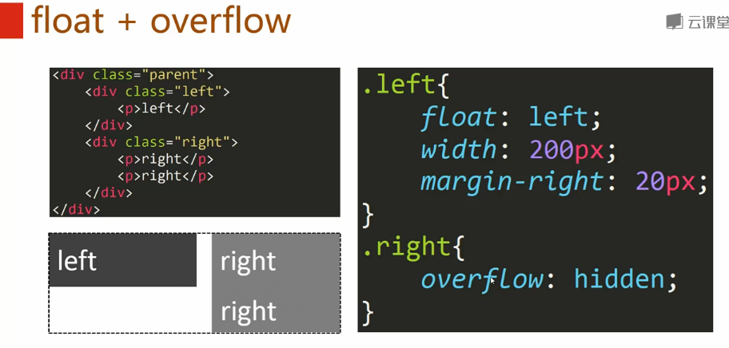
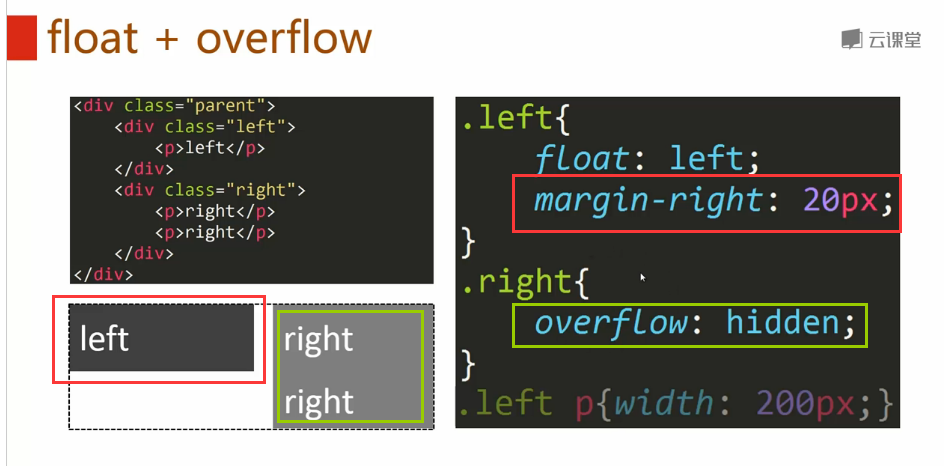
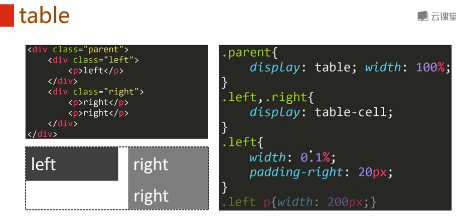
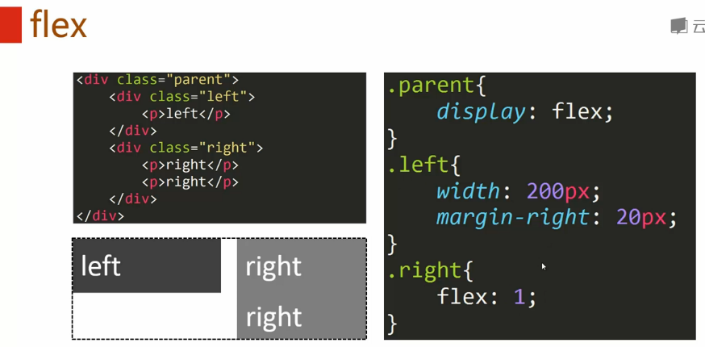

###两列不定宽与一列自适应
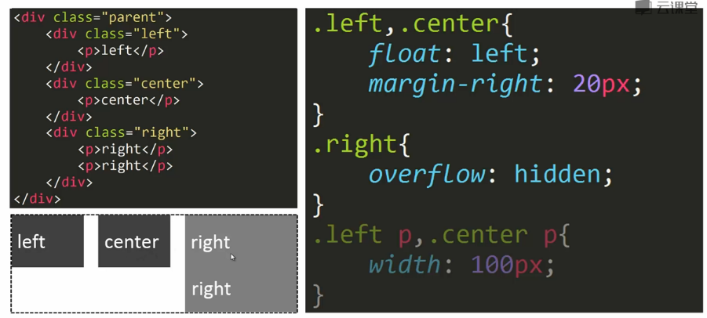

###等分布局
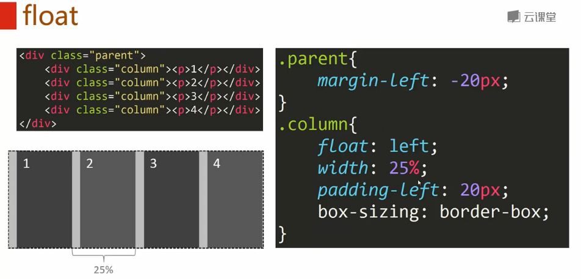
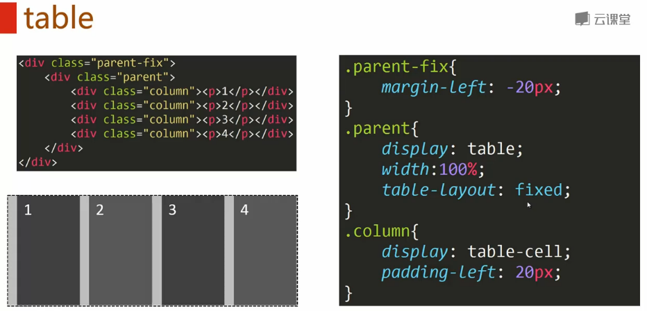
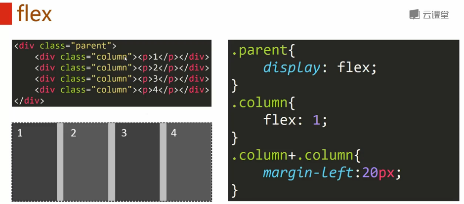

###等高
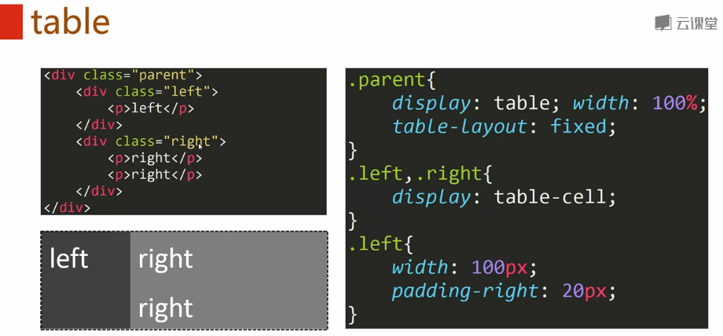
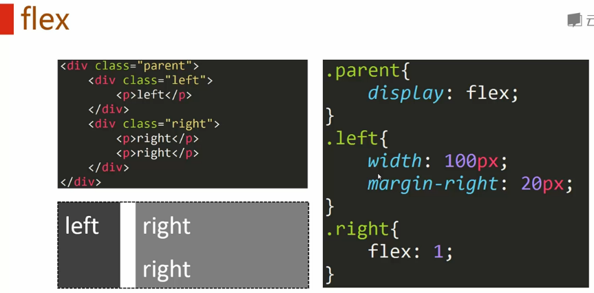
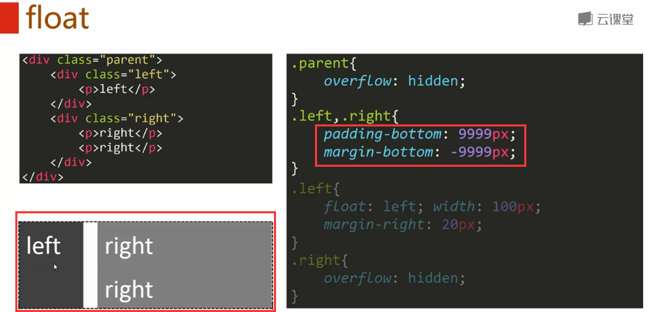

>Div高度的百分比问题：http://blog.163.com/m13864039250_1/blog/static/213865248201391012657561/  。
