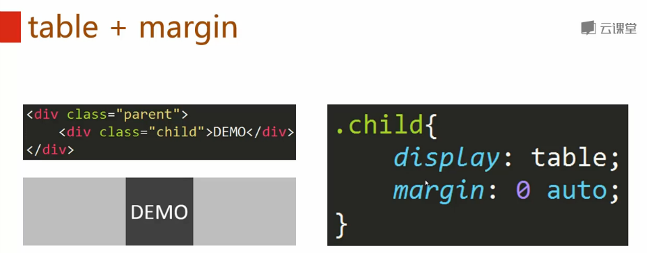
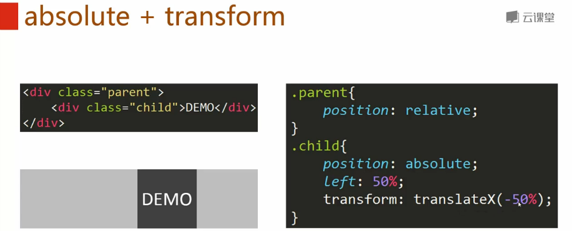
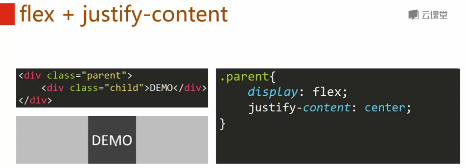
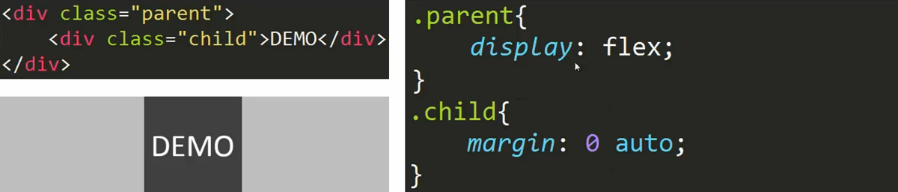
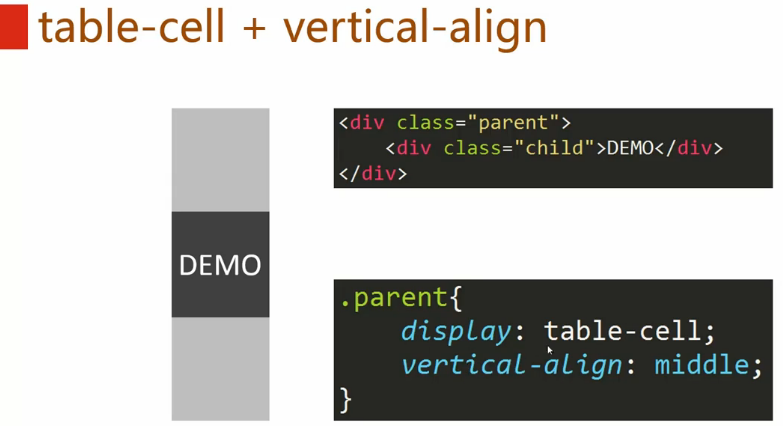
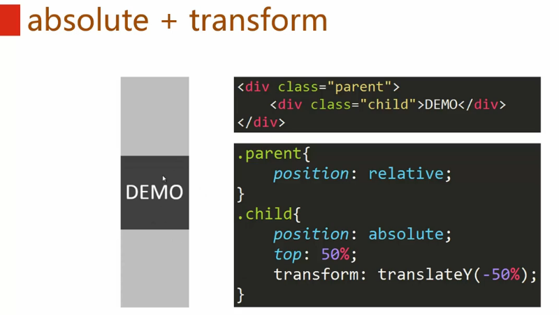
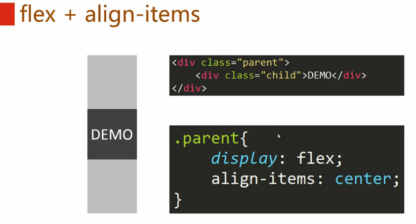
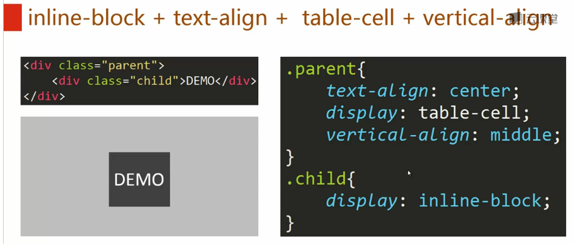
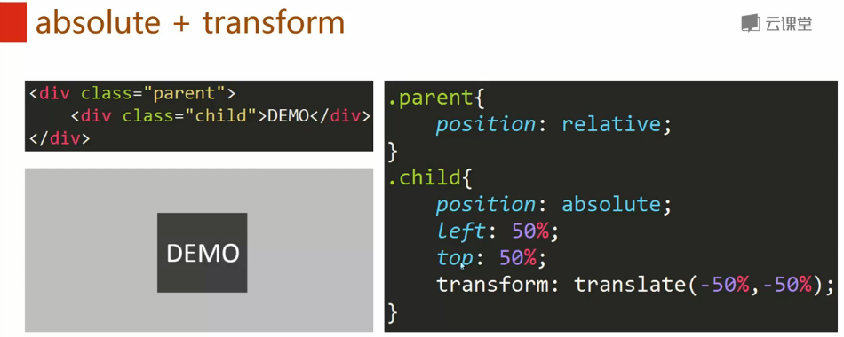
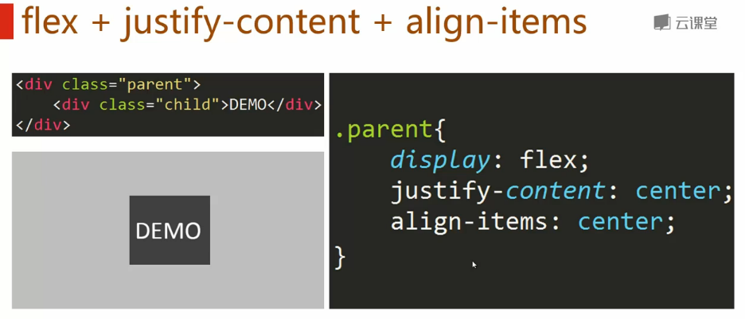

**目录**：

>笔记持续更新，原地址 : https://github.com/Niefee/Wangyi-Note ;

<ul>
<li><ul>
<li><a href="#居中布局">居中布局</a><ul>
<li><a href="#水平居中">水平居中</a></li>
<li><a href="#垂直居中">垂直居中</a></li>
<li><a href="#水平垂直居中">水平垂直居中</a></li>
</ul>
</li>
</ul>
</li>
</ul>
##居中布局
###水平居中

1、

2、

3、

4、
    

###垂直居中
 1、
>把div换成 table 结构可以兼容ie6、7、8。

2、
>**transform**在不同浏览器要加上私有前缀。

3、
>只有高版本浏览器才兼容。

###水平垂直居中
1、

2、

3、
di
